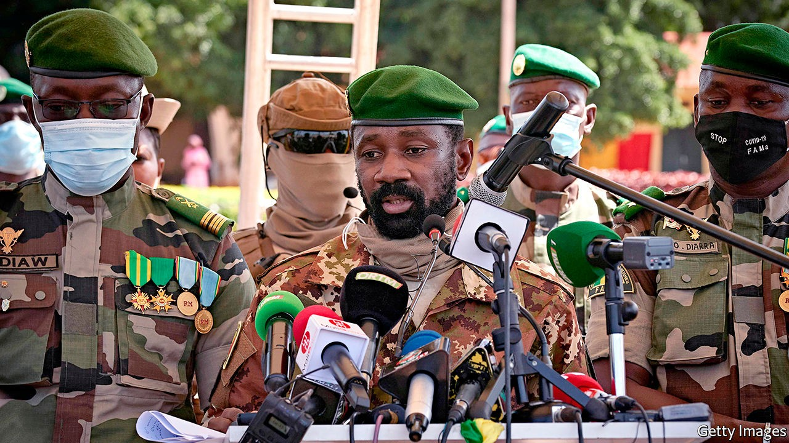

## After the coup

# Mali’s “civilian” government has rather a lot of soldiers

> A new regime struggles to vanquish jihadists, who hold sway over much of the country

> Oct 15th 2020

IN THE LATE evening of October 8th a man in a white turban stepped off a military plane into a crowd of well-wishers at Bamako airport in Mali. Soumaila Cissé, an opposition leader kidnapped by jihadists in March, was free at last. Also arriving to cries of “maman” from her waiting son was Sophie Pétronin, a 75-year-old French woman held hostage for almost four years. Two Italians were freed, too. Locals blowing plastic horns celebrated in the streets. Mali’s new post-coup government, appointed just days earlier, claimed its first big public-relations success.

But in northern Mali there would soon be another party to welcome back many of the 200 or so jihadists who were freed in exchange for the hostages. Bomb-makers and insurgent commanders were treated to a feast of grilled meat, couscous and fruit by the jihadist leaders who hold sway over much of the north and centre of Mali.

Less than two months after massive street protests precipitated a coup that ousted President Ibrahim Boubacar Keita, Mali’s politics are still extremely wobbly. That worries other countries, too: Mali is at the centre of an international effort to contain jihadism. It is also in the heart of a region described this week by Mark Lowcock, the UN’s emergency-relief co-ordinator, as “close to a tipping point” that might make it the world’s worst humanitarian disaster. “Nowhere scares me more than the Sahel,” he said. It was not necessary to add that the odds are stacked against Mali’s new government restoring stability or rolling back the spreading jihadist insurgency.

Start with the government’s composition. After the coup in August, ECOWAS, a regional bloc, imposed sanctions on Mali and demanded that the junta hand power back to a civilian administration. In early October it did so, sort of. Bah Ndaw, president of the “civilian” transitional government, is a retired colonel and former minister of defence. His vice-president is Assimi Goita (pictured, centre), the colonel who led the coup. Though there are real civilians in the cabinet, members of the junta got four of the top posts, including responsibility for organising elections, which are promised within 18 months. “The real power is with the military,” says Bréma Ely Dicko of the University of Letters and Social Sciences in Bamako.

The appointments were enough to satisfy ECOWAS, which has lifted sanctions. But they will do little to mollify M5-RFP, the coalition of opposition groups that led the protests—and has been almost entirely left out of the government. That puts Mali’s Western allies in an awkward spot. The EU had a large mission training the army. France has some 5,100 troops in the region fighting jihadists. America has provided military assistance. The UN has 15,000 peacekeepers in Mali. A coup and a government led by hard men were not in anyone’s good-governance plans.

France urges a return to civilian rule, but also says “it is imperative that we continue the fight against terrorism.” A new force of Estonian and French commandos has just deployed. France hopes to persuade other countries to send troops, but the coup has surely made that harder. The EU has suspended its training mission (though may be edging towards resuming it) and America has stopped military aid until elections are held. In recent years the jihadists have been gaining ground, attacking neighbouring countries and inflicting heavy losses on Mali’s army. Instead of more help, though, Mali may get less.

Backers of the coup say it was needed to restore security and stability and that the uniformed men who now run things will bring grit to the fight. Yet the new government seems to have moved in the opposite direction by freeing prisoners. The released fighters will swell the ranks of Jama’at Nasr al-Islam wal Muslimin (JNIM), a group linked to al-Qaeda, by about 10% and stiffen them with seasoned fighters.

Reportedly among those released were the men behind terrorist attacks on hotels in Mali, Ivory Coast and Burkina Faso that killed scores. One is thought to be Mimi Ould Baba, who faces terrorism charges in America for killing an American in Burkina Faso in 2016. A ransom worth €10m-30m ($12m-35m) was apparently handed over, a sum that will not only buy bullets but also boost JNIM’s prestige, says Héni Nsaibia of Menastream, a research consultancy.

Some Malians hope the prisoner swap will open the door to peace talks. But JNIM is strong, so the government is not in a good position to negotiate. And because there are rival extremist groups, such as Islamic State in the Greater Sahara, JNIM may worry that its fighters will defect if it is seen as going soft.

Beyond security, the new government has promised to curb corruption and enact a raft of reforms. But just before the coup took place a UN report detailed ample graft in the armed forces themselves.

All the same, many Malians remain cautiously optimistic. Mr Cissé’s return and promised reforms to the constitution and electoral system should lend more legitimacy to any future election. But if the government makes slow progress on its reform agenda or in pushing back the jihadists, it may use this as an excuse to push back the date of the next election, says Boubacar Haidara of Sciences Po Bordeaux, who is based in Ségou in central Mali. “They will try it,” he adds.

After a visit to Mali on October 11th Nana Akufo-Addo, the Ghanaian president who currently heads ECOWAS, said there was “good hope” that the new government would keep its promise to hold elections. He urged it to set a firm date for the poll. The coup was an unwelcome “bunch of lemons”, says an American diplomat. Yet he hopes that Mali and its backers can “at least make lemonade” out of it. ■

## URL

https://www.economist.com/middle-east-and-africa/2020/10/15/malis-civilian-government-has-rather-a-lot-of-soldiers
