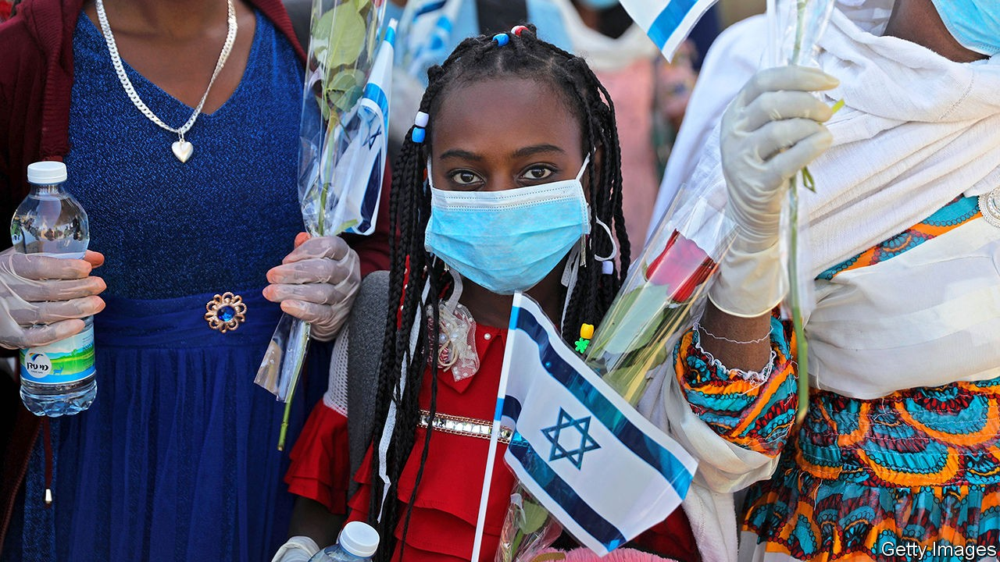

## From Gondar to Jerusalem

# The Jews from Ethiopia who confound Israel’s law of return

> Should the descendants of Christian converts be granted Israeli citizenship?

> Oct 15th 2020JERUSALEM

THE AIRLIFTS that brought Ethiopian Jews to Israel during the 1980s and 1990s are the stuff of legend. A secret operation over 36 hours in 1991 involved 40 flights carrying some 14,000 members of the Beta Israel, the largest community of Ethiopian Jews. At the time Israelis celebrated the missions. But today their government’s plans for a different group of Ethiopian Jews are making few people happy.

On October 12th Israel decided to admit 2,000 members of the Falash Mura, descendants of Ethiopian Jews who converted to Christianity over a century ago. For nearly 30 years the Falash Mura have been clamouring to be accepted by Israel. Every now and then Israel lets a few thousand in. But roughly 8,000 languish in camps in Addis Ababa and Gondar. Some Jews think Israel should open its doors to all of them. Others question whether the Falash Mura qualify under Israel’s law of return, which grants citizenship to all Jews.

Ethiopian Jews claim their ancestors belonged to the lost tribe of Dan, which dispersed when the ancient kingdom of Israel fell, over 2,700 years ago. But, largely isolated, their practices differ from those of mainstream Jews. The Falash Mura have another problem: Israel’s high court long ago ruled that Jews who converted to another religion, and their descendants, are not eligible under the law of return. The government does not consider the group fully Jewish. Even some Beta Israel members accuse them of pretending to be Jewish in order to escape hardship at home.

The government occasionally buckles under pressure from liberals, who favour more African immigration, and nationalists, who see the newcomers as helping Jews outnumber Palestinians. There are around 150,000 Ethiopian-Israelis (almost 2% of the population). Half are Falash Mura, who are required to convert to Orthodox Judaism.

Ethiopian-Israelis have faced discrimination and struggled economically. But they have also gained a bit of political influence. Earlier this year Pnina Tamano-Shata became Israel’s first Ethiopian-born minister. Binyamin Netanyahu, the prime minister, often talks of bringing over more Ethiopians when he is in political trouble—as he is now, due to his mishandling of covid-19.

But Israel’s policy on the Falash Mura is a muddle, says Fentahun Seyoum, an Ethiopian-Israeli activist: “Either they are not eligible and no one should be allowed in, or allow them all. Just 2,000 out of 8,000 doesn’t make sense.”

## URL

https://www.economist.com/middle-east-and-africa/2020/10/15/the-jews-from-ethiopia-who-confound-israels-law-of-return
