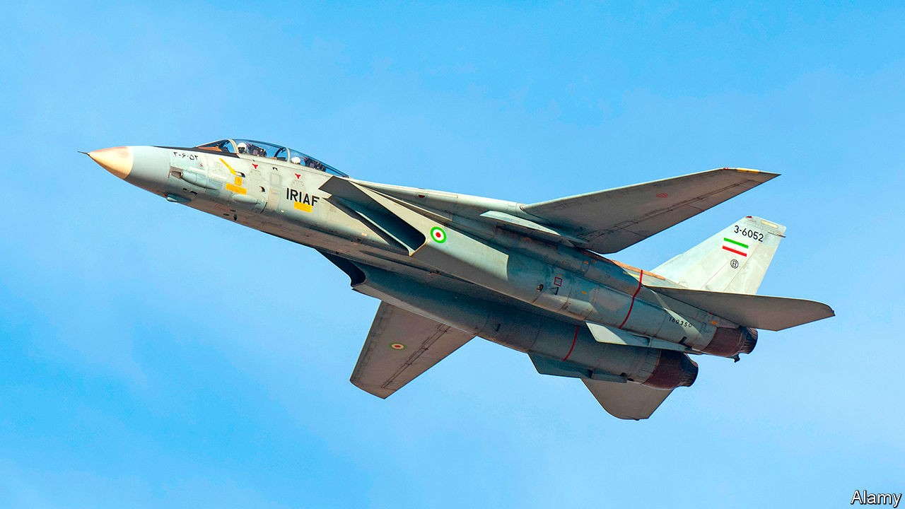

## Arsenal of theocracy

# The weapons embargo on Iran is coming to an end

> But don’t expect the regime to go on a buying spree

> Oct 13th 2020

THE F-14 TOMCAT was a cutting-edge fighter jet when it first flew 50 years ago. It acquired iconic status when it starred in “Top Gun”, a Hollywood blockbuster, during the Reagan era. Newer planes have long since taken its place in America’s air force. But Tomcats are still a feature of Iran’s decrepit armed forces, which acquired the planes (one is pictured) shortly before the Islamic revolution in 1979. Many of the country’s other weapons, from infirm British tanks to vintage American helicopters, are also museum pieces. But the expiry of a United Nations arms embargo on October 18th allows the country’s generals to dream of shinier weapons.

Iran’s armed forces have long had to make do with junk. Though America and Britain sold advanced weapons to the pro-Western shah in the 1960s and 1970s, the theocracy that followed lost somewhere between one-half and two-thirds of that equipment in a brutal eight-year war with Iraq. The departure of Western technicians and an informal arms embargo prevented the Iranians from maintaining or replacing what was left. In 2007 the UN imposed a formal arms embargo, amid rising tensions over Iran’s nuclear programme.

In 2015 Iran signed a deal with six world powers, under which it agreed to curb its nuclear programme in return for the lifting of international sanctions—and the arms embargo in 2020. The Trump administration walked out of the deal in 2018 and demanded that the embargo remain in place. But those efforts ended in humiliation in August, when America was rebuffed at the UN by allies and rivals alike. The embargo will therefore expire as planned on October 18th, though restrictions on Iran’s development of nuclear-capable ballistic missiles will remain in place until 2023.

In theory, it will be legal for Iran to buy and sell weapons to and from whomever it chooses. Russia has hinted that it is keen to do business. “We have said since the very first day that there will be no problem with selling weapons to Iran from October 19th,” said Russia’s ambassador to Iran. Last year an assessment by America’s Defence Intelligence Agency said Iran would probably buy advanced Russian fighter jets. China is also eager to sell its arms, which tend to be cheaper. China and Iran are working towards an agreement on economic and military co-operation, including joint weapons development.

Yet a full-blown arms spree is unlikely for several reasons. Russia and China both want to keep good relations with Iran’s deeper-pocketed Arab rivals. Iran’s annual military spending was $12.6bn last year; Saudi Arabia spent almost five times that. Nor is Iran about to catch up soon. America’s own sanctions—separate from the UN measures (and more draconian)—have strangled Iran’s economy and sent its currency to new lows, pushing up the price of arms imports. America’s Treasury Department continues to hound anyone doing business with Iran, deterring many countries from taking the risk. Iran is also keen on building up its own defence industry, though (with the exception of missiles and drones) it produces more hot air than modern weapons. An ostensibly new tank unveiled in 2016, for instance, used a chassis from a 1950s American one, notes Robert Czulda of the University of Lodz.

Most important, Iran’s military strategy does not depend on traditional weapons, but on a mix of ballistic missiles to deter attacks and a sprawling network of friendly militia groups—from Hizbullah in Lebanon and Syria to the Houthis in Yemen—to project power. Accordingly, Iran’s Islamic Revolutionary Guard Corps, which controls the missiles and works with the militias, is politically and militarily more powerful than the regular armed forces. In June Mike Pompeo, America’s secretary of state, was ridiculed when he tweeted that new Iranian warplanes would mean that “Europe and Asia could be in Iran’s crosshairs”. A map attached to his tweet used ranges that implied one-way suicide missions.

“I don’t think this is going to be a moment where they just get a bunch of tanks and march across the Middle East, because they are already present through proxies and drones,” says Behnam Ben Taleblu of the Foundation for Defence of Democracies, a think-tank in Washington that has argued in favour of continuing the embargo. Iran does not have a history of huge arms deals, but Hassan Ahmadian of the University of Tehran thinks it will make some purchases “to enhance its defensive capabilities and to showcase the end of the embargo”. It may focus on better cruise missiles and modernisation of its diesel submarines, says Mr Ben Taleblu. Western officials say their biggest concern is that Iran will pass on imported weapons or technology to its proxies abroad. But if the country hopes to tune up its ageing Tomcats, it is out of luck. America shredded the last of its fleet a decade ago, precisely to exclude that possibility. ■

Correction (October 22nd 2020): We feel the need—the need for contrition. We implied that the F-14 Tomcat, which starred in the movie “Top Gun”, was flown by America’s air force. In fact, the fighter jet was flown by the navy. Sorry.

## URL

https://www.economist.com/middle-east-and-africa/2020/10/13/the-weapons-embargo-on-iran-is-coming-to-an-end
