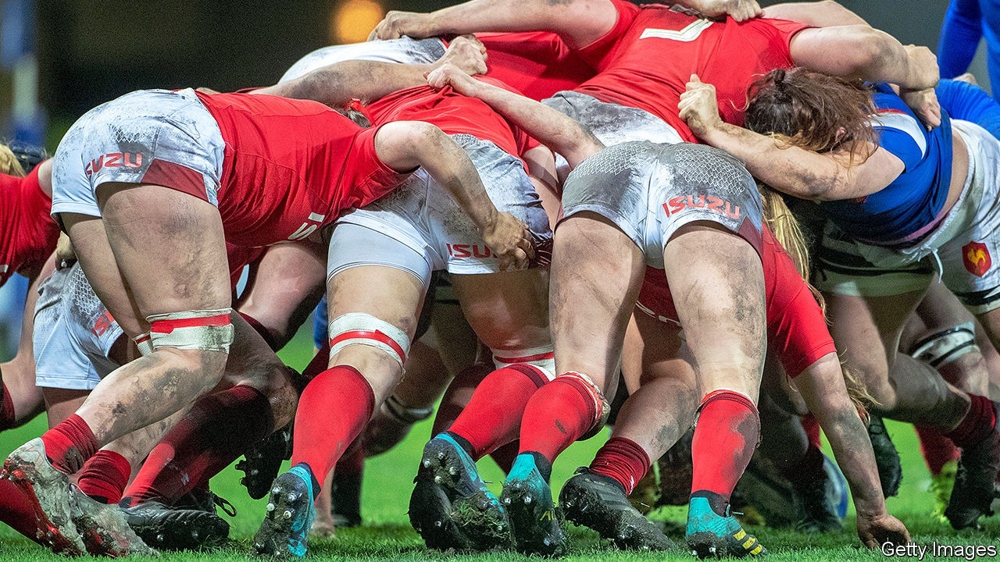
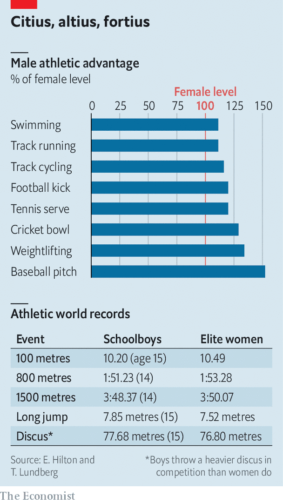

## Transgender athletes

# A ban by World Rugby could prove influential for transgender sports

> The horns of a dilemma

> Oct 17th 2020

IT IS THE latest development in a bitter argument. On October 9th World Rugby, the global governing body for rugby union, decided to bar trans women—people who are biologically male, but identify as women—from playing in the international women’s game, on the grounds that it is unsafe. That ban will probably affect the top levels of the game in individual countries, too, since international players are drawn from the top clubs. Decisions on what to do in the game’s lower levels have been left to the governing bodies in individual countries.

World Rugby’s decision puts it at odds with much of the rest of the sporting world. The International Olympic Committee (IOC) has allowed trans women to compete in women’s events since 2004. It loosened its rules in 2015, removing the requirement for genital surgery in favour of a declaration of good faith, and requiring, in the interest of fair competition, that trans women reduce the amount of testosterone in their blood for at least a year before competing. The idea behind this was that suppressing testosterone would reduce or eliminate the athletic advantages conferred by male physiology.

The IOC’s influence means that similar rules have been adopted by many other sports. That, in turn, has led to some famous victories for trans women. In 2018 Rachel McKinnon, a Canadian trans woman, won a women’s cycling championship in the 35-44 age bracket. (Ms McKinnon has since changed her name to Veronica Ivy.) Laurel Hubbard, a transgender weightlifter from New Zealand, has won a string of medals in women’s contests. Rugby’s best-known transgender player is probably Kelly Morgan, who plays at club level in Wales.

It has also caused rows. Some female athletes have complained that it is unfair to make them compete against people who, despite their gender identities and medical procedures, remain biologically male. Others worry that the system is open to abuse by unscrupulous athletes desperate for success. Several prominent female athletes, including Martina Navratilova, a tennis player, and three British Olympians, have urged the IOC to think again. The arguments are particularly acute in America, where, in at least two cases, they have ended up in court.

World Rugby’s decision is significant not just for the precedent it might set in a notoriously bad-tempered debate, but also because of how it was arrived at. After receiving worried letters from referees and female players, the sport organised a workshop earlier in the year to which it invited scientists, players, lawyers and ethicists. Presentations were posted online, in the interests of transparency. One crucial question was whether the testosterone-suppressing drugs advocated by the IOC were enough to counter the sporting advantages enjoyed by males.

Start with the size of that advantage. Sports science confirms what common experience suggests: most males are bigger, stronger and faster than most females. They have bigger muscles, bigger hearts and bigger lungs, as well as a greater capacity to transport and use oxygen, stronger bones and tougher ligaments. The advantage that all this grants varies from sport to sport, from around 10% in running to more than 30% in weightlifting (see chart). But even at the lower end of the scale, it is enough of a difference that some talented male teenagers—despite having yet to finish puberty—can outperform the best female athletes in the world.

It is a similar story on the rugby field. Emma Hilton, a biologist at the University of Manchester, presented data to World Rugby on strength and speed in top-flight rugby players of both sexes. These showed only a small overlap in the speed with which male and female players could manage a ten-metre dash. Even the bulkiest male players were only a fraction slower than the nimblest female ones. The paciest males left both in the dust. Data on the bench press, a weightlifting exercise that emphasises the arms, shoulders and chest, revealed no overlap at all. The weakest, smallest males could shift 10% more weight than the biggest, strongest females. The strongest male players could lift over 60% more.

A great deal of this sex-based advantage arises from the actions of testosterone. Besides being the primary male sex hormone, it is the original anabolic steroid. Doping with it and its chemical cousins remains a popular way of getting an illicit advantage. Suppressing its production might, therefore, be expected to undo some of the advantages it bestows.

But what evidence there is suggests otherwise. A review written after the workshop by Dr Hilton and Tommy Lundberg, a physiologist at the Karolinska Institute in Stockholm, summarises existing research on the effects of testosterone suppression in trans women. Drs Hilton and Lundberg analysed 11 scientific papers. Three measured strength directly. The rest measured either muscle size or “lean body mass”, defined as total body weight minus fat. Most reported changes of the order of a 5% loss after one to three years of suppression—far too little to remove the physical advantages possessed by males. Participants in the studies had testosterone levels below even the IOC’s guideline levels, says Dr Hilton. That suggests no amount of testosterone suppression in adulthood can bring male athletes into line with female ones

https://www.youtube.com/embed/qrgJQI3O_RQ

On the other hand, Joanna Harper, a researcher at Loughborough University, points out that few of the studies summarised in Drs Hilton and Lundberg’s paper measured sporting performance directly. Most came at the question from a medical point of view rather than a sporting one. All focused on strength, she says. None measured speed. And not all the evidence points in the same direction. In 2015 Ms Harper published a study into transgender runners, which suggested that testosterone suppression cut performance sharply.

Ross Tucker, a sports scientist who consults for World Rugby, points out in turn that Ms Harper’s paper covered only eight runners, lumped together recent transitioners with those who had made the jump years earlier, and did not attempt to control for other variables, such as levels of training. He says that studies of men taking treatment for prostate cancer—which also suppresses testosterone—show that exercise can avoid loss of muscle altogether.

Faced with this imperfect, but suggestive, evidence, World Rugby has come down on the side of a ban. The sport’s authorities weighed questions of fairness, inclusion and safety, says Dr Tucker, but it was safety that clinched the decision. He points out that, besides the evidence on strength, the size of a player’s skeleton does not change after transition. The sport is already worried about concussion, a common rugby injury now known to cause more long-term damage than previously thought. “When we say safety is our number one priority, that’s not just lip-service,” he says.

World Rugby plans to review the science every three years, and to update its decision if necessary. Better data may yet emerge. Ms Harper is trying to recruit participants for a controlled, longitudinal trial of trans women and sporting performance that would follow participants for several years. Dr Lundberg is keen on doing something similar. But Ms Harper cautions that it is likely to be a lengthy process. Finding volunteers is not easy, she says.

In the meantime, the governing bodies of other sports, particularly contact and combat sports, have been watching World Rugby’s deliberations, says Dr Hilton. She thinks some may adopt similar guidelines of their own.

A more immediate question will be whether the rest of rugby does the same. Although World Rugby can rule on what happens in international matches, it can offer only guidance to national unions. Authorities in England have already said they will ignore this guidance and carry on allowing trans women to play the women’s game within England. Rumblings suggest other unions in both the northern and southern hemispheres may follow suit. Excluding trans women from women’s sport may conflict with laws—or proposed laws—in some countries, including America and Canada. If anything, the arguments are likely to get louder.■

## URL

https://www.economist.com/science-and-technology/2020/10/17/a-ban-by-world-rugby-could-prove-influential-for-transgender-sports
