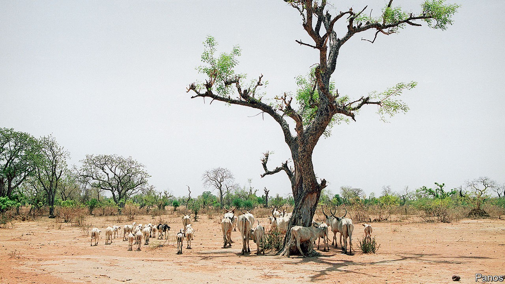

## Ecology

# Arid areas have more trees than previously thought

> A census of all Earth’s trees may eventually be possible

> Oct 17th 2020

TREES LOOM large in both environmental science and the wider social and political movement of environmentalism. Not for nothing are greens sometimes called “tree-huggers”. Generally, the arboreal news is gloomy, as large areas of forest are cleared and either burned or taken on a one-way trip to the saw mill. But a paper published in this week’s Nature, by Martin Brandt of the University of Copenhagen and Compton Tucker of NASA, America’s space agency, brings some welcome good news. A part of the world previously seen as lacking in trees has actually been shown to harbour almost 2bn of them.

The area in question embraces the western end of the Sahara desert and the semi-desert Sahel region to its south. Few trees have shown up here in past surveys because such surveys have used satellite photographs that have insufficient resolution to spot individual trees’ canopies. Instead, they have looked for contiguous patches of green that represent woods and forests.

Dr Brandt and Dr Tucker thought this approach old-fashioned. Many high-resolution satellite photographs of Earth’s surface now exist. Some—in the hands of armed forces and intelligence agencies—are secret. But others, owned by private Earth-observation firms, can be inspected at a price. As it happened, that price had already been paid by the American government for a set of appropriate images. This gave the researchers access to shots with a resolution as small as 50cm, rather than the 10-30 metres of those used in the past.

It is one thing, though, to have adequate resolving power. It is quite another to be able to use it. For that, Dr Brandt and Dr Tucker had to apply some artificial intelligence to the problem. This involved hand-labelling 89,899 individual trees in a set of training images, in order for the search algorithm to be able to learn what a tree looks like at different times of day, when covered by cloud, when shrouded by dust and when viewed from different angles. And, of course, individual trees themselves look different from one another.

Once it had digested these images, the algorithm was let loose on high-resolution photographs covering 1.3m square kilometres of the Sahara and the Sahel. In contrast to the previous negative results, it reported that there are 1.8bn trees in the area.

In the global scheme of things, 1.8bn is still a tiny number. People debate how many trees Earth supports, but it is probably in the low trillions. Locally, however, even sparse tree cover is important. Trees provide shade for people and animals, and their roots hold the soil together. On top of this, being able to monitor these loners will help to monitor a region’s ecological health. Crucially, the price of high-resolution images is expected to fall as more firms enter the market, and satellites get smaller and cheaper to launch. Dr Brandt and Dr Tucker therefore suggest using their approach to analyse other parts of the world currently listed as having few trees.

Something similar, but more sophisticated, might have still wider applications, like permitting different species to be recognised or allowing individual trees to be distinguished within forests. At the limit of the imagination lies the possibility of mapping every sizeable tree in the world. Ecologists would love this level of detail—provided that they did not have to hug them all as a result.■

For more coverage of climate change, register for The Climate Issue, our fortnightly [newsletter](https://www.economist.com//theclimateissue/), or visit our [climate-change hub](https://www.economist.com//news/2020/04/24/the-economists-coverage-of-climate-change)

## URL

https://www.economist.com/science-and-technology/2020/10/17/arid-areas-have-more-trees-than-previously-thought
