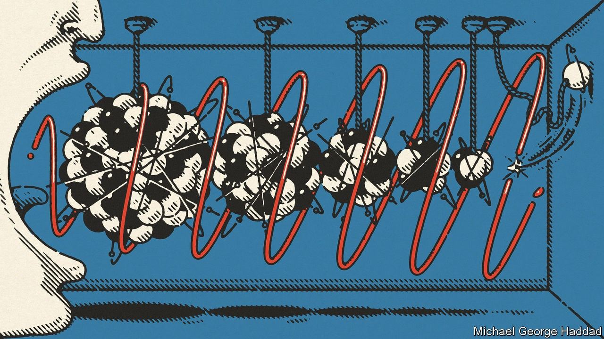

## Physics

# Does sound, like light, have a maximum speed?

> Quite probably, yes

> Oct 17th 2020

WHEN IT COMES to cosmic speed limits, light gets all the attention. Its velocity in a vacuum, a tad below 300m metres per second, is an absolute upper bound on how fast anything in the universe can travel. This value, called “c” by physicists, is somehow baked into the fabric of reality as what is known as a fundamental constant.

The speed of sound, by contrast, has no obvious upper limit of its own. Find the right material, it has always been assumed, and you could make sound travel arbitrarily fast—so long as you did not break the speed of light.

Kostya Trachenko of Queen Mary University of London, however, disputes this—at least when the sound in question is travelling through a solid or a liquid. He proposes that in these circumstances sound, too, has a maximum possible velocity. Intriguingly, he also proposes that this is likewise baked into reality’s fabric by being composed solely of fundamental constants. In a paper just published in Science Advances, he lays out the reasons why.

Sound travels by making things vibrate. In solids and liquids—known collectively to physicists as the condensed phases of matter—molecules are bound to one another tightly. When one moves, its neighbours follow suit, and a wave of sound is thus transmitted. Allowing for differences in properties such as density and interatomic bond strength, Dr Trachenko and his colleagues calculated that the speed of sound in condensed matter obeys a simple trend. The lighter the particle doing the vibrating, the faster it transmits sound. Sound’s highest speed in such matter, they therefore predict, will be through a solid made of the lightest atoms: hydrogen.

Unfortunately hydrogen, which generally exists as a gas, is notoriously difficult to squeeze into a solid form, so measuring the speed of sound within its solid phase is tricky. But Dr Trachenko’s analysis predicts that if and when this is done, the result will be about 36,000 metres per second. That testable prediction of his theory is twice the current measured record for condensed-matter sound waves, which is held by diamond—ie, crystallised carbon.

Part of what makes Dr Trachenko’s work so surprising is the way he arrived at this figure. His formula depends only on four fundamental constants of nature. One is c. The others are the mass of an electron, the mass of a proton and something called the fine-structure constant. This last is a parameter from quantum theory, the branch of physics which describes the universe on its smallest scales.

Dr Trachenko’s insights do not apply to uncondensed matter—namely gases and the state of matter called plasma, in which electrons break free from their parent atoms. In gases, the speed of sound increases with temperature, so the newly described speed limit might be exceeded were a gas hot enough. It would, though, need to be at well over 1m degrees for this to happen, and at that temperature it would have turned to plasma. The acoustic physics of plasma are not well understood, so what the speed of sound would be then is anyone’s guess.

The other place to look for sound travelling at supersonic speeds, as it were, would be a form of matter where the word “condensed” barely begins to describe what is happening. Neutron stars, composed, as their name suggests, almost entirely of those particular subatomic particles, are the densest objects known of outside a black hole. That density might overcome Dr Trachenko’s new limit. But finding out would be the stuff of Nobel prizes.■

Clarification (October 22nd 2020): Several readers have written in to suggest that there was an error in one of last week’s stories, “Max machs”. There wasn’t. But The Economist’s Style Book is to blame for the confusion. We gave the speed of light as “a tad below 300m metres per second”, using the Style Book’s convention of abbreviating “million” to “m”. Some people seem to have read this as “300 metres per second”, perhaps because “m” is also the official scientific abbreviation for “metre”. Apprised of the confusion, we will now spell “millions” out if similar circumstances arise in future.

## URL

https://www.economist.com/science-and-technology/2020/10/17/does-sound-like-light-have-a-maximum-speed
