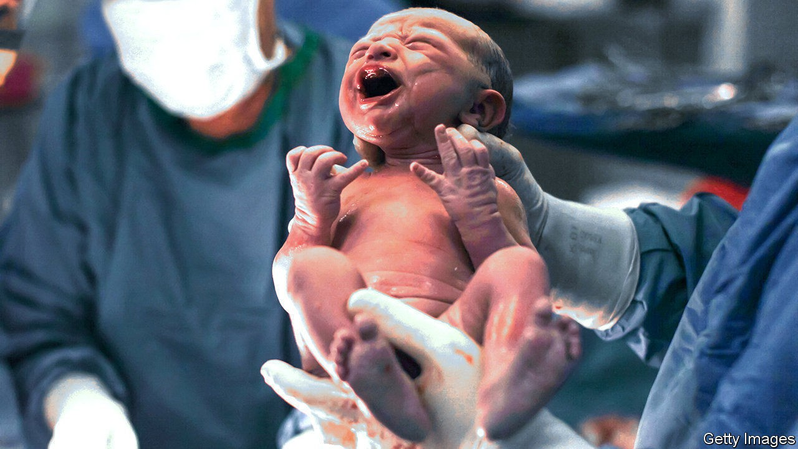

## Healthy childbirth

# How to arm Caesarean babies with the gut bacteria they need

> Into the mouths of babes and sucklings

> Oct 17th 2020

CHILDBIRTH IS MESSY. When a baby comes out, a lot else comes out with it. Some of this material is inevitable, such as the amniotic fluid that presages birth and the placenta which follows it. But a fair bit of faeces is discharged, too.

From an evolutionary perspective, that seems surprising. Exposing newborns to such bacteria-laden excrement looks risky. Yet no mechanism has arisen to stop it happening. Evidence is mounting, moreover, that far from being harmful, this exposure is actually important for the development of the child’s immune system. Interaction with the multitude of microscopic organisms a baby picks up when it is born helps that system to learn friend from foe. Without it, immune disorders like allergies and type-1 diabetes may follow. Components of the gut flora are also involved in digesting certain foodstuffs containing complex carbohydrates, and an unbalance in the relevant microbial mix is implicated in obesity.

Babies born via Caesarean section (ie, surgical removal directly from the womb) do not get such a biological baptism, and their guts are left bacterially bereft as a consequence. That has left doctors wondering how best to give them what they are missing. In the past, researchers have skirted around the central point by swabbing the faces of newborns with bacteria collected from their mothers’ vaginas. To no avail. Willem de Vos and Sture Andersson of the University of Helsinki, have therefore taken the bull by the horns. In a paper just published in Cell they demonstrate that feeding newborns a dose of their mothers’ gut bacteria, in the form of faeces inoculated into breast milk, seems more fruitful.

Dr de Vos and Dr Andersson selected seven mothers-to-be who had elected, for medical reasons, to have their children delivered by Caesarean. They were screened to make sure they had no pathogenic bacteria in their faeces. And none had recently taken antibiotics.

Collectively, these seven women gave birth to five girls and two boys, all healthy. Each of the newborns was syringe-fed a dose of breast milk immediately after birth—a dose that had been inoculated with a few grams of faeces collected three weeks earlier from its mother. None of the babies showed any adverse reactions to this procedure. All then had their faeces analysed regularly during the following weeks. For comparison, the researchers collected faecal samples from 47 other infants, 29 of which had been born normally and 18 by Caesarean section.

Dr de Vos and Dr Andersson found that, though the bacterial populations in the faeces of the seven treated infants initially resembled those found in the faeces of the untreated Caesarean-born infants, this quickly changed. Within three weeks their gut floras had come to resemble the bacterial mix seen in the vaginally born infants. Whether this shift to normality will reduce the chances of children treated in this way developing immune-related maladies later in life remains to be determined by longer and larger studies—which Dr de Vos and Dr Andersson are now planning.■

## URL

https://www.economist.com/science-and-technology/2020/10/17/how-to-arm-caesarean-babies-with-the-gut-bacteria-they-need
