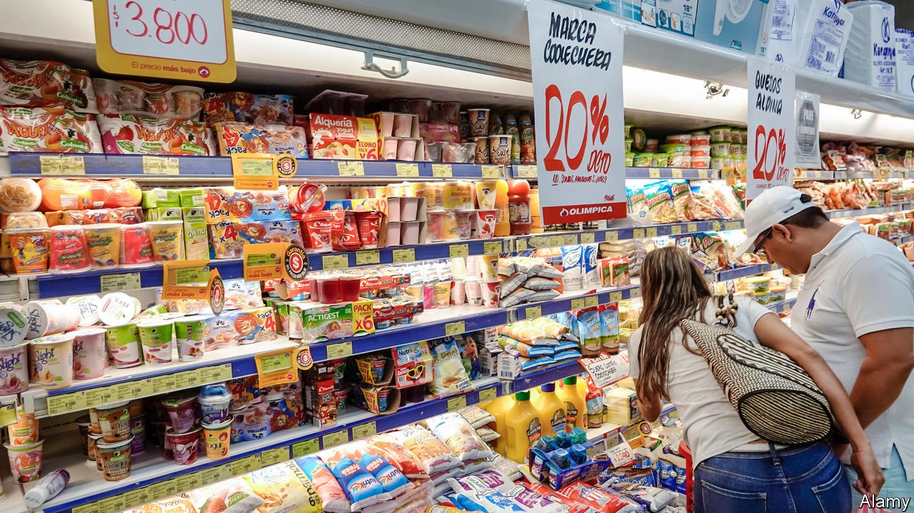
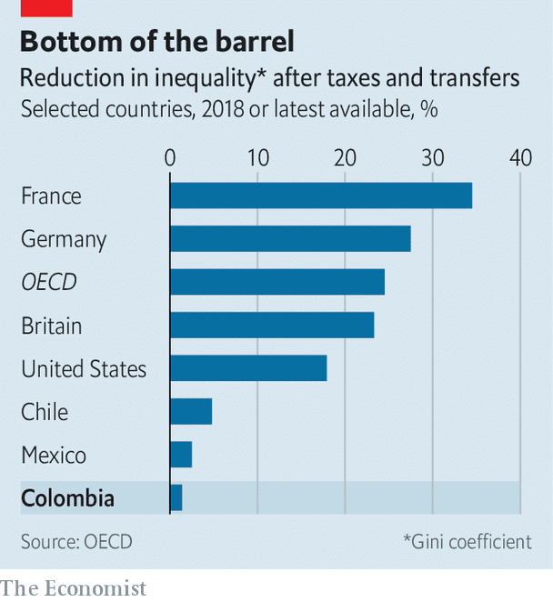

## VAT half-empty

# Colombia tries to fix a messy and unfair tax

> A scheme to help the poor, and raise more revenue for the government

> Oct 17th 2020BOGOTÁ

THE POLITICS of value-added tax (VAT) are complicated in many countries. They are especially tricky in Colombia. The standard VAT rate is 19%, one of the highest in Latin America, but the list of exemptions, which includes milk, eggs and visits to the doctor, is long. This is supposed to help the poor, but the rich benefit more. Salmon, which is imported and therefore expensive, is not taxed. Coffee and soap, which almost all Colombians use, are.

Luis Alberto Rodríguez, who as director of national planning manages public investment, says it has been “our obsession” to correct this unfairness. Income inequality is the highest in the OECD, a club of mostly rich countries. Colombia’s taxes and transfers do less to correct this than in any other member country (see chart). VAT exemptions and reductions are also expensive. They cost the government the equivalent of 6% of GDP, more than in any other Latin American country.

In the early 2000s Alberto Carrasquilla, the finance minister, wanted to give rebates to poor people for the VAT they paid. That would have allowed the government to shorten the list of exemptions, boosting its revenue. But politicians objected, because VAT exemptions are popular. The government lacked the information it needed to compensate the poor.

Now it knows more, and, under Mr Carrasquilla, who is again finance minister, it is making another attempt. The government quietly inserted a VAT compensation scheme into a tax bill that Congress rushed to approve in January to stave off a downgrade of Colombia’s credit rating. Lawmakers did not realise that the measure was in it, says a former government adviser. It has helped poor people cope with the recession caused by the pandemic. It may become a model for other countries. Argentina and Ecuador have tried such schemes before, without success.

Colombia’s government now has two tools that it lacked. The first is a computerised version of Sisbén, a database of mostly low-income families. An upgrade of a registry created in the 1990s, it includes 80% of the population. In Latin America, only Costa Rica has a similar database that covers as high a share. Sisbén informs the universal health-care system and identifies beneficiaries of conditional cash-transfer (CCT) programmes like Families in Action, which helps families that keep children in school. Local authorities provide four-yearly updates to discourage cheaters from registering in more than one place. There are ways to add households between updates. Thanks to Sisbén, Colombia transferred more emergency aid during the pandemic than Peru, which had a bigger aid budget as a share of GDP.

The second tool is digital financial services. In 2012 the government signed a contract with Davivienda, the third-largest bank, to deliver cash transfers through DaviPlata, a free “digital wallet” that allows rural people to open accounts on their smartphones. Other banks and fintech firms followed. Today, 37% of beneficiaries get their money through digital wallets.

Because many Colombians are employed off the books and shop in stores that do not keep accurate records, the government does not know precisely how much poor families spend on VAT. Using surveys, it has estimated that the average outlay is 37,500 pesos ($10) a month. The compensation programme gives that amount back, in two-monthly instalments.

One beneficiary is Irma Rosa Melenje, a single mother, who lives in a slum 40 minutes south of Popayan in south-western Colombia. She lost her job as a saleswoman in her sister’s stationery shop in March, when the government decreed a countrywide lockdown. But she hasn’t had to cut down on meals. VAT compensation plus Families in Action, which gives her 160,000 pesos a month, provides enough cash to buy fruit and veg for her two daughters.

The government had planned to launch the VAT scheme as a trial this year for 300,000 of the poorest families. Because of the lockdown, it increased that to 1m families. By next year the scheme will cover 2m households, many of which do not qualify for a CCT programme, at a cost of $250m, or 0.3% of the budget. A pre-pandemic study found that VAT compensation would reduce the rate of “monetary poverty”, ie, the share of households that earn less than the minimum needed to buy basic goods, by two percentage points from around 30%.

The scheme should be more ambitious, says Roberto Angulo, a development economist. He thinks all the poor, some 6m households, need VAT compensation. The government says it does not yet have the money for that. The OECD suggests that the cash should be delivered more often than every two months.

The government sees the compensation scheme as the first stage of a plan to shore up its finances. Tax revenue amounts to just 14% of GDP; VAT accounts for more than two-fifths of that. The budget deficit is expected to exceed 8% of GDP this year. Now that it can shield the poor, the government hopes to persuade Congress to lengthen the list of VAT-liable products. It will soon propose a tax bill to deal with the effects of the recession. That, supporters say, is a chance to make the country fairer.■

## URL

https://www.economist.com/the-americas/2020/10/17/colombia-tries-to-fix-a-messy-and-unfair-tax
