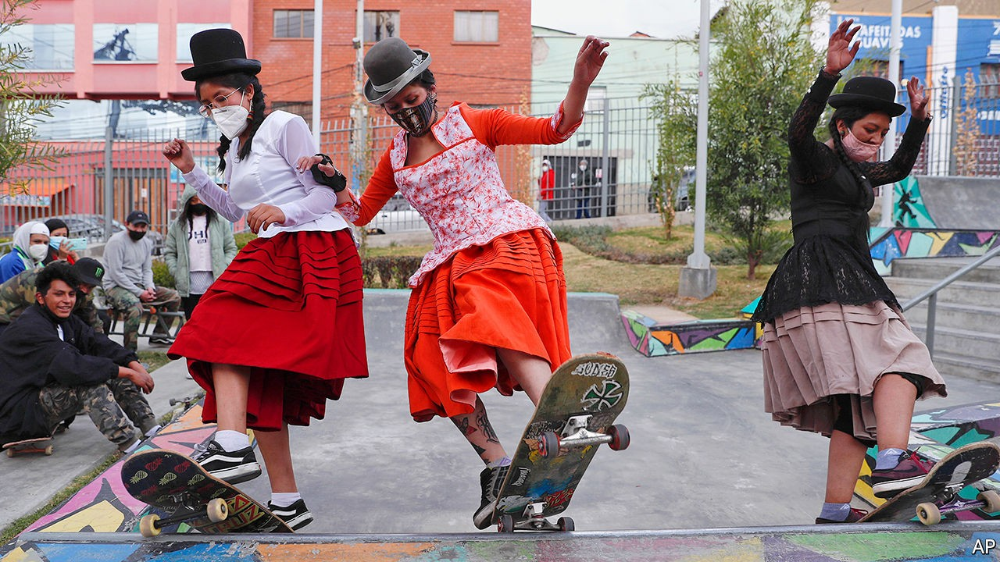

## A consequential contest

# Fresh elections, and perhaps a fresh start, for Bolivia

> A chance to restore peace to a bitterly divided country

> Oct 15th 2020LA PAZ

LAST OCTOBER, after an election marred by accusations of fraud, Joan Fernández joined thousands of Bolivians in protests that toppled the socialist government of Evo Morales. His joy quickly gave way to disillusion. After Mr Morales, who had been seeking a fourth term, resigned on November 10th and fled to Mexico, Jeanine Áñez, a right-wing senator, became president. Her only goal, she said, was to prepare fresh elections. Instead, she became a candidate, used the justice system to go after her rivals and flubbed the government’s response to the pandemic. 

“They used us to get rid of Evo and then they abandoned us,” says Mr Fernández, a college student from Villa Armonía (Harmony Town), a working-class neighbourhood in La Paz, the administrative capital. With new elections scheduled for October 18th, the plaza is decorated with flags from rival political parties, a loudspeaker announces free rabies jabs and families chat as they wait with dogs on leads and cats in blankets. The harmonious scene is deceptive. People are stocking up on food in anticipation of post-election protests, says Mr Fernández, stroking his cocker spaniel.

Bolivia is again bitterly divided between supporters of Mr Morales’s Movement to Socialism (MAS) and backers of Carlos Mesa, a centrist former president who ran last year. Polls predict a runoff, which would be held on November 29th. Mr Mesa would probably win that. But the MAS candidate, Luis Arce, an ex-finance minister, could win in the first round. Either result would give Bolivia a chance to lessen the rancour left by Mr Morales’s 14-year rule and Ms Áñez’s interregnum. “The only thing I want is stability,” says Mr Fernández, who is betting on Mr Arce to deliver it. But the gulf is wide. An economic crisis will make it harder to narrow.

In 2016 Bolivians voted in a referendum to deny Mr Morales, the first indigenous president, the right to run again. He ignored them. On election night last October a pause in the rapid count fuelled suspicions of vote-rigging. An audit by the Organisation of American States (OAS) appeared to confirm an attempt to manipulate the results. Anger surged, and Mr Morales quit.

His backers say he was the victim of a right-wing coup. Several studies, including one by the Centre for Economic and Policy Research, a left-wing think-tank in Washington, DC, have questioned the OAS’s findings. “The OAS should leave our democracy alone,” says Mr Arce. Most of the 36 people killed in protests after the elections were MAS supporters who died at the hands of the police or the army.

Ms Áñez did not bring harmony. Old tweets surfaced, in which she had called indigenous religion “satanic”. Her government urged a pliant attorney-general’s office to open scores of cases against former MAS officials for terrorism and sedition. “People were dragged from their homes for belonging to the MAS,” says Mr Arce, who is being investigated for illicit enrichment. Mr Morales’s chief of staff, charged with terrorism on the basis that she spoke to him by phone, received no health care in pre-trial detention and had a miscarriage.

In May the health minister was arrested on suspicion of corruption. The fight against the pandemic faltered. Ms Áñez “had one eye on the health crisis, and one eye on her campaign”, says Mr Mesa. 

Last month she withdrew, citing the need to unite the anti-MAS vote. That still leaves as a candidate Luis Fernando Camacho, the far-right leader of last year’s protests against Mr Morales. His base is Santa Cruz, Bolivia’s most populous department, which has flirted with secession. Mr Camacho is not promoting unity. Cruceños are exchanging lists on WhatsApp of Mr Mesa’s supporters, who are then ostracised. 

Blaming the pandemic, Ms Áñez postponed the elections twice. That fuelled suspicion among MAS supporters that they would be stolen from them. Mr Arce told The Economist that he would respect the results of “transparent” elections, but has also said that “only fraud” would explain a victory by Mr Mesa. Less than half of Bolivians trust the Supreme Electoral Tribunal, according to a poll by Fundación Jubileo, an NGO linked to the Catholic church. 

The best reason to be hopeful is that those suspicions are groundless. The tribunal has new members. They have removed dead people and non-voters from electoral rolls and developed software and rules for protecting ballots. The pandemic has kept many foreign observers away, but hundreds of Bolivians have been trained to assume their roles. “The international community won’t support anyone who tries to overturn the results,” says an ambassador.

Even if a political crisis is avoided, an economic one awaits. Falling revenue from gas exports had reduced growth before covid-19. GDP is expected to shrink by at least 6% this year. The fiscal deficit, 7% of GDP at the end of 2019, is expected to reach 12% this year. Ms Áñez cancelled construction projects that employed thousands. After the pandemic struck, the MAS-controlled legislature refused to spend a $327m loan from the IMF, which deepened the suffering. Two payments to Bolivians of 500 bolivianos ($72) each “were hardly enough to buy internet”, says an Aymara woman selling colourful sweaters and face masks at the Feria 16 de Julio, a huge market in El Alto, on the plains above La Paz. More pain is in store. The next president will have to reduce spending.

But he will probably inflame Bolivians less than Mr Morales and Ms Áñez did. Some indigenous people regard Mr Mesa, who was driven from office in 2005 by demonstrators demanding nationalisation of gas, as a blander version of the interim president. A graffito in Villa Armonía declares “Mesa = Añez”. Mr Mesa responds that he will fight racism and poverty. “A president should be judged by his actions, not by the colour of his skin,” he says.

Mr Arce seeks to distance himself from the most contentious aspects of the Morales years. He says he will not interfere in investigations against former officials. His ministers will not be veterans of the former government. Unlike Mr Morales, “Luis Arce is not a caudillo,” says Juan Carlos Nuñez, the director of Fundación Jubileo.

The next president is unlikely to command congress as Mr Morales did. That poses a risk. A legislative impasse could further damage the economy and lead to new protests. However, there might be less cronyism and more pragmatism in a government answerable to a legislature in which no party has a majority. It will have to seek consensus, for example, to approve nominees for jobs in such corruption-prone organisations as state-owned firms and the customs agency.

Across the plaza in Villa Armonía, Carla Fernández waits in drizzle for a bus, sporting a Mesa hat. “My mother wears a pollera [traditional skirt] and I’m not rich. But that doesn’t mean I’m going to vote for the MAS,” she says. Her vote will offset that of Joan Fernández, who is no relation. They share a hope that the elections, while they may not bring harmony, will at least forestall another outbreak of violence.■

## URL

https://www.economist.com/the-americas/2020/10/15/fresh-elections-and-perhaps-a-fresh-start-for-bolivia
