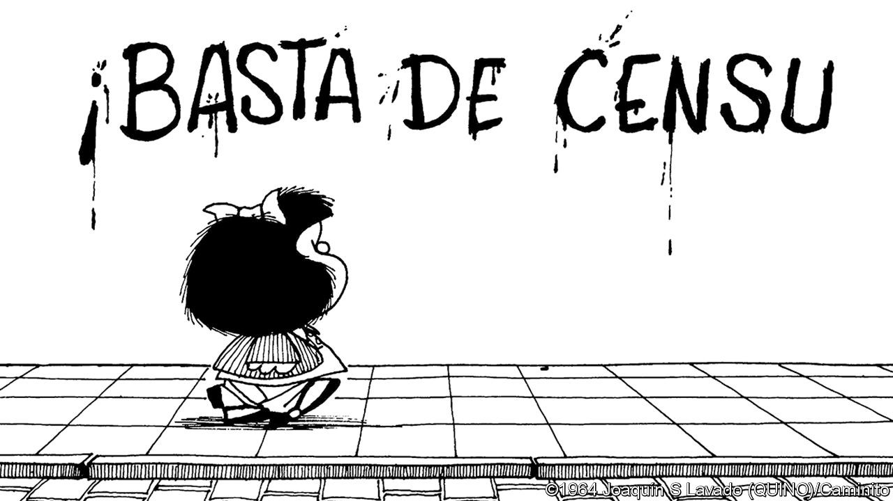

## Bello

# The meaning of Mafalda

> Though her creator has died, her satirical spirit lives on in Latin America

> Oct 15th 2020

THE COMIC strip appeared for just nine years, between 1964 and 1973, in Argentina. Yet Mafalda occupies a unique and lasting place in Latin American popular culture. That showed in the acclaim and affection bestowed on her creator, Joaquín Lavado, who died on September 30th. The strip’s heroine was a dumpy, mop-haired, rebellious six-year-old girl. With the implacable logic of children (but rather more sophistication than most), she interrogated domestic life, her country and the world, and usually found them wanting.

Mafalda was more political than Peanuts and more modern than Asterix, but she enjoyed similar popularity. Mr Lavado, who drew under his childhood nickname of Quino, syndicated the strips across Latin America and southern Europe. They were translated into 26 languages and are still republished today. Mafalda has sold more than 20m books as well as T-shirts, mugs and other memorabilia. The original comic strips reflect a particular milieu and time: middle-class Argentina in the turbulent 1960s and 1970s. But much of Mafalda’s wit is universal and feels fresh even today. She plays a prominent role in a long and continuing tradition of political satire in Latin America.

Umberto Eco, an Italian writer, was an early fan. Mafalda, he wrote, is “an irate heroine who rejects the world as it is…defending her right to continue to be a girl who doesn’t want to take charge of a world spoiled by adults”. She was a born rebel—and she hated soup. In one strip she reads a newspaper recipe for vegetable broth. She wants to put the ingredients on trial for “illicit association”.

She was an early feminist. “The bad thing about the human family is that everyone wants to be the father,” she says. If her mother hadn’t dropped out of university to get married, “you would have a degree in your hands and not a pile of shirts,” she tells her. She drives her father, a mild-mannered office worker whose hobby is potted plants, to distraction with her questions. The space race, the Vietnam war, the Beatles, wash-and-wear suits and inflation—already a growing problem in Argentina—all make an appearance.

Mafalda despairs at the state of the world. After a military coup in Argentina in 1966, she contemplates a graffito stating: “Basta de censu…[ra]”, or “Down with censo ...[rship]”. Quino promptly introduced a new member to her group of friends in the strip, a girl called Libertad (Freedom) who is a dwarf. But Mafalda is no raging leftist. In perhaps her greatest political put-down she asserts that “soup is to childhood what communism is to democracy”. But she is also merciless about the failings of the establishment and the Argentine state. She calls her pet tortoise “Bureaucracy”. When she and her friends decide to play at being the government, she tells her mother, “Don’t worry, we’re going to do absolutely nothing.” She is at bottom a progressive liberal, mistrusting power of all kinds.

It is perhaps this suspicious scorn of the state that made Mafalda such a hit in a region that has too often been misgoverned. In Latin America, as elsewhere, satire has long been a weapon against the abuse of power. Mafalda was part of its golden age. The 1960s and 1970s were “a good time” to be a cartoonist, Quino reflected much later, because “there was so much conflict”.

That still applies. Humour may be more globalised: stand-up comics have appeared in the region and memes on social media relay satire from the United States. But more traditional forms still provoke official wrath, recently that of autocrats of the left. In 2011 Hugo Chávez’s regime in Venezuela shut down a satirical magazine and arrested its staff. The government has repeatedly fined TalCual, a newspaper, for its lampoons. Rafael Correa, when Ecuador’s president, organised a fine against a newspaper over a cartoon. In Nicaragua threats from the regime of Daniel Ortega forced Pedro X. Molina, a cartoonist, to flee in 2018. Mafalda would have sentenced such despots to a lifetime of soup.

## URL

https://www.economist.com/the-americas/2020/10/15/the-meaning-of-mafalda
