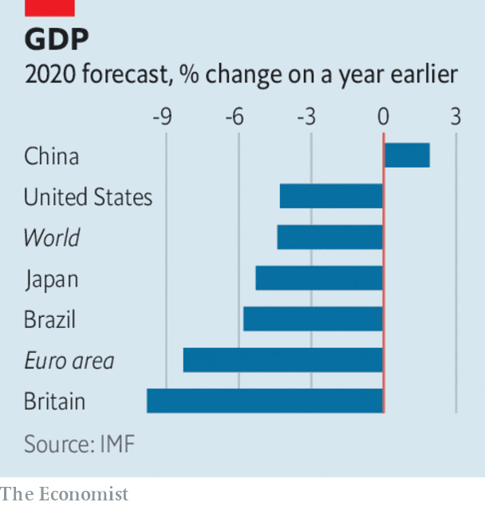

# Business this week

> Oct 17th 2020

The IMF now thinks that the world economy will shrink by 4.4% this year, an improvement on its previous estimate, and grow by 5.2% next year. The fund warned that although the outlook is improving, “prospects have worsened significantly” in some emerging and developing economies, with extreme poverty rising for the first time in two decades. It echoed the World Health Organisation in calling for a multilateral approach to distributing vaccines for covid-19 when they become available. See [article](https://www.economist.com//finance-and-economics/2020/10/17/the-imf-predicts-that-the-world-economy-will-suffer-from-long-covid).

Chinese exports and imports in September rose at the fastest rate in 2020, year on year and in dollar terms. And sales of cars have rebounded in China, registering a quarter of growth for the first time in two years, according to the passenger-car association. Forthcoming data are expected to show that China’s GDP growth rate has returned to pre-covid levels. See [article](https://www.economist.com//finance-and-economics/2020/10/15/can-chinas-reported-growth-be-trusted).

Singapore’s economy shrank by 7% in the third quarter, year on year. But compared with the second quarter it grew by 7.9%, rebounding from a sequential contraction of 13%.

As the initial covid jobs-retention scheme in Britain winds down, and a new, leaner plan is put in place, the outlook for jobseekers is grim. Unemployment claims have doubled since the initial lockdown, to 2.7m. Areas hit hardest by the new restrictions tend to have higher unemployment rates. Liverpool, which is under the severest controls, already has a claimant count of 9%. 

The Democrats in America’s House of Representatives, rejected an improved offer on stimulus spending from the White House that would have provided $1.8trn for various measures. Democrats have passed their own $2.2trn bill. A deal seems out of reach; most Republicans in Congress want the legislation to be capped at around $1trn.

America’s big banks announced their earnings for the third quarter. JPMorgan Chase reported a surprise bump in net profit compared with the same quarter last year, to $9.4bn. Citigroup’s net income of $3.2bn was better than expected, as was Bank of America’s $4.9bn. Surging revenues drove an almost doubling of profit at Goldman Sachs, to $3.6bn. Most banks have benefited from trading in equities. See [article](https://www.economist.com//finance-and-economics/2020/10/15/wall-street-says-it-is-braced-for-losses-now-what).

BlackRock is also having a good pandemic. Revenue surged in the third quarter at the world’s biggest fund manager, generating a sharp rise in profit. The company’s assets under management leapt to a record $7.8trn.

The London Stock Exchange Group agreed to sell Milan’s Borsa Italiana, which it took over in 2007, to Euronext. The LSE hopes the divestment will smooth the thorny regulatory path of its $27bn acquisition of Refinitiv, a data and trading company, which was announced in August 2019.

Alex Cruz was ousted as chief executive of British Airways, to be replaced by Sean Doyle, the boss of Aer Lingus. Mr Doyle spent 20 years in management roles at BA before moving to the Irish airline. The shake-up comes a month after Luis Gallego took charge at IAG, the parent company of both BA and Aer Lingus. Mr Cruz’s tenure at BA was marked by cutbacks that soured relations with workers, especially during the pandemic.

Passenger revenue slumped by 83% at Delta Air Lines for the three months ending September 30th, year on year. Like BA and others it has been hit particularly hard by the loss of lucrative business travel. United Airlines reported a bigger-than-expected quarterly loss of $1.8bn.

Scientists created a material that can conduct electricity with perfect efficiency at ambient temperatures, around 15°C. Superconductors that are available today, used in medical scanners and maglev trains, need to be cooled to hundreds of degrees below zero and are thus expensive to build and operate. The downside of the new substance, a combination of sulphur, carbon and hydrogen, is that it needs to be compressed to 267 gigapascals, about a million times the pressure of a typical car tyre. 

AMC, the world’s biggest chain of cinemas, which also owns the Odeon and UCI brands, warned that it was running out of cash. Attendance is down by 85% at its American venues compared with a year ago because of social distancing. Cinemas remain shut in some cities, notably New York. The industry has also taken a hit from the delayed release of blockbuster films, which may be postponed again after the dismal performance of “Tenet”, which cost $205m to produce but has made just $50m over seven weeks in North America.

With cinemas facing a daunting future, Disney reorganised its media and entertainment business to give priority to streaming, noting the “rapid success” of its Disney+ service. “There is a seismic shift happening” in how content is viewed, said Bob Chapek, Disney’s chief executive.

## URL

https://www.economist.com/the-world-this-week/2020/10/17/business-this-week
