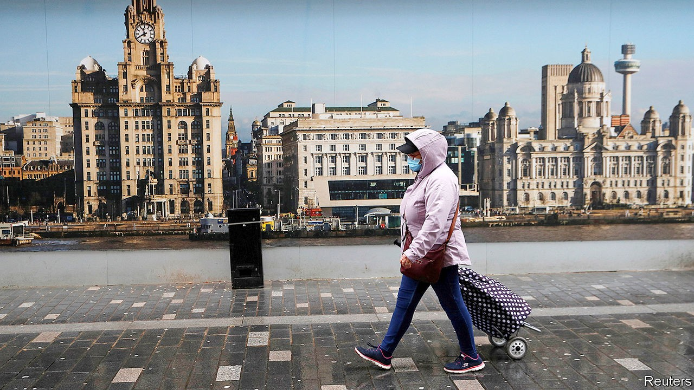
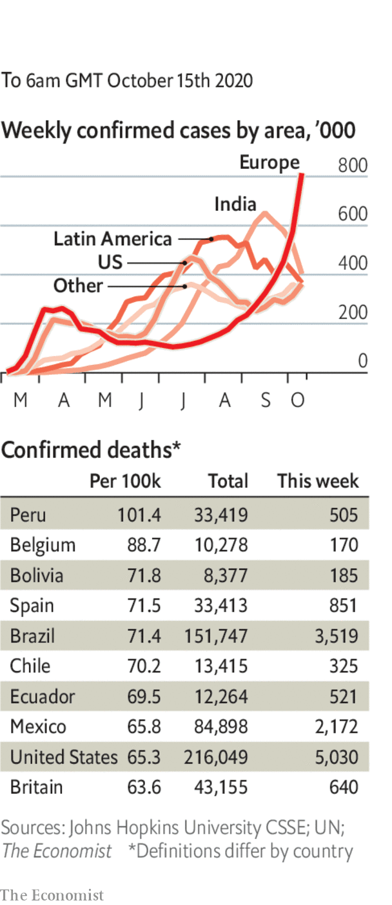

# Politics this week

> Oct 15th 2020

More European countries reapplied tight restrictions on social life to counter a rise in covid-19 infections. Emmanuel Macron imposed a 9pm curfew on Paris and eight other French cities, saying that this was not the time for conviviality. A new three-tiered system for local restrictions was introduced in England, which caused outrage in the Liverpool region, the first area to be put in the highest tier. London was due to be placed in the second-highest tier. Pressure increased on the government to impose a nationwide “circuit-breaker” strict lockdown of two weeks or more. Many fear that would crush the nascent economic recovery. See [article](https://www.economist.com//node/21792906).

Germany announced a curfew on visiting bars and restaurants in hotspots. “We are already in a phase of exponential growth,” said Angela Merkel, the chancellor. Daily cases have risen above 6,000 for the first time since April.

A ceasefire went into effect in Nagorno-Karabakh, a disputed enclave inside Azerbaijan that is run by ethnic Armenians. There were reports of some violations.

A state of emergency was declared in Thailand,allowing police to crack down on protesters calling for a new constitution, fresh elections and a more circumscribed role for the king. The decree said that the demonstrators had tried to obstruct the royal motorcade; they had made gestures at a car carrying the queen. See [article](https://www.economist.com//briefing/2020/10/17/thailands-king-seeks-to-bring-back-absolute-monarchy).

Donald Trump said that all American forces would leave Afghanistan by Christmas. His national security adviser had said the number of US troops would fall to 2,500 in early 2021. Taliban fighters besieged Lashkar Gah, the capital of Helmand province.

Kyrgyzstan’s president, Sooronbay Jeyenbekov, resigned after ten days of political turmoil following a disputed election. Supporters of the new prime minister, Sadyr Japarov, a convicted kidnapper, urged the Speaker of parliament to resign so that Mr Japarov could become acting president. Liberal politicians are warning of a descent into mob rule. See [article](https://www.economist.com//node/21792893).

Anwar Ibrahim, the leader of the opposition in Malaysia, reiterated his claim to have enough support in parliament to form a government. The king, who appoints prime ministers, said Mr Anwar had still not supplied him with a list of names.

China’s leader, Xi Jinping, visited Shenzhen, a city bordering Hong Kong, to mark its 40th anniversary as a “special economic zone”. He said the world had entered a “period of turbulent change” and urged greater reliance on the domestic market.

Israel approved a plan to admit 2,000 Ethiopian Jews. Thousands more remain in Ethiopia, most of them waiting, some for years, to emigrate. See [article](https://www.economist.com//node/21792893).

Thousands protested in Nigeria after the killing of a young man by a police unit often accused of such things. The government said it would disband the Special Anti-Robbery Squad.

Donald Trump’s doctor said that the president had tested negative for covid-19 and is “not infectious”, a week after he left hospital having contracted the disease. Mr Trump returned to the campaign trail with a rally in Florida. 

The second debate between America’s presidential candidates was cancelled. The commission that oversees such events wanted a virtual one, given the risk of covid-19. Mr Trump refused to take part.

Amy Coney Barrett, Mr Trump’s choice to replace Ruth Bader Ginsburg on the Supreme Court, gave an assured performance when she was questioned by the Senate Judiciary Committee at her confirmation hearing. It was a world away from the ruckus of Brett Kavanaugh’s hearing in 2018. See [article](https://www.economist.com//node/21792865).

Eight countries, including America, Britain and Japan, became the first signatories to the Artemis accords, an initiative by NASA to establish principles for the sustainable and peaceful exploration of the Moon. Those countries can participate in the Artemis programme, which will send two astronauts, one of them a woman, to the Moon in 2024.

A Colombian court freed Álvaro Uribe, a conservative former president who is the political patron of the current one, Iván Duque, from house arrest. The country’s Supreme Court had ordered his arrest during an investigation into allegations that he had tampered with witnesses in a case against a left-wing politician.

Some 100,000 Venezuelans who returned to their country during the pandemic have been quarantined in unsafe and abusive conditions, according to an NGO report. Quarantine centres lack medical care, food and water. Because covid-19 tests are often delayed, many inmates must remain quarantined longer than the standard 14 days.

Holocaust denial is to be banned on Facebook.

A jury in Slovakia endured an eight-hour speech by a far-right politician, who was on trial for promoting neo- Nazism after handing out cheques for €1,488. The numbers 14 and 88 are code; 88 stands for “Heil Hitler”, as “h” is the eighth letter of the alphabet. A coincidence, he claimed. He was found guilty.

Iran shattered its single-day record for cases and deaths. The government said masks must be worn outdoors in Tehran. It had previously shut schools, mosques and other public spaces. But contact-tracing has been a challenge and many Iranians are ignoring the state’s restrictions.

After the discovery of a dozen coronavirus cases in the Chinese port of Qingdao, city authorities launched an effort to test all of its 9m people in five days. There had been no reports of domestically transmitted infections since early August.

The Czech Republic announced that schools, restaurants and bars would shut for three weeks. A national partial lockdown was introduced in the Netherlands.

The number of daily cases in India started to climb again. They had fallen to 55,000, the lowest figure since August.

## URL

https://www.economist.com/the-world-this-week/2020/10/15/politics-this-week
