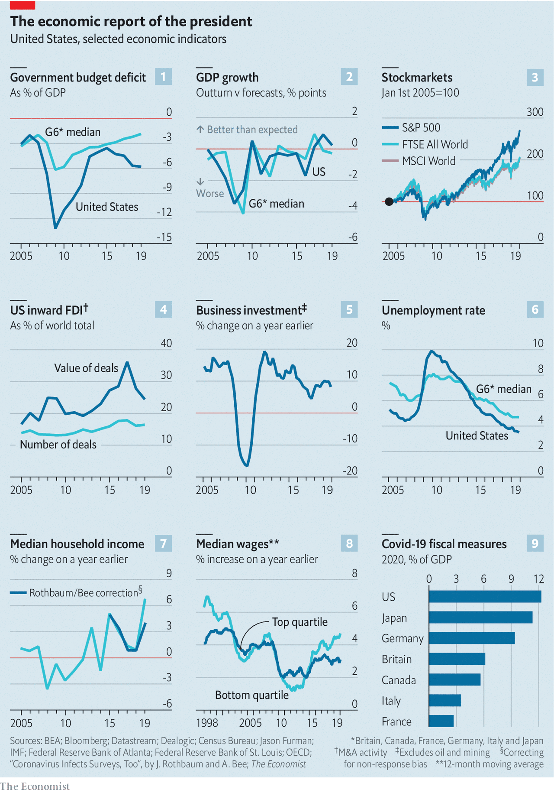

## Watered with liberal tears

# How the American economy did under Donald Trump

> An international comparison

> Oct 14th 2020

IN HIS NEW book Casey Mulligan offers an intriguing explanation for why President Donald Trump makes outlandish economic claims. Mr Trump knows he is hyperbolising when he says that America has enjoyed “the greatest economy in the history of the world” on his watch, suggests Mr Mulligan, who was until recently the chief economist on the president’s Council of Economic Advisers. It is a “strategy for getting the press to cover a new fact, which is to exaggerate it so that the press might enjoy correcting him and unwittingly disseminate the intended finding”. Journalists’ dislike for Mr Trump, according to Mr Mulligan, blinds them to many of the administration’s genuine economic successes. He may have a point.

Assessing leaders’ economic records is fraught with difficulty. Presidents typically get credit when the economy is doing well and blame when it does badly—but short-term economic outcomes are usually more influenced by central banks, demography and what is happening in the rest of the world, among other factors. Even today, political scientists continue to argue over whether the economy in the 20th century did better under Democratic or Republican administrations. All this is of little use to the American public, whose vote for a president must be based, in part, on a real-time assessment of economic competence.

Mr Trump came to power with unrealistic promises to create 25m jobs and supercharge economic growth, and to that end cut taxes and boosted spending, widening the fiscal deficit (see chart 1). Economists will continue to weigh up the specific costs and benefits of those policies. A true evaluation will take some time. At present, however, it is possible to assess whether the American economy overall did better or worse under Mr Trump. That involves comparing actual American economic performance, on the one hand, with what an impartial spectator could reasonably have expected, on the other. To that end The Economist has gathered a range of economic data, from business investment to wage growth, wherever possible comparing American economic performance to that of other rich countries.

The bulk of the analysis covers the period from 2017, when Mr Trump took office, to the end of 2019. We stop in 2019 in part because some data are released only annually, and in part because the pandemic has turned economies across the world upside down. Our conclusion is that, in 2017-19, the American economy performed marginally better than expected. (That conclusion remains if we follow the practice of some political economists, who argue that the influence of presidents on the economy can be discerned only after a year in office, and limit our analysis to 2018-19.)

Take gross domestic product (GDP), a measure of output which is the most common yardstick of economic performance. GDP growth was somewhat faster in 2017-19 than it was in either Barack Obama’s first or second term, according to official data. America also did well relative to other countries. The world economy peaked in 2017. In 2018 it slowed but America accelerated. In 2019 America slowed too, but stayed ahead of others.

Another way to look at this question is to assess whether America in 2017-19 exceeded or fell short of economists’ expectations (see chart 2). In October 2012 the IMF forecast that in the subsequent four years (those of Mr Obama’s second term), the American economy would grow by an annual average of 3%. In fact that proved to be too optimistic; it actually grew by closer to 2% a year. But the IMF was too pessimistic in its projections for 2017-19, released shortly before the election of 2016. In those years America outperformed the forecasts.

But if the American economy did better than expected in some respects, it disappointed in others. Take the corporate sector, which Mr Trump helped with lighter taxes. Corporation-tax cuts did increase post-tax earnings, one reason why the American stockmarket has done relatively well since Mr Trump came to power (see chart 3). America has also become a more favoured destination for foreign direct investment (see chart 4). But there is little evidence of the promised business-investment boom (see chart 5).

America’s labour-market performance is similarly nuanced. Though Mr Trump particularly likes to boast about monthly employment figures, it is hard to make the case that in 2017-19 the jobs machine was whirring. Jobs growth was slower than it had been during Mr Obama’s second term. In 2009-16 America’s unemployment rate fell relative to the average for other G7 economies (see chart 6). Under Mr Trump unemployment did fall to the lowest since the 1960s, but this was not internationally exceptional. America’s improvement relative to employment in other countries stopped under Mr Trump.

The lot of working-class Americans, however, definitely improved in 2017-19. Comparing household incomes between countries is difficult, certainly for recent years. But though there is some dispute about the reliability of the data gathered in 2020, where the pandemic made it difficult for researchers to conduct surveys, there is clear evidence of an acceleration in the growth of America’s median household income from 2017 onwards (see chart 7). A tight labour market also helped raise the wage growth of the lowest-paid Americans, relative to others, to a degree not seen since Bill Clinton was president (see chart 8).

And what of the economy in 2020? Mr Trump’s loose fiscal policy before the pandemic left America with much higher debt going into the crisis. On top of that splurge, this year America has implemented the world’s largest fiscal package (see chart 9), posting stimulus cheques worth up to $1,200 per person and temporarily bumping up unemployment-insurance payments by $600 a week. It is possible, though unlikely, that Congress will pass even more stimulus before the election. Even without another package, however, and even though it is enduring a deep recession, America will probably be the best-performing G7 economy in 2020—perhaps by some margin. Just before the pandemic, the American economy looked slightly stronger than other rich countries. Before long, the gap may be more impressive. ■

Dig deeper:Read the [best of our 2020 campaign coverage](https://www.economist.com//us-election-2020) and explore our [election forecasts](https://www.economist.com/https://projects.economist.com/us-2020-forecast/president), then sign up for Checks and Balance, our [weekly newsletter](https://www.economist.com//checksandbalance/) and [podcast](https://www.economist.com/https://play.acast.com/podcasts/2020/01/24/checks-and-balance-our-new-weekly-podcast-on-american-politics) on American politics.

## URL

https://www.economist.com/united-states/2020/10/14/how-the-american-economy-did-under-donald-trump
