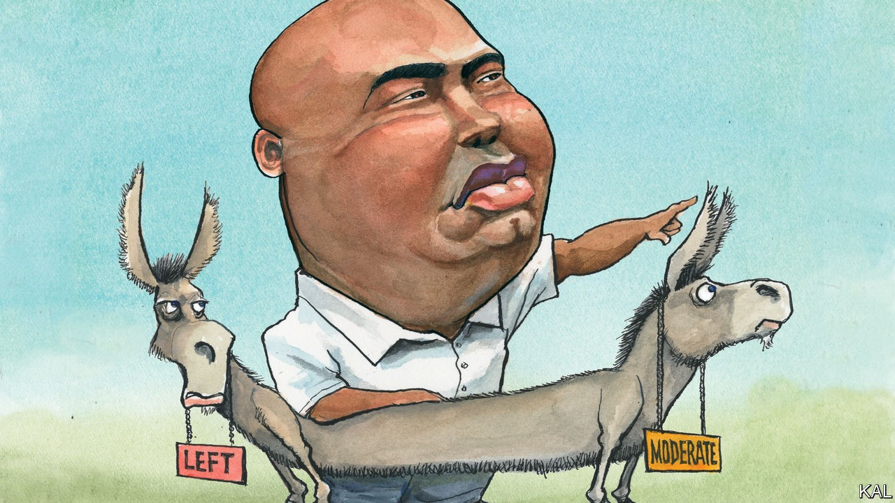

## Lexington

# The audacity of Jaime Harrison

> The Democrats’ latest crush is a former lobbyist scrapping for conservative votes in South Carolina

> Oct 17th 2020

JAIME HARRISON says his earliest political memories are of discussing the evening news with his grandfather in the rented condo in impoverished Orangeburg County, South Carolina, where his grandparents raised him. “That’s where it started, I would pepper him with questions about the president and I became very interested in politics,” recalled the amiable Democratic Senate candidate this week, after a long day on the virtual trail.

One thing led to another. Mr Harrison, who was born to a 16-year-old single mother, won a full scholarship to Yale. He then proceeded to law school and a job on the Hill with an early mentor, Jim Clyburn, South Carolina’s first black congressman since the Reconstruction era. Yet his gritty approach to politics, including a willingness to compromise informed by his knowledge of the obstacles in the way of progress, still recalls Orangeburg’s red-dirt roads and the grim stories—of cowering from Klan rallies and long walks to school—his grandparents told him. “I think I got my pragmatism from them,” he said. “I know I’m not going to get everything I want. But anything gained is positive movement.”

This hard-nosed view is antithetical to the activist left that was until recently said to have captured Mr Harrison’s party. Indeed he opposes what many of its members consider essential: including Medicare-for-All, packing the Supreme Court and scrapping the Senate filibuster. Yet he, not Alexandria Ocasio-Cortez, is currently the Democrats’ posterchild. The 44-year-old first-time candidate raised a record-smashing $57m in the past three months and has turned his improbable tilt at Lindsey Graham, a Republican incumbent running for a fourth term, into a nail-biter. Recent polls point to a tied race. If Mr Harrison wins—an outcome this newspaper’s forecasters consider unlikely but highly possible—it would be the second-most-momentous result of the night.

There is an interesting symmetry to this. When black South Carolinians resuscitated Joe Biden’s candidacy eight months ago (following Mr Clyburn’s dramatic endorsement of the former vice-president on the eve of the state’s primary) they not only gave him a badly needed win. They also framed the argument for his unexciting but unobjectionable candidacy. Black voters—everywhere, but in the South especially—tend to vote for the sympathetic candidate they consider likeliest to win sufficiently broad support from whites to get elected. And with President Donald Trump on the ticket, and South Carolina’s electability specialists as their guide, this thinking suddenly made a lot of sense to Democrats outside the pampered coteries of Iowa and New Hampshire.

Mr Biden proceeded to win almost half the votes in the remaining primaries. Where Mr Obama was the first black president, his deputy might therefore be considered the first presidential nominee to have been expressly selected by black voters. Mr Harrison, a fresher face than Mr Biden but with much the same politics, is another sign of the pre-eminence of their approach.

Like Mr Biden, he emphasises unity over partisanship, practical solutions over big ideas and an old-fashioned regard for institutions as a fount of both of the above. Having been a shoo-in for the Democratic ticket—as a well-connected former chairman of the state party—Mr Harrison has been running campaign advertisements for a year, most of which focus on his inspiring personal story. “There’s a general fatigue with chaos and division,” he says.

His policy proposals are similarly soothing. He speaks of expanding rural broadband and making Medicaid available to more poor people, which most South Carolinians support. He also cites the importance of such unglamorous policies to explain his attachment to the filibuster. “Politics swings like a pendulum,” he says. “But certain government programmes are necessary for the most vulnerable. How would we protect those programmes from those who would gut or eliminate them without the filibuster?”

Mr Biden’s pragmatic pitch is based on a calculation, so far amply justified, that he can build a bigger coalition by rallying the country in opposition to Mr Trump than by revving up the left. Mr Harrison had no alternative to such moderation. No Democrat has been elected to the Senate from South Carolina for over two decades, because the state does not have nearly enough African-Americans and white moderates to make a majority. His electoral hopes therefore hinge on his ability to recruit a slither of Trump-voting conservatives who have had enough of Mr Graham.

This looks possible because the veteran senator is less popular in South Carolina than the president. A sometime moderate, who warned that there were not enough “angry white guys” in America to sustain an unreformed Republican Party, Mr Graham has latterly tried to fix that problem by adding himself to their ranks. Where once he pushed immigration reform, he now indulges in racist dog-whistling, while fulminating against Democrats and toadying to a president he formerly dismissed as a “race-baiting xenophobic bigot”. It has been a humiliating performance by a once widely admired politician. Opinion polls suggest most South Carolinians consider him dishonest.

Conventional wisdom suggests the Democrats’ current unity would not last much beyond a Biden victory. Yet the promise of Mr Harrison and other moderate Democrats—running strongly in Arizona, Montana and elsewhere—suggests that might underrate the dynamism of the moment. A big Democratic win would swell Congress with such figures; the centre-left would be the decisive vote on most new legislation. It is also just about possible to imagine Democrats learning the right lessons from their predicted success.

Even against opponents of Mr Trump’s and Mr Graham’s calibre, the quirks of the electoral system make it hard to win power from the left unless with Mr Biden’s and Mr Harrison’s expansive, pragmatic message. Instead of betting on their chances of changing the system, Democrats should stick with that message.■

Dig deeper:Read the [best of our 2020 campaign coverage](https://www.economist.com//us-election-2020) and explore our [election forecasts](https://www.economist.com/https://projects.economist.com/us-2020-forecast/president), then sign up for Checks and Balance, our [weekly newsletter](https://www.economist.com//checksandbalance/) and [podcast](https://www.economist.com/https://play.acast.com/podcasts/2020/01/24/checks-and-balance-our-new-weekly-podcast-on-american-politics) on American politics.

## URL

https://www.economist.com/united-states/2020/10/17/the-audacity-of-jaime-harrison
