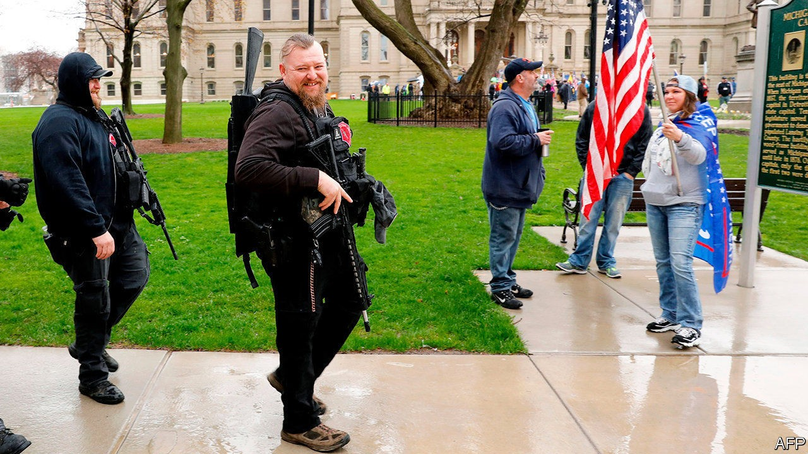

## Making the world glow

# The plot against Gretchen Whitmer

> The threat from right-wing terror groups is more serious than for decades

> Oct 17th 2020CHICAGO

FEDERAL AGENTS grow twitchy when they hear a would-be terrorist talk of using a “chemistry set”. On September 12th Barry Croft, while meeting several other men in a rural redoubt in Michigan, referred to his set as the men tested an improvised explosive device. He taped coins around it, to see how the blast would send shrapnel flying into red human silhouettes painted on nearby boards. Neighbours later recalled hearing a bomb explode, but they shrugged it off—it was routine to hear heavy weaponry fired there.

The weekend was busy. The apparent leader, Adam Fox, told 11 others of a plan to kidnap Michigan’s Democratic governor, Gretchen Whitmer, whose holiday home was nearby. He called her a “tyrant” and predicted fellow militiamen all over America would rise and topple other leaders, when “everybody takes their tyrants”. That night the armed men, in three cars, drove to her lakeside house to do surveillance. They stopped en route to inspect and photograph a bridge they planned to blow up.

For months they had debated how to attack Mrs Whitmer. Pose as a food delivery service? Grab her from a car? Use a Taser? Some talked of sending “cakes” or “cupcakes”, a euphemism for a bombing campaign. In June Mr Fox had proposed leading “200 men” to storm the state capitol in Lansing. Some talked of attacking police and trying to spark civil war. The plot, he insisted, must precede the elections in November. They would try her for “treason”, perhaps in Wisconsin, over her efforts to contain coronavirus. Mr Fox was furious that his gym was shut. What would he achieve? He explained in July: “I just wanna make the world glow, dude…everything’s gonna have to be annihilated, man.”

The anti-government plotters did more than just talk, but they inflicted no harm. Thankfully, they were riddled with FBI informants and spied on for months. On October 8th agents arrested 13 men and charged them over the kidnap scheme or the threats to the capitol. One defendant later added that Ralph Northam of Virginia, another Democratic governor, was also sized up for kidnapping. Among those arrested were members of a Michigan militia, the Wolverine Watchmen.

Their plot reflects a growing threat from right-wing domestic terror groups. Daryl Johnson, an analyst of far-right extremism, says what “really stands out” is how many defendants collaborated and how long the plot ran on. It looked unusually sophisticated. When he was at the Department of Homeland Security (DHS), more spontaneous plots, or ones involving two or three men, were the norm. Each year, he says, extremist activity creeps up to new heights.

Christopher Wray, the head of the FBI, testified last month to Congress that domestic violent extremists, notably white supremacists, are the most persistent, lethal threat facing America. The DHS said the same last week in an annual report on terrorism. It called 2019, when 48 people were killed in 16 attacks, the “most lethal year for domestic violent extremism in the United States since the Oklahoma City bombing in 1995”.

“We have never seen so much as this,” agrees Kathleen Belew, a historian of extremism. She counts “many reasons for alarm”, tracking an upsurge of activity because of anger over states’ coronavirus lockdowns, worries over unemployment, protests against racial justice and policing, bitter party-political confrontation, and the long-term (though largely neglected) impact of many veterans coming home from overseas wars. Another analyst calls it a “perfect storm of paranoia”.

Donald Trump is also a cause. He boosted anti-government protests in April by tweeting “liberate Michigan”, for example, then praised as “good people” armed protesters who entered the state capitol. Rather than urging calm, he deflects invitations to condemn right-wing extremist groups. That thrills members of ragtag outfits like the Proud Boys, the Oath Keepers and the Three Percenters. “There’s a surfeit of tensions right now, and the president is supercharging this,” says Ms Belew.

Not all militias are terror groups in the making. Amy Cooter of Vanderbilt University estimates there are “two dozen real militias in Michigan, maybe 2,000 people”, plus many more sympathisers and hangers-on, notably in the isolated Upper Peninsula of the state. Racial division, fondness for guns, large rural spaces and economic decline may all help explain why Michigan has more such groups than many states. But 90% of these are what she calls “constitutionalist” outfits, where middle-aged men make a hobby of little more than wearing uniforms, shooting targets and moaning about big government.

It is a small minority of “millenarian” and conspiracy-minded groups that are most extreme. She says these are prone to violence, for example when there are protests, as there could be if forthcoming elections are disputed. Her most pressing worry is that moderate militia groups may be drawn to align closer with extreme ones, as when they “bump elbows with overt neo-Nazis” or white supremacists at protests over the handling of coronavirus. In previous research in Michigan she saw how apolitical militias shunned racist groups. She is alarmed by signs that this is ending, as different outfits have grown closer in the past six months.

That suggests no one should expect tension to ease soon. Cynthia Miller-Idriss, of American University, has tracked an increase in hate groups in America at least since Barack Obama was elected in 2008. This is not a phenomenon only of the past four years. She also sees growing readiness to support the use of at least some violence to achieve a political goal. Pollsters say public backing for that (on both the left and right) has ticked up from 8%, three years ago to between 14% and 18% today. “That fringe is growing and is mobilised,” she says, pointing to a global trend of more terrorist acts by right-wing groups.

In America, “everyone I know is worried about the potential for spontaneous violence”, she says. Sales of firearms and munitions this year have broken records—by one estimate 16.7m firearms had been bought by September, already more than in any (full) year on record. Sales in September were 66% higher than a year earlier. Supplies of ammunition in some markets have run so short that recreational shooters are going without. That alone could stir fury in hunting-mad rural Michigan. All told, 5m Americans are thought to have bought a gun for the first time this year. ■

Dig deeper:Read the [best of our 2020 campaign coverage](https://www.economist.com//us-election-2020) and explore our [election forecasts](https://www.economist.com/https://projects.economist.com/us-2020-forecast/president), then sign up for Checks and Balance, our [weekly newsletter](https://www.economist.com//checksandbalance/) and [podcast](https://www.economist.com/https://play.acast.com/podcasts/2020/01/24/checks-and-balance-our-new-weekly-podcast-on-american-politics) on American politics.

## URL

https://www.economist.com/united-states/2020/10/17/the-plot-against-gretchen-whitmer
