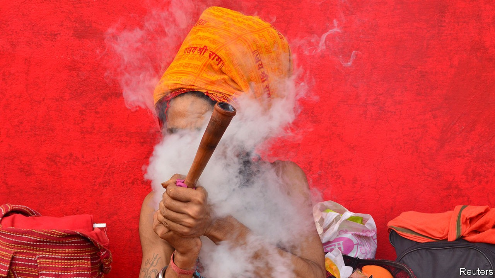

## Weed killer

# Indian stoners face a moral crusade

> Puritans fret that cannabis-crazed actors are corrupting the nation’s youth

> Oct 22nd 2020DELHI

ONE MIGHT expect India to be at peace with marijuana. Before time itself, the god Shiva is supposed to have discovered the stuff. He sits high in a mythical Himalayan abode, eating gobs of it while pondering the mysteries of the universe; so do religious mendicants who emulate him today. Victorian India exported ganja to Jamaica with indentured labourers in the first half of the 19th century, long before the West surrendered to its mellow charms. But this monsoon season, moralists have raised the alarm: cannabis-crazed Bollywood stars are corrupting India’s youth.

The Indian media went to war with the killer weed in September while the Narcotics Control Bureau (NCB) and other law-enforcement agencies rolled out a series of pretexts to hold Rhea Chakraborty, a Bollywood starlet, in jail for a month—ultimately for having procured marijuana for her boyfriend, a better-known actor who committed suicide in June. In poring over Ms Chakraborty’s private communications, investigators connected her to other dissolute young actors, including the A-lister Deepika Padukone, who discussed “doob” over WhatsApp. “The ground is ready for a Bollywood clean-up,” thunders a journalist friendly to the government, connecting the film industry’s supposed “drug obsession” with ills as diverse as “smuggling, sex rackets, terrorism [and] killing wildlife”.

The notion that Indians ought to be outraged by this is curious. The oldest literary references to cannabis use are from the Hindu Vedas, which spoke glowingly of hemp’s high 3,000 years ago. Kiosks around the country sell squashy boluses of bhang, a mildly psychoactive paste made from its leaves, for two rupees apiece (less than three cents). In 2018 ABCD, a Germanmarketing firm, estimated that Delhi and Mumbai are among the top six cannabis-consuming cities in the world, together burning through more than 70 tonnes each year. Even respectable Hindu families share tumblers of a bhang-based drink to celebrate the spring festival of Holi, as do teetotal Sufi Muslims.

When America declared its ill-starred war on drugs in the 1970s, Bollywood tried joining the cause. A Hindi film in 1971 that gave Indian stoners their theme song, “Dum Maro Dum” (“Take Another Hit”), warned that madness and death lay the way of the doobie. By 1985 international pressure bent India into compliance with a series of American-driven, UN-backed anti-drug conventions, which classified cannabis alongside drugs like heroin—albeit leaving a quirky loophole for bhang.

India’s history with cannabis is unique in keeping an unbroken connection to the stuff, including in centuries when it was forgotten by Europeans. As colonists arrived, they were sceptical but intrigued. In 1890 the British undertook an exhaustive study, resulting in a seven-volume “Indian Hemp Drugs Commission Report”. Its conclusions presaged the contemporary post-post-hippie consensus, which has led to waves of medical research and decriminalisation in North America and Europe: “The moderate use of hemp drugs is practically attended by no evil results at all.” ■

## URL

https://www.economist.com/asia/2020/10/22/indian-stoners-face-a-moral-crusade
