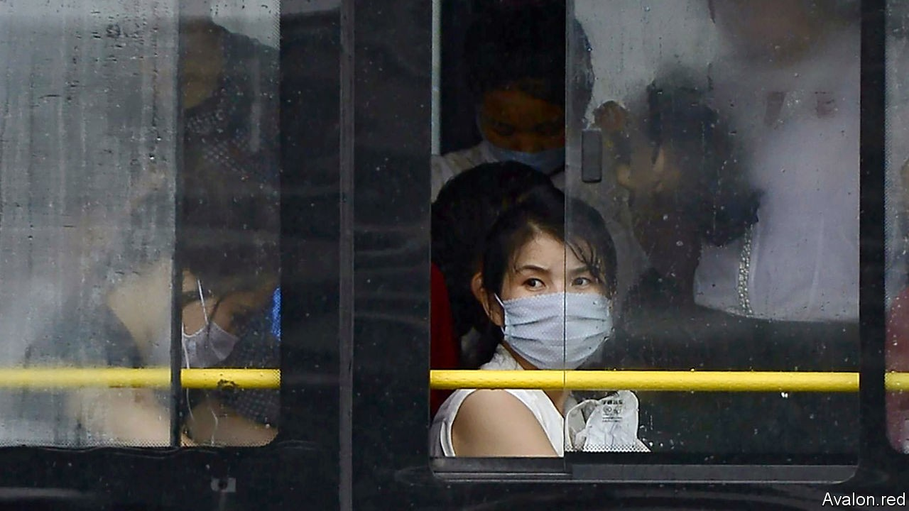

## Hermit kingdom

# North Korea is lonelier than ever

> With borders shut and diplomats confined, the only things improving are the missiles

> Oct 24th 2020SEOUL

IT WAS SATURDAY morning on the Korean peninsula and Friday evening in America when pundits and policymakers around the world tuned into North Korean state television. They had hoped to watch a military parade in Pyongyang, the capital, to mark the 75th anniversary of the ruling party’s creation on October 10th. But instead of the expected display of military hardware, they were treated to patriotic soap operas and a programme on how to care for ornamental fish. It was only at 7pm in Seoul, South Korea’s capital, that a special broadcast confirmed earlier rumours. The parade had already happened—in the middle of the previous night.

The nocturnal parading shows just how much more isolated the secretive dictatorship has become since covid-19 erupted. North Korea’s borders, hardly bustling to start with, have been shut since the end of January. Official trade with the outside world, already sharply curtailed by UN sanctions, has all but ceased. Diplomacy with South Korea and America has been moribund since last year’s failed summit in Vietnam. With most foreign diplomats and NGO people expelled from Pyongyang and the remaining few largely confined to their houses, it is harder than ever for outsiders to pierce the autocratic fog.

The anniversary celebration is a case in point. For the last big parade, in September 2018, the regime invited a large contingent of foreign journalists and dignitaries, as well as diplomats stationed in Pyongyang, to witness a relatively emollient display of flower-clad floats with economic themes. This time round there were fewer flowers, more arms—and no independent coverage.

Beyond the capital, self-isolation takes a more sinister form. As part of its anti-covid measures, the regime instituted a shoot-to-kill order along its border with China at the end of August to prevent smugglers from crossing; several have reportedly been killed. The rule may also have contributed to a gruesome incident last month when North Korean border guards shot and killed a South Korean official who had ended up in their waters.

North Korea’s decision to self-quarantine seems to have caused much economic distress both to ordinary North Koreans in the countryside and elites in the capital. In the border regions near China, where residents supplement their incomes with small-scale smuggling, a survey of ten households suggests that people have cut back on spending by around a third so far this year, reports DailyNK, a South Korean website. Damage from floods and typhoons has compounded the misery in rural areas. Shops in Pyongyang have rationed staple foods amid panic-buying.

Kim Jong Un, the North’s dictator, shed tears earlier this month when he theatrically apologised that his efforts had been insufficient to free his people “from the difficulties in their lives”. His contrition is likely to have elicited hollow laughter from the North Koreans who recently told researchers from Human Rights Watch, a monitor, about beatings, rape and starvation in pre-trial jails.

Thanks to unofficial Chinese aid, things are unlikely to deteriorate to the point of collapse, reckons Andrei Lankov of Kookmin University in Seoul. Because China’s relations with America are so poor, he says, “keeping North Korea stable is more important to China than ever.” He cites fuel supply as an example of China’s discreet aid: according to trade data reported to the UN, oil imports, already capped by sanctions, dropped to near zero in August. But there has been no rise in domestic fuel prices, suggesting that, despite the quarantine, supplies are still arriving by unofficial channels from China and possibly Russia.

The one thing unaffected by quarantine is the progress of Mr Kim’s arsenal. At the recent parade he presented a huge—if unwieldy and untested—new road-mobile intercontinental ballistic missile, thought to be the largest of its sort in the world, plus several other new arms. Despite the diplomatic overtures of 2018 and 2019, Mr Kim clearly values flashy weapons above full plates (for his subjects, anyway). With borders shut and diplomats confined, he need not worry much about external scrutiny. ■

## URL

https://www.economist.com/asia/2020/10/24/north-korea-is-lonelier-than-ever
