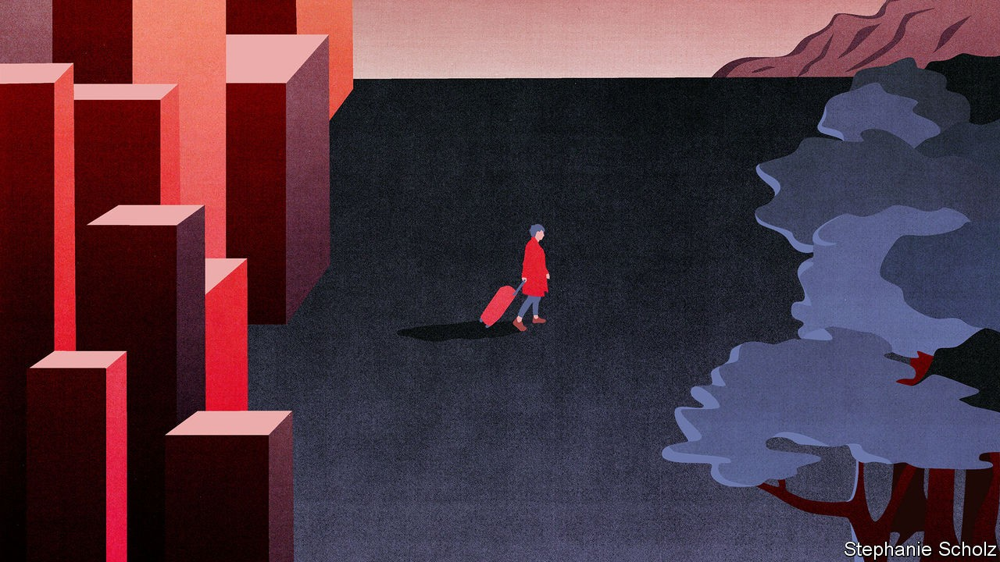

## Worlds of their own

# Giving up on politics is often tempting. It is also risky

> In a polarised age, some on both left and right are choosing internal exile

> Oct 24th 2020

Live Not By Lies. By Rod Dreher. Sentinel; 256 pages; $27.

WORLDLY SUCCESS has not made Rod Dreher fonder of the world as he finds it. In “The Benedict Option”, published three years ago, the veteran commentator on religious affairs lamented that conservatives like him had been utterly vanquished in America’s culture wars. The moral gap between liberals and traditionalists had become unbridgeable, he argued; the only hope for the godly lay in abandoning the fight for power and withdrawing from the social mainstream into self-contained families and communities.

“The Benedict Option” was a bestseller. So warm and widespread was the acclaim that its Manichean pessimism seemed to have been disproved. But Mr Dreher has not mellowed. In his new book he compares the situation of observant Christians in America to dissidents, especially religious ones, in the Soviet Union. The title, “Live Not By Lies”, invokes Alexander Solzhenitsyn, who told his compatriots that even if they could not oppose Soviet rule, they should avoid colluding with it.

Plenty of believers, in America and elsewhere, share Mr Dreher’s sense of alienation. But his work resonates for another reason. Many others who disavow the rest of his worldview have confronted the basic choice that he lays out: participation or flight. That fraught dilemma seems especially acute in an age of sharply polarised politics, but it is ancient.

Visiting Russia, Mr Dreher learns how honest Soviet citizens tried to avoid having much to do with the system. Geology was a popular discipline among scientists, as it let researchers spend a good portion of their lives in far-flung and unsullied places. (Humbler jobs as furnace-stokers or nightwatchmen were another refuge for free spirits.) Mr Dreher also speaks to people who lived through communism and know modern America. These battle-hardened folk say they find something horribly familiar about the emergence of intolerant thought police who can ruin careers, in academia or the professions, as punishment for dissent from the new orthodoxies on gender, race or sexuality.

Whatever you make of that analogy, there are some fundamental parallels between the two places. Like Russia, America is vast, meaning retreat has always seemed physically possible, even enticing, whether in the mountains of Idaho or the Arizona desert. Motives for withdrawal have included ideological dissent, Utopian experiments, eschatological hopes, the avoidance of social or technological change or the acceleration of such change. America has its Amish communities; the taiga and steppe of tsarist Russia accommodated schismatic groups such as the Old Believers, who were theologically conservative but economically progressive.

Today the kind of flight proposed by Mr Dreher need not be physical. You can live on a remote island and engage furiously in political battles (Mr Dreher wages his own from Baton Rouge, Louisiana). Conversely, a city-centre flat can be a place of isolation, embraced for intellectual reasons as well as pandemic-related ones. And in many modern democracies lots of liberal-minded people, too, have been tempted to desert the political and social mainstream, with or without a change of place. That has been most starkly true in cantankerous America and Brexit-era Britain.

Anthony Barnett, an English writer on democracy, observes a mood of retreat among older, left-leaning people in England and America: some over 50 are, he says, withdrawing from active politics into un-ideological passions such as gardening. The impulse, he thinks, derives less from fatalism than from an awareness that the job of fixing a broken system properly belongs to a younger, untarnished generation. The older cohort “know they were part of the problem”.

Retreat and reflection are a healthy response for liberal-minded activists chastened by populism, reckons Hugo Dixon, a co-leader of the failed campaign for a second popular vote on Brexit. They must ponder why the old managerial style of politics was rejected in favour of abstract values like meaning and community. Nor are they the only ones to feel desolate or, for the time being, politically homeless. Linda Bilmes, a professor of public policy at Harvard who served in Bill Clinton’s administration, points to the cadre of moderate Republicans who have been driven to abandon the fray. Whatever its outcome, the impending presidential election may push some Americans into a sort of internal exile.

Conservatives longing for a safe space to marry and bring up children as they see fit; liberals in search of a quiet spot to lick their wounds: another category of people may harbour a different worry—about the impact on social cohesion when the disillusioned withdraw. One risk is that their flight from the arena will leave it free for opportunists and cynics, and that politics enters a degenerate spiral. Alongside that concern is a long-standing question of personal morality. If you are deeply convinced that the present order is wrong, do you have the right to opt out rather than remaining engaged and working for change?

Among the philosophical currents that shaped the West, a powerful one insists not merely on the right to engage in public debates, but on the duty. The great Anglo-Irish theorist Edmund Burke reputedly warned that evil would prevail if good people stood aside. You need not be a totalitarian to find merit in Karl Marx’s adage that philosophers must change the world as well as understand it.

More recently some of the Frankfurt School of German thinkers, such as Theodor Adorno, took refuge from Nazism in the United States; but their critique of modern society and populist culture, for all its cerebral opacity, was meant for active use, not just idle observation. Their ideas probably helped shape post-war German culture and immunise it against fresh totalitarian temptation.

In some circumstances, the calculus changes. Former dissidents of the kind Mr Dreher meets might insist that the Soviet regime offered no leeway for improvement. Preserving their own integrity was as much as they could do—and that in itself could amount to a profound moral statement, incurring harsh retribution. Rancorous as they can be, though, have America and other democracies really reached a similar point now? After all, for those who abhor national politics, there is a glorious array of alternative forms of engagement—from voluntary groups and local civic initiatives to conservation movements, not to mention the free exercise of speech online and elsewhere.

As it happens, the world’s first democracy, in ancient Athens, also fretted over degrees of participation and the price of withdrawal. Many Athenians resented the apparent indifference to politics of the city’s wisest person, Socrates; some alleged, not absurdly, that his seeming apathy had opened the way for vicious interludes of authoritarianism.

On trial for his life, Socrates insisted he was anything but indifferent to the city’s welfare. He simply chose to stand a few paces back, challenging his fellow-citizens by asking basic, awkward questions and hence prodding them, like a gadfly, to act more wisely. “Socrates was not a quietist,” says Paul Cartledge, a British expert on ancient democracy. The trouble was that some of his compatriots “saw politics, like religion, as something to be done in public if it was done at all”.

Today’s representative democracy finds it easier to accommodate a division of labour between thinkers and doers, actors and observers, participants and abstainers. Many citizens eschew even the minimal commitment of voting. But those who abstain will always face hard questions about whether leaving the stage was the only way to enact their principles. ■

## URL

https://www.economist.com/books-and-arts/2020/10/24/giving-up-on-politics-is-often-tempting-it-is-also-risky
