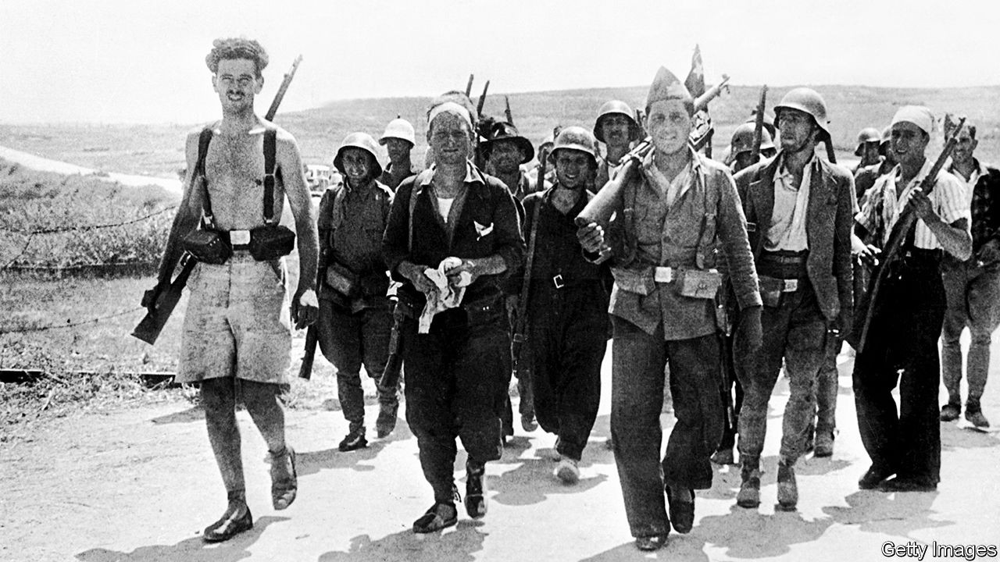

## ¡No pasarán!

# The tragic idealism of the International Brigades

> They remain heroes of the left for their self-sacrifice in the Spanish civil war

> Oct 24th 2020

The International Brigades. By Giles Tremlett.Bloomsbury; 720 pages; £30. To be published in America in July 2021; $30.

HISTORY MAY often be written by the victors, but that has never applied to the Spanish civil war. The standard version tells of the Republic’s heroic but doomed struggle against the nationalist forces of Francisco Franco—whose triumph was made possible by Hitler and Mussolini, while Britain and France stood idly by. The role of the International Brigades, in which around 35,000 idealists and adventurers from 65 different countries served, has contributed mightily to the romantic view of a horrible conflict, as have the works by Hemingway, Orwell and Auden that it inspired. Yet it is four decades since a comprehensive history of the Brigaders’ exploits was last published in English.

Making good use of the surviving parts of the International Brigades’ own archive in Moscow, Giles Tremlett, a former Madrid correspondent for this newspaper, sets out to fill this gap. He provides an almost blow-by-blow narrative of what befell the Brigaders, from the arrival of the first foreign volunteers to defend Madrid in August 1936 to the Brigades’ eventual disbandment in September 1938, after a string of bloody defeats by Franco’s superior forces.

Only a handful of the volunteers had military experience and many, particularly the anarchists and the more Utopian socialists, had unrealistic notions of martial discipline. Despite a largely British myth that they were all leftish intellectuals, most came from working-class backgrounds, often sent to Spain by local Communist parties on orders from the Comintern in Moscow. Many were unemployed or refugees from other parts of Europe—Germany and Italy, but also Poland and Hungary.

Though an attempt was made to organise battalions on the basis of shared language, communication in such a polyglot outfit was a perpetual problem. Yet often with only a few hours’ training, and armed with obsolete rifles, they were thrown into the fight, used as shock troops because of their (initially) high morale, almost suicidal courage and capacity for improvisation. In their first test, the bid to repel the nationalists from the University City area of Madrid, Brigade machine-gunners found that thick library books on German philosophy made excellent sandbags (the bullets rarely got past page 350). Grenades with their pins pulled out were sent in lifts to floors held by Franco’s Moroccan snipers.

Success in the battle for Madrid flattered to deceive. The Republican militias and the International Brigades had shown that they could doggedly secure a position against nationalist attack. The largely defensive battles of Jarama and Guadalajara in 1937—in which the Brigades, taking heavy losses, had played a vital part—were also seen as Republican victories. But prosecuting an effective offensive against a well-equipped professional army was a different matter.

Poor strategic leadership, inferior weapons (the Soviet T26 tank was a rare exception), political divisions, the imported infection of Stalinist paranoia (many Soviet military advisers were sent home to be purged), and, above all, the honing by Franco’s Nazi allies of the Blitzkrieg techniques they were to apply across Europe—all these led to a succession of grim blows to the Republic. By the end of the war, Hitler and Mussolini had sent powerful air forces and 90,000 well-trained troops to ensure Franco’s victory, more than twice the total of foreign volunteers fighting for the Republic, which hoped in vain that the Western democracies would drop their policy of non-intervention.

When the Brigaders staged their farewell parade in Barcelona, only 7,100 were still fit enough to march. The casualties they suffered in two years of combat are disputed, but estimates suggest nearly 10,000 died and about 8,000 were counted as missing. Mr Tremlett reckons one in five of the volunteers became, in Hemingway’s words, “part of the earth of Spain”.

Inevitably, this book is only a very partial account of the civil war, eschewing analysis (particularly of the political context) to maintain a narrative momentum that sometimes stumbles in the fog of war. But as a history of the International Brigades it is meticulously researched and engagingly written. Mr Tremlett resurrects an extraordinary cast of characters, such as the flamboyant generals Kléber and Lukács (the former died in Stalin’s Gulag, the latter in action); the sinister British NKVD spy David Crook; Winston Churchill’s rebellious nephew Esmond Romilly; the young American economics teacher Robert Merriman, who commanded the Lincoln Battalion and was taken prisoner and shot by the nationalists; and the repulsive French Communist leader André Marty, who claimed to have ordered the executions of more than 500 Brigaders.

The best way to describe the Brigaders in all their varieties is as sincere anti-fascists, the author says; as he points out, a disproportionate number were Jewish. But he does not flinch from the brutality, the betrayals and the incompetence of their largely Soviet-directed leaders. The Brigaders remain heroes of the left for their internationalism and self-sacrifice. Mr Tremlett has done them proud. ■

## URL

https://www.economist.com/books-and-arts/2020/10/24/the-tragic-idealism-of-the-international-brigades
