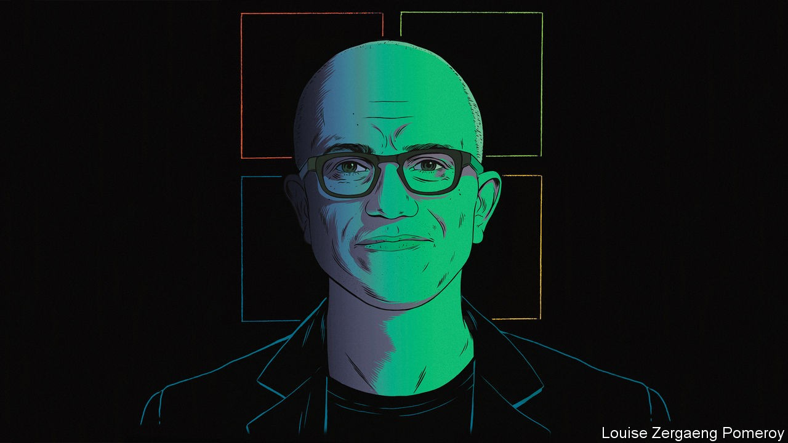
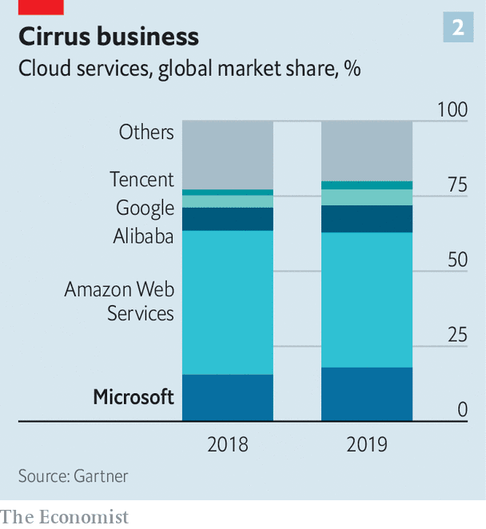
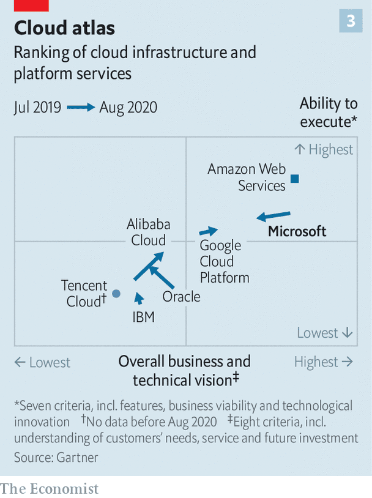
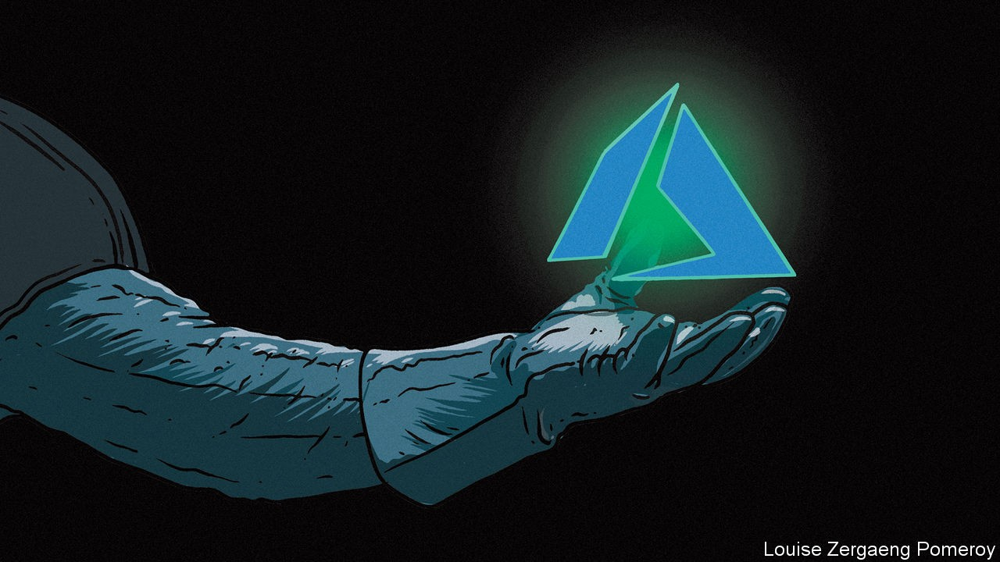

## After the reboot

# How Satya Nadella turned Microsoft around

> Now for the hard part

> Oct 22nd 2020

WHEN SATYA NADELLA became the third boss of Microsoft in 2014 one photograph captured the moment. It shows him flanked by Bill Gates, the co-founder and chairman, and Steve Ballmer, Mr Gates’s successor as chief executive. The two white tech tycoons strike a confident pose in casual dress. Mr Nadella, an Indian-American, skulks in a suit, smiling awkwardly.

He had a reason for that awkward smile. The company was in a ditch. While it hunkered down at its headquarters in Redmond, Washington, Apple invented the iPhone, and Google and Facebook rose from Silicon Valley. Its share price barely budged for years. When he took over, says Mr Nadella, outsiders questioned if Microsoft will “make it to the other side”.

It did—with aplomb. Mr Nadella dethroned the Windows operating system as its core product. He brought Microsoft’s software and services to other operating systems, including “open source” Linux, as well as Google’s and Apple’s. Most important, he put Microsoft’s cloud-computing arm, Azure, launched in 2010, at the heart of the business. The result has been double-digit revenue growth and a market capitalisation of $1.6trn. Only Apple and Saudi Aramco, an oil colossus, are more valuable.

Microsoft succeeded in its reinvention where other tech firms seeking a second life, such as IBM and Oracle, have not. But nothing lasts for ever in the fast-changing world of technology. The old personal-computer (PC) business has slowed. The firm’s products are not always the best or most popular. Azure is considered by many experts to be technologically behind the market leader, Amazon Web Services (AWS), which the e-commerce giant launched four years earlier. Many users prefer to make video calls on Zoom and chat on Slack rather than use Microsoft’s Teams. This year Microsoft failed to buy TikTok, which might have boosted its consumer-facing business that includes the Xbox games console and (less interestingly for TikTokers) LinkedIn, a careers network; the popular Chinese-owned short-video app inked a nebulous technology partnership with Oracle instead. And Microsoft has to square up not just to Amazon but to younger tech giants such as Alphabet (Google’s parent) and China’s Alibaba and Tencent.

The pressure to succeed is immense. The firm’s shares have more than quintupled in value since Mr Nadella took over (see chart 1). They now trade at 37 times earnings, a higher multiple than those of Alphabet, Apple or Facebook (though far below Amazon’s ratio of 123). The company is priced for perfection, says Mark Moerdler of Bernstein, a research firm. And for further expansion.

Mr Nadella acknowledges the challenge. “This is not some linear transition,” he says. “When the first hockey stick plateaus the question is: have you got the other things?” In an effort to live up to the hype he is dusting off old weapons—bundling and licensing—the aggressive use of which got Microsoft in trouble with antitrust authorities from the late 1990s and earned it the moniker “evil empire”. An insider since 1992, he remembers those days, when the firm narrowly avoided a forced break-up. Can it continue to grow while steering clear of the old pitfalls?

Until 2014 Microsoft had five different business areas. Most of the profit came from three of them: Windows, its Office software (spreadsheets, word-processing, PowerPoint and the like) and programs to run the servers used in data centres and corporate networks. Entertainment and devices, including the Xbox, made a bit of money. Online services such as the Bing search engine and MSN web portal did not.

Mr Nadella reconfigured this structure. Today Microsoft’s 20 or so businesses fall into three big buckets: cloud, productivity software and business processes, and personal computing. Each contains one of the lucrative stalwarts—servers, Office and Windows—alongside lots of others such as Surface PCs and digital whiteboards, or Dynamics business software. Many of the businesses revolve around Azure, which has grown into the internal computing backbone for Microsoft’s applications, as well as a product to sell to customers. Forays into futuristic quantum computing or virtual and augmented reality stand on their own, while boosting Azure’s capabilities. So do artificial-intelligence (AI) algorithms, trained on data from Bing, LinkedIn and other places.

If any of those whizzy bets succeed at scale, they would sharpen Microsoft’s innovative edge, which looks blunter than either Amazon’s or Alphabet’s. Even if they do not, Microsoft may succeed by commercialising products rather than inventing new ones. As insiders quip, the firm is never first to market and often not second, but “man, we will make all the money”.

That has certainly been true of Office. Excel was not the first spreadsheet (remember Lotus 1-2-3?). But it is deemed by many software engineers to be the most consequential program ever written, in part because it has been so widely adopted. Around 1.2bn workers use Office or Office365, a web-based version served up through Azure. Here, too, Microsoft lagged behind Google’s G-suite software, which, among other things, enabled multiple users to work on one document at the same time. Googlers make digs at what they see as Microsoft’s offline, “save as” mentality.

Still, managers prise Office—and especially Excel—from desk-jockeys at their peril. As a result, Microsoft controls 87.6% of the market for such software, to Google’s 11.5%, according to Gartner, a research firm. To boost Teams, Microsoft has started bundling it with Office365 free of charge; by April Teams had 75m daily users. Unfair, rivals say; in July Slack launched an antitrust suit against Microsoft. It calls Teams a copycat product aimed at killing it—just as Microsoft’s Internet Explorer vanquished Netscape, a rival web browser, which led to its battle with trustbusters.

Critically, Microsoft has been a superfast follower in the cloud. In Mr Nadella’s book about the firm’s transformation, “Hit Refresh”, he described how, by the time he took over, AWS had built a vast cloud business with no competition. “Amazon was leading a revolution and we had not even mustered our troops,” he wrote.

The stakes are huge. Over time most of the world’s companies are expected to move computing to the cloud. The share of IT spending going to the cloud is approaching 10%. But that already amounts to an annual market of $240bn. Given expected annual growth rates of nearly 20% it could reach $1trn before long.

In the cloud Azure faces two big rivals—AWS and Google Cloud Platform (GCP)—and two others—Oracle and Alibaba Cloud. Its market share has risen steadily, to 18% (see chart 2). Again, Microsoft’s rapport with firms’ IT departments has served it well. It still dominates parts of business software and nearly four in five personal computers run on Windows, as do 72% of all servers. It can offer corporate clients a single price that bundles Azure with Office and other software. That way Azure can end up costing only a fifth as much as AWS, Microsoft claims (AWS disputes this). And it is easier to use than Amazon’s offering, whose advanced features overwhelm even some IT professionals.

It is also easier to swallow for many clients than Amazon products. When Microsoft pitched for business, recalls a former executive, Azure would lose the technical evaluation but win out of customers’ fear that Jeff Bezos, Amazon’s insatiable boss, might use their money and data to invade their turf. Suspicion of Mr Bezos may explain why AWS lost a $10bn Pentagon cloud contract to Microsoft, despite being tipped to win. Amazon believes Microsoft benefited from Donald Trump’s feud with Mr Bezos, who also owns the Washington Post, a newspaper the president does not like. Amazon has legally challenged the award, unsuccessfully so far.

Azure aims to match or overtake AWS in the cloud. Yet in Gartner’s closely followed ranking of cloud providers Azure comes in well behind AWS and has lately slipped down (see chart 3). The way Microsoft has built its global cloud infrastructure, covering more geographical ground than AWS but more thinly, may make it less reliable. Gartner cites insufficient redundant capacity to deal with data centres knocked out by bad weather or other problems. Even without disruptions, capacity has proved problematic. As demand has surged in the pandemic, with millions of remote workers switching to the cloud, Azure has at times been unable to keep up. Microsoft Teams suffered a blackout in March. That month Microsoft put in place temporary resource limits on new Azure subscriptions. AWS has not needed to.

Microsoft cannot afford to get Azure wrong. It is what drives its share price. Azure is estimated to make up only a tenth of Microsoft’s $53bn in annual operating profit. But every quarter Wall Street fixates on how fast the cloud is growing, notes Heather Bellini of Goldman Sachs, an investment bank. Recently analysts have been disappointed to see growth slow, from 59% year on year in the first three months of 2020, to 47% from April to June. (It is some comfort that AWS’s growth has also slowed in recent quarters.)

Azure is sure to get a fillip from new licensing rules, just as Teams has from bundling. Up to now Microsoft let customers use its software on dedicated servers run by AWS or any cloud provider under a practice called “bring your own licence” (BYOL). That freedom enabled easy switching; of all cloud-based Windows software, 57% runs on AWS, nearly twice as much as on Azure.

Last summer Microsoft did away with BYOL and introduced restrictions for customers wishing to put its software on certain big clouds. If a client wanted to run desktop and server programs on those clouds after October 1st, it would have to buy a new subscription, rather than a one-off licence. Not to offend antitrust rules Microsoft put Azure on its list alongside AWS, GCP and Alibaba Cloud. But it separately offered customers a better deal to move to Azure, offsetting the extra cost.

Amazon said Microsoft was trying to restrict what clouds companies can use. Several neutral observers concur. “Microsoft is taking its arsenal of Windows Server, a massive installed software base, and using it punitively against competitors,” says Raj Bala, Gartner’s main cloud-infrastructure expert and author of its cloud ranking. It is the antithesis of Mr Nadella’s more open strategy, adds Wes Miller of Directions on Microsoft, a research firm. After all, he had eased Office’s move to non-Windows devices such as Apple’s iPad. “Satya wants to make people think he’s different, but he’s old-school Microsoft, just with a little softer exterior,” sums up an executive at a rival.

Microsoft is the only big cloud provider which also sells lots of programs that clouds host. “Is there a piece of software that Amazon or Google has built that runs on Azure? Zero,” Mr Nadella says. That also gives Azure a big advantage to exploit. Mr Nadella does not intend to repeat the mistake of letting Windows workloads all migrate to Amazon’s cloud, as happened early on. “We were stupid, not realising what was happening,” he says. “We will absolutely monetise our intellectual property on their clouds.”

Since the licensing changes went into effect Gartner has received several hundred inquiries about them. An executive from a Fortune 500 health-care company that had picked AWS as its cloud provider says that the new rules meant an extra annual cost of $100m, forcing the firm to slow down its transition to the cloud. “They are writing licence terms to get customers to believe their only choice is Azure,” complains a vice-president of a medium-sized firm in Wisconsin that felt forced to switch from AWS. “There is no law against it but it removes choice,” he adds. An IT chief at another midwestern firm likens the new rules to a long lease on a car where “the lessor says you can only use Chevron gas, not BP or Exxon”. Two of the three customers are set on writing Microsoft software out of their stacks over time.

That points to a risk for the tech giant. By tugging reluctant customers onto Azure too aggressively Microsoft may put a lot of them off Windows—or, possibly, provoke mass flouting of rules, daring the software giant to enforce them. Takeshi Numoto, chief marketing officer of Microsoft’s commerical business, says the feedback Microsoft is receiving on cloud choice after the new rules is positive, adding that “We want to hear from all customers if there are ways we can improve our partnership and support of their businesses.”

How closely is Microsoft flirting with the kind of behaviour that got it in trouble in the late 1990s? After its bruising antitrust battle it is likely to proceed cautiously. If Europe proves sympathetic to Slack, the messaging firm could bring a similar case in America. If that happens, Microsoft may offer concessions to make it go away.

Mr Nadella resists the idea that Microsoft is overstepping the mark. “Look at the number of enterprise SAAS [software-as-a-service] and infrastructure firms,” he says—hardly suggestive of “a monopoly company collecting monopoly rent”.

In its defence Microsoft can certainly argue that Azure has brought competition to cloud computing, which AWS might otherwise have cornered. Tellingly, Mr Nadella was spared the indignity of testifying in front of a congressional antitrust subcommittee, which recently grilled his opposite numbers at Alphabet, Amazon, Apple and Facebook. A congressional report on big tech’s digital dominance did not finger Microsoft. America’s trustbusters have gone after Google instead (see [article](https://www.economist.com//business/2020/10/21/american-trustbusters-take-on-google)). Google denies wrongdoing.

Microsoft’s rebuffed $25bn-30bn bid for TikTok could have been a boon to competition. Had it succeeded, Microsoft would have challenged Google and Facebook in digital advertising in short order. TikTok’s reams of data on its teenage users would have fuelled Microsoft’s AI, which competes against algorithms being developed by all its big tech rivals in America and China. The purchase of ZeniMax Media, a games developer, for $7.5bn to bolster its flourishing cloud-gaming platform does not make up for the failed bid.

Google’s antitrust troubles could offer consolation. The case may shake up internet search, helping Bing. It is a tiddler despite having a quality of search results that is not all that different from Google’s. In a hint that Microsoft might want to revive its search engine, this month it was rebranded as “Microsoft Bing”.

Mr Nadella is confident about future growth, his early awkwardness long since replaced by a justified and resolute assuredness. “We’re lucky enough to be in the tech business, and IT spending is going from 5% of GDP to 10% over the next ten years,” he says. But competition for those IT dollars is white-hot. Microsoft’s response—leaning heavily on customers not to defect—may work in the short run. But as the pace of change in the technology industry accelerates, thanks to abundant brainpower and oodles of capital, customers may put innovation ahead of loyalty to long-standing providers. One successful reinvention is unlikely to be enough. ■

Clarification (October 23rd 2020): Microsoft's claim that Azure can cost a fifth as much as AWS is disputed by AWS

## URL

https://www.economist.com/briefing/2020/10/22/how-satya-nadella-turned-microsoft-around
