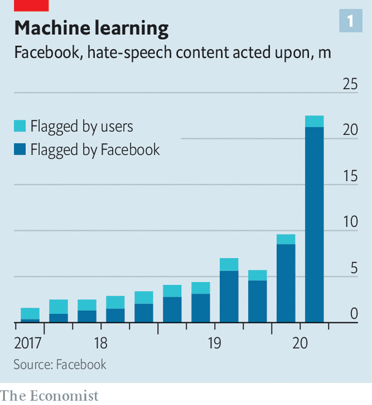
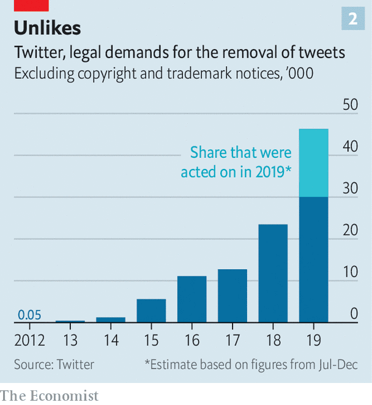
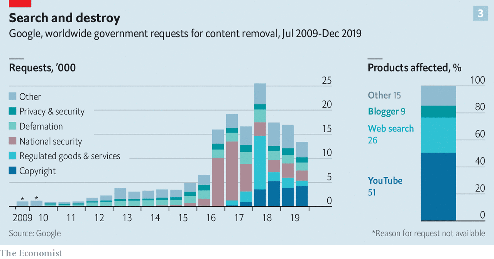

## Big tech and free speech

# Social media’s struggle with self-censorship

> Tech giants are removing more content, but are they making the right choices?

> Oct 22nd 2020

WITHIN HOURS of the publication of a New York Post article on October 14th, Twitter users began receiving strange messages. If they tried to share the story—a dubious “exposé” of emails supposedly from the laptop of Hunter Biden, son of the Democratic presidential nominee—they were told that their tweet could not be sent, as the link had been identified as harmful. Many Facebook users were not seeing the story at all: the social network had demoted it in the news feed of its 2.7bn users while its fact-checkers reviewed it.

If the companies had hoped that by burying or blocking the story they would stop people from reading it, the bet did not pay off. The article ended up being the most-discussed story of the week on both platforms—and the second-most talked-about story was the fact that the social networks had tried to block it. The Post called it an act of modern totalitarianism, carried out “not [by] men in darkened cells driving screws under the fingernails of dissidents, but Silicon Valley dweebs.” Republican senators vowed to extract testimony on anticonservative bias from Mark Zuckerberg and Jack Dorsey, the dweebs-in-chief of, respectively, Facebook and Twitter.

The tale sums up the problem that social networks are encountering wherever they operate. They set out to be neutral platforms, letting users provide the content and keeping their hands off editorial decisions. Twitter executives used to joke that they were “the free-speech wing of the free-speech party”. Yet as they have become more active at algorithmically ranking the content that users upload, and moderating the undesirable stuff, they have edged towards being something more like publishers. Mr Zuckerberg says he does not want to be an “arbiter of truth”. The Post episode fed the suspicion of many that, willingly or not, that is precisely what he is becoming.

America’s fractious election campaign has only made more urgent the need to answer the unresolved questions about free expression online. What speech should be allowed? And who should decide? Rasmus Nielsen of the Reuters Institute at Oxford University describes this as a “constitutional moment” for how to regulate the private infrastructure that has come to support free expression around the world.

Social networks have been on the mother of all clean-ups. Facebook’s removal of hate speech has risen tenfold in two years (see chart 1). It disables some 17m fake accounts every single day, more than twice the number three years ago. YouTube, a video platform owned by Google with about 2bn monthly users, removed 11.4m videos in the past quarter, along with 2.1bn user comments, up from just 166m comments in the second quarter of 2018. Twitter, with a smaller base of about 350m users, removed 2.9m tweets in the second half of last year, more than double the amount a year earlier. TikTok, a Chinese short-video upstart, removed 105m clips in the first half of this year, twice as many as in the previous six months (a jump partly explained by the firm’s growth).

Artificial intelligence has helped to make such a clean-up possible. Most offending content is taken down before any user has had a chance to flag it. Some lends itself readily to policing with machines: more than 99% of the child-nudity posts Facebook takes down are removed before anyone has reported them, but most of the bullying or harassment is flagged by users rather than robots. Two years ago Facebook’s AI removed a post referring to “merciless Indian Savages”, before human moderators realised it was a quote from the Declaration of Independence. Facebook now employs about 35,000 people to moderate content. In May the company agreed to pay $52m to 11,250 moderators who developed post-traumatic stress disorder from looking at the worst of the internet.

Discussions about free speech that may once have seemed abstract have become all too practical—the murder of Samuel Paty near Paris last week being the latest shocking reminder. Social networks tightened their policies on terrorism after Islamist attacks in Europe in 2015 and an anti-Muslim rampage in New Zealand last year, which was live-streamed on Facebook and shared on YouTube. The American election and Brexit referendum of 2016 forced them to think again about political communication. Twitter banned all political ads last year, and Facebook and Google have said they will ban them around the time of this year’s election on November 3rd.

The companies have also improved their scrutiny of far-flung countries, after criticism of their earlier negligence in places such as Myanmar, where Facebook played a “determining role” in the violence against Rohingya Muslims, according to the UN (see [article](https://www.economist.com//asia/2020/10/22/in-myanmar-facebook-struggles-with-a-deluge-of-disinformation)). This week Facebook announced that it had hired more content-reviewers fluent in Swahili, Amharic, Zulu, Somali, Oromo and Hausa, ahead of African elections. Its AI is learning new languages, and hoovering up rule-breaking content as it does so.

Some tech bosses have been rethinking their approach to the trade-offs between free expression and safety. Last October, in a speech at Georgetown University, Mr Zuckerberg made a full-throated defence of free speech, warning: “More people across the spectrum believe that achieving the political outcomes they think matter is more important than every person having a voice. I think that’s dangerous.” Yet this year, as misinformation about covid-19 flourished, Facebook took a harder line on fake news about health, including banning anti-vaccination ads. And this month it banned both Holocaust denial and groups promoting QAnon, a crackpot conspiracy.

The pressure from the media is to “remove more, remove more, remove more”, says one senior tech executive. But in some quarters unease is growing that the firms are removing too much. In America this criticism comes mostly from the right, which sees Silicon Valley as a nest of liberals. It is one thing to zap content from racists and Russian trolls; it is another to block the New York Post, one of America’s highest-circulation newspapers, founded by Alexander Hamilton (who admittedly might not have approved of its current incarnation, under Rupert Murdoch).

Elsewhere, liberals worry that whistle-blowing content is being wrongly taken down. YouTube removed footage from users in Syria that it deemed to break its guidelines on violence, but which was also potential evidence of war crimes. Until last year TikTok’s guidelines banned criticism of systems of government and “distortion” of historical events including the massacre near Tiananmen Square.

Where both camps agree is in their unease that it is falling to social networks to decide what speech is acceptable. As private companies they can set their own rules about what to publish (within the confines of the laws of countries where they operate). But they have come to play a big role in public life. Mr Zuckerberg himself compares Facebook to a “town square”.

Rival social networks promising truly free speech have struggled to overcome the network effects enjoyed by the incumbents. One, Gab, attracted neo-Nazis. Another, Parler, has been promoted by some Republican politicians but so far failed to take off. (It is also grappling with free-speech dilemmas of its own, reluctantly laying down rules including no sending of photos of fecal matter.) Outside China, where Facebook does not operate, four out of ten people worldwide use the platform; WhatsApp and Instagram, which it also owns, have another 3bn or so accounts between them. “Frankly, I don’t think we should be making so many important decisions about speech on our own either,” Mr Zuckerberg said in his Georgetown speech.

Bill Clinton once said that attempting to regulate the internet, with its millions of different sites, would be “like trying to nail Jell-O to the wall”. But the concentration of the social-media market around a few companies has made the job easier.

Twitter has faced steep growth in the number of legal requests for content removal, from individuals as well as governments (see chart 2). Last year Google received 30,000 requests from governments to remove pieces of content, up from a couple of thousand requests ten years ago (see chart 3). And Facebook took down 33,600 pieces of content in response to legal requests. They included a Photoshopped picture of President Emmanuel Macron in pink underwear, which French police wanted removed because it broke a law from 1881 restricting press freedom.

In America the government is prevented from meddling too much with online speech by the First Amendment. Section 230 of the Communications Decency Act gives online platforms further protection, exempting them from liability for the content they publish. But carve-outs to this exemption are growing. Firms cannot avoid responsibility for copyright infringements, posts that break federal criminal law, or which enable sex trafficking. The latter exemption, made in 2018, had an impact on speech that was greater than its drafting implied: sites including Tumblr and Craigslist concluded that, rather than risk prosecution, they would stop publishing adult material of all sorts.

In Europe regulation has gone further. In 2014 the European Court of Justice (ECJ) established the “right to be forgotten” when it found in favour of a Spanish man who wanted Google to remove old references to his history of indebtedness. Since then Google has fielded requests for about half a million URLs to be removed each year, and granted about half of them. Last year the ECJ ruled that European countries could order Facebook to remove content worldwide, not just for users within their borders. The European Audiovisual Media Services Directive requires online video services to take “appropriate measures” to protect viewers from harmful or illegal content, including setting up age checks. The European Commission is to publish a Digital Services Act, expected to impose further obligations on internet companies.

National governments have also set their own rules, notably Germany, whose Network Enforcement Act of 2017 threatens platforms with fines of up to €50m ($60m) if they fail to take down illegal content within 24 hours of notification. In response Facebook opened a new moderation centre in Germany. The trouble with privatising the enforcement of the law in this way, points out Mr Nielsen, is that the companies have big incentives to err on the side of caution. A judge may use discretion to ignore rules on speech that are seldom applied (such as a German law that until recently banned insulting a foreign head of state). But a social-media company has no reason to risk ignoring a law.

Some governments are leaning on social networks to remove content that may be legal. The social-media platforms have their own rules that go further than most governments’. A ban on material that could interfere with “civic integrity” may sound like something from communist China; it is actually in Twitter’s rules. London’s Metropolitan Police has a unit that scours platforms for terrorism-related content, which it “requests” be taken down for breaching the platform’s terms of service—even though the material may not break any law.

“Authoritarian governments are taking cues from the loose regulatory talk among democracies,” writes David Kaye, a former UN special rapporteur on free expression. Last year Singapore passed what it described as an anti-fake-news law, banning the online publication of lies that could harm the public interest. Thailand has enforced its lèse-majesté laws online, in August ordering Facebook to block a critical group called Royalist Marketplace, which with more than 1m members was one of the largest on the platform. (Facebook complied, but is suing the Thai government for breaking human-rights law.)

If neither governments nor executives make reliable custodians of free speech, what can be done to keep the internet a tolerable place while protecting freedom of expression? An increasingly common answer in Silicon Valley is to draw a distinction between freedom of speech and “freedom of reach”: leave posts up, but make them less visible and viral.

Last year YouTube changed its algorithm so that videos that were borderline cases for deletion were recommended less often. After the bombings of churches and hotels in Sri Lanka at Easter in 2019, Facebook prevented the resharing of posts by friends of friends, to stop inflammatory content travelling too far or fast; this rule is in place in Ethiopia and Myanmar. Twitter has tried to stop people from mindlessly sharing fake news by prompting them to read articles before they retweet them. Platforms are adding more labels to content, warning users that it is misleading.

Another idea gaining momentum is that firms should make their data available for audit just as listed companies must open up their accounts. Their internal processes could also be more transparent. At Facebook there is an odd tension between its earnest approach to policymaking, with fortnightly “mini-legislative sessions”, and the fact that every month Mr Zuckerberg personally takes a handful of the hardest decisions on content moderation. Treating the big calls as “corner-office decisions” is a mistake, believes Mr Kaye: better for companies to say, “We have these rules, we’re going to apply them neutrally. And we don’t want that process to be corrupted by political pressure.”

Facebook took a step towards such a system on October 22nd with the launch of its Oversight Board, a watchdog made up of 20 members of the great and good who will scrutinise its moderation decisions and issue binding rulings. The board’s scope is narrower than some had hoped. It can consider only whether deleted posts should be reinstated. It merely applies Facebook’s rules, rather than setting them. It cannot consider posts that have been algorithmically demoted, as opposed to deleted. So some of the most prominent recent controversies—Facebook’s decision to leave up a contentious post by Donald Trump, its removal of QAnon, its reversal on Holocaust denial and its demotion of the Post story—are outside the board’s jurisdiction.

Yet as Alan Rusbridger, a former Guardian editor and member of the new board, puts it, it is a “revolutionary thought”. “A company that has notoriously been very reluctant to surrender control on anything has handed over…the power to make some pretty consequential decisions on its behalf,” he says. He hopes the board will get more powers over time. Facebook says this is premature. But Sir Nick Clegg, its head of global affairs, hopes the board’s remit might one day expand to consider cases submitted by other social networks.

Others have similar ideas. Article 19, a free-speech lobby group, has suggested that platforms could outsource their moderation decisions to non-governmental “social-media councils”, something like the press watchdogs that in many countries hold newspapers to a voluntary code.

For now, the social networks have to get through perhaps the hardest fortnight in their short history. They face the possibility of having to deploy content-moderation tools developed for fragile, emerging democracies in their home country. Facebook removed 120,000 pieces of content aimed at voter suppression in America in the past quarter. The New York Post affair does not bode well for how the companies might handle the fallout from a contested election. “When they appeared to depart from their policies they opened themselves up to the very charges of bias that followed,” says Evelyn Douek of Harvard Law School. As the election approaches, they need to “tie themselves to a mast” of clear rules, she says. A storm is coming. ■

## URL

https://www.economist.com/briefing/2020/10/22/social-medias-struggle-with-self-censorship
