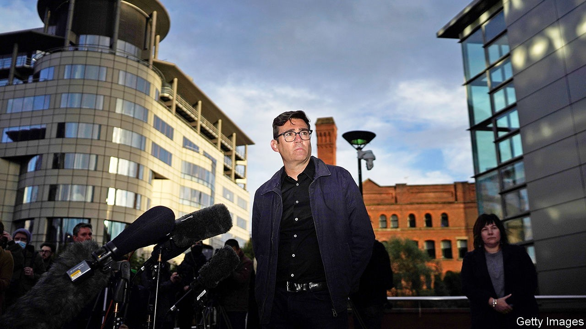

## Managing the pandemic

# The fight between central government and city mayors over lockdown

> Local leaders are too weak to defy the government, but too strong to ignore

> Oct 24th 2020

HAVING UPSET pretty much all Boris Johnson’s plans, covid-19 has found a new way to thwart the prime minister: by undermining his strategy for re-election in 2024. Other than getting Brexit done, Mr Johnson’s main policy plank when he was elected was to “level up” impoverished areas of the country far from the capital, and thus consolidate the votes that he won through his support for Brexit. A battle that is now raging between the government and city mayors over local lockdowns could damage the prime minister’s credibility as saviour of the north.

Directly elected mayors are a novelty. Labour began the experiment 20 years ago, as part of its devolution strategy. The Tories adopted the idea, hoping that urbanites who were viscerally opposed to Conservative governments might nevertheless opt for a charismatic local Tory. In typically British fashion, new mayoral arrangements have been laid on top of older ones, producing a mess. Liverpool has a city mayor, a metropolitan mayor and a ceremonial lord mayor, for good measure.

The government gave mayors few formal powers, expecting them to be little more than local cheerleaders and problem-solvers. Their ability to raise money is limited. But mayors have large mandates and high local profiles, which give them great informal power. Boris Johnson is prime minister because he won 92,000 votes in a Tory leadership election and then, last December, 25,000 votes in his constituency. By contrast, 360,000 people in Greater Manchester voted for Andy Burnham. Almost 1.2m Londoners voted for Sadiq Khan.

As the government moved from a nationwide lockdown to targeted local ones, it tried to treat mayors mostly as mouthpieces for its policies. Steve Rotheram, Liverpool’s metropolitan mayor, says he found out that his city would be placed into the highest level of lockdown by reading the Times. Sir Peter Soulsby, the mayor of Leicester, says he learned of changes to the rules in his city by studying government news releases: “We were never warned in advance, and never asked for our opinion.” Then the government tried to tighten the lockdown in Greater Manchester, and Mr Burnham dug in.

He had already demonstrated his informal power. In May, he and the city mayor of Liverpool argued against reopening schools. Although mayors are not supposed to control schools, this had a huge effect. In early June only 6% of schools in north-west England were open for children in the reception year, compared with 41% in the Midlands. Mr Burnham dished out more opinions. People in the north-west, he said, were being treated as “canaries in the coalmine for an experimental regional lockdown strategy”. In mid-October a poll by YouGov showed that people in northern England trusted him to handle coronavirus more than they trusted Mr Johnson or Sir Keir Starmer, the Labour Party leader.

Mr Burnham argued that if the government wanted to tighten the lockdown in Manchester, it should shell out more generously to cover the economic damage the city would suffer. After more than a week of negotiations, on October 20th the government refused his demands and went ahead without his approval. The two sides were just £5m ($6.5m) apart.

Still, it is striking that a man holding an office that did not even exist four years ago has made the government negotiate with him, almost as though he were a foreign leader. Mr Burnham and some of the other mayors are beginning to acquire national clout. “I think it represents the coming of age of the metro mayors,” says Lord Kerslake, a former civil-service chief who now chairs the UK2070 Commission, an inquiry into regional inequality. He thinks that more power and funding ought to flow to them eventually.

Covid-19 has exposed the failings of Britain’s centralised state, which is coping with the virus less well than countries with stronger local public-health systems such as Germany and South Korea. But the centre does not give up power easily. A white paper on devolution has been put off. And shortly after slapping down Mr Burnham, Mr Johnson picked a new fight with Mr Khan, over London’s transport system.■

Editor’s note: Some of our covid-19 coverage is free for readers of The Economist Today, our daily [newsletter](https://www.economist.com/https://my.economist.com/user#newsletter). For more stories and our pandemic tracker, see our [hub](https://www.economist.com//news/2020/03/11/the-economists-coverage-of-the-coronavirus)

## URL

https://www.economist.com/britain/2020/10/24/the-fight-between-central-government-and-city-mayors-over-lockdown
