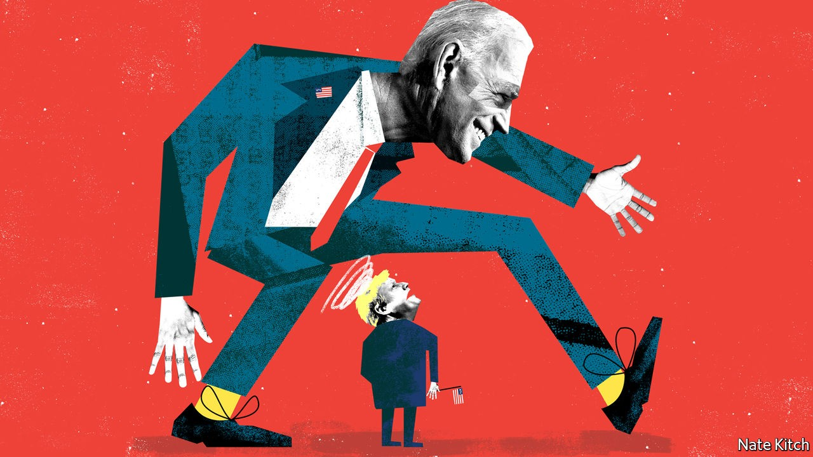

## Bagehot

# What Joe Biden means for Boris Johnson

> A Biden administration will make the prime minister’s life even more difficult

> Oct 24th 2020

NEW ADMINISTRATIONS in America often cause problems for Britain. Bill Clinton was annoyed with John Major because Conservative activists publicised his dope-smoking at Oxford. George W. Bush initially regarded Tony Blair as a Clinton stooge. But these problems pale into insignificance compared with the ones that will confront the Johnson government if, as expected, Joe Biden wins the presidential election on November 3rd.

The Democrats see Boris Johnson through the prism of Donald Trump and the culture wars that he has inflamed. Mr Johnson was so close to Mr Trump that the 45th president dubbed the prime minister, ungrammatically but memorably, “Britain Trump”. Mr Johnson also fails the Black Lives Matter test that is now sacred to the Democratic left. As graduates of Barack Obama’s administration, Mr Biden and his closest foreign-policy advisers are particularly mindful of Mr Johnson’s claim, back in 2016, that America’s first black president removed a statue of Winston Churchill from the Oval Office because, as a “part-Kenyan”, he was prejudiced against Britain.

The government has been scrambling to improve its relations with the Biden camp ever since he established a sustained lead in the polls. But senior government figures, who are Brexiteers to a man and woman, have few if any links with the Biden team. Michael Gove, the Cabinet Office minister and intellectual engine of Johnsonism, is even more closely identified with the American right than his boss. And Britain’s diplomats are in no position to fill the gap. Kim (now Lord) Darroch, the diplomat with the best contacts in Bidenworld, was sacked as ambassador to America over a leaked memo which described Mr Trump’s White House as “uniquely dysfunctional”, among other disobliging phrases. His successor, Karen Pierce, who was moved from the United Nations in New York to replace him, has not had time to develop close ties with the Democratic establishment in Washington. The pandemic has transformed the embassy from a centre of the social whirl into a ghost ship. Mr Biden’s team refuse to meet foreign diplomats, including Britain’s, citing the furore created by Michael Flynn’s contact with a Russian ambassador, Sergey Kislyak, before the formal handover of power in 2017.

Britain has a good record of turning Anglo-American frostiness into romance. The Deep State provides a reliable resource: America has closer military and security relations with Britain than any other ally. Having served on the Senate Foreign Relations Committee for three decades, Mr Biden understands the art of strategic forgetting. And having morphed from a liberal mayor of London into a leader of the Brexit rebellion, Mr Johnson knows how to play to his audience. His most recent passion, for Franklin Delano Roosevelt, is calculated to appeal to a Democratic president who wants to launch an ambitious programme of domestic reconstruction and international engagement.

Mr Johnson also has some levers to pull. He can emphasise the two countries’ common interest in standing firm against China and Russia. He can burnish his environmental credentials. Britain’s hosting of the next UN Climate Change Summit in November next year may provide a useful opportunity for bridge-building. A Biden administration would be keener to repair America’s damaged interests around the world than to punish miscreants, and the Johnson government would have an interest in writing Mr Trump out of history: expect a stream of briefings from Downing Street proclaiming that he was all hat and no cattle when it came to negotiating a free-trade deal.

But it will not be that easy. A Biden victory would replace a president who, for all his quirks, supports Brexit—the most significant policy change in Britain for decades—with one who thinks that it’s a rookie mistake. A handover of power would, by its nature, set back progress on trade negotiations, and Mr Biden has no incentive to prioritise their resumption. More worrying for Downing Street, Mr Biden would also side with Europe (and particularly the Irish Republic) if Britain endangers the Anglo-Irish agreement. Mr Biden is a proud Irish-American (five-eighths Irish, according to genealogists) who made a point of saying, during the first presidential debate, that “aloof plutocrats” like Mr Trump “look down their nose at Irish Catholics like me”. He is also a proud member of a Democratic establishment that regards the agreement as one of its signature achievements.

Mr Biden’s biggest threat, though, is not to the pace of Brexit but to its meaning. With the election of Mr Trump in 2016, Britain could claim that it was in the slipstream of history, as one of the first to abandon a collapsing global order; the election of an inveterate multilateralist like Mr Biden would make it look as if it is stuck in a cul-de-sac while America moves on. Brexiteers hoped that Brexit would have a series of knock-on-effects: the contraction of the European Union as other countries looked for an exit, the rise of the Anglosphere, as Britain forged close relations with the old colonies (including America) and the restoration of self-confident nations at the centre of the global order. But the EU is looking stronger, not weaker, as a result of Brexit, and a Biden administration would push history further in the opposite direction, reinforcing global institutions and making talk of the Anglosphere sound out-of-touch if not barking mad. Indeed, the combination of Biden and Brexit would further erode the central pillar of the Anglosphere: Britain’s special relationship with the United States. Mr Biden and his foreign-policy team want to rebuild the old multilateral system, particularly the Atlantic alliance, but, at the same time, adapt it to the needs of a changing world.

That is bad news for a country whose vaunted special relationship with the United States depended, in the end, not on sentiment or tradition, but on Britain’s ability to act as a bridge between America and Europe. In the global architecture which Mr Biden would rebuild, Britain’s place would be a humbler one. ■

Dig deeper:Read the [best of our 2020 campaign coverage](https://www.economist.com//us-election-2020) and explore our [election forecasts](https://www.economist.com/https://projects.economist.com/us-2020-forecast/president), then sign up for Checks and Balance, our [weekly newsletter](https://www.economist.com//checksandbalance/) and [podcast](https://www.economist.com/https://play.acast.com/podcasts/2020/01/24/checks-and-balance-our-new-weekly-podcast-on-american-politics) on American politics.

## URL

https://www.economist.com/britain/2020/10/24/what-joe-biden-means-for-boris-johnson
