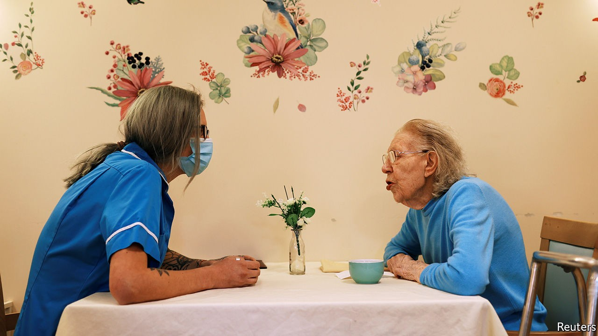

## A big old problem

# Will Boris Johnson keep his promise to reform social care?

> A new report urges the government to put at least £7bn into the English system

> Oct 22nd 2020

IN 1943 WINSTON CHURCHILL promised to bring the “magic of averages to the rescue of millions” by creating a national-insurance system to look after Britons from cradle to grave. Some 77 years later, Boris Johnson employed the same phrase at the Conservative Party conference. This time, the “magic of averages” would be used to fix “the injustice of social-care funding”.

Many politicians, including Mr Johnson, have made similar vows, yet failed to act. On October 22nd the House of Commons health and social care committee, led by Jeremy Hunt, Mr Johnson’s erstwhile opponent for Tory leadership, gave the prime minister a prod, with a report urging the government to spend at least £7bn ($9bn) more on social care by 2023-24, thus raising total spending by a third.

Some £3.9bn of the money would cover demographic change—growing numbers of old people and more young people requiring care—and enable providers to pay their staff the rising living wage. The other £3.1bn would be spent on capping the amount people pay for care during their lifetime at £46,000: anything above that would be covered by the state. That idea dates back to a review of social care in 2011 by Andrew Dilnot, an economist.

Unlike health care, social care is both needs-tested and means-tested. At present, only those with assets below £23,250 receive any state support. Since the cost of care is so hard to predict, firms are unwilling to offer protection, making social care the one great risk in life that is in effect uninsurable. A cap on costs would still require fiddly assessments of people’s needs, to keep tabs on how much they have spent from their approved budget. But it would also prevent people’s savings from being wiped out if they get dementia.

It may have other benefits, too. Mr Dilnot argues that people underspend on care because they want to have enough in the bank for the long haul. A cap would remove the fear of running out of money, enabling people to spend more in the short term, including on things (a stairlift, say) that stop them having accidents in the first place. Meanwhile, a more stable financial settlement would help reassure private providers to stay (and invest) in the market. Both would increase the incentive to develop new and better forms of care.

The £7bn price-tag for the committee’s proposal is hefty—but it still leaves plenty out. Social-care workers were more likely to die than even their colleagues in hospitals during the first wave of the covid-19 pandemic, a fact that has drawn attention to their meagre pay. Their wages could be pegged to similar roles in the health service, which would help reduce extremely high levels of turnover, but require additional funding unless the government wanted to bankrupt providers. Labour and some senior Tories support the introduction of free personal care, which covers things like help with bathing and dressing, and would cost another £5bn.

The problem with social care is not a lack of options. The King’s Fund, a think-tank, counts a dozen government papers on reform in the past two decades. The difficulty is summoning the political will to implement any of them, and raising the cash to do so, with opposition parties reliably objecting to plans for change. After the general election last year, Mr Johnson had an 87-seat majority and had declared his intention to fix social care once and for all. He was edging towards a Dilnot-style cap.

The pandemic has shone a light on the problems of social care. But it has also wrecked the public finances. On October 21st the Treasury said that a planned three-year spending review had been ditched in favour of a one-year one, owing to the unusual circumstances. With finances tight and the government reluctant to make long-term decisions, an announcement on social-care reform is likely to be delayed. Mr Hunt, who was health secretary from 2012 to 2018, does not think the pandemic is a good excuse, however. As he puts it: “We were even more bankrupt in 1945 when we decided to sort out the NHS.” ■

## URL

https://www.economist.com/britain/2020/10/22/will-boris-johnson-keep-his-promise-to-reform-social-care
