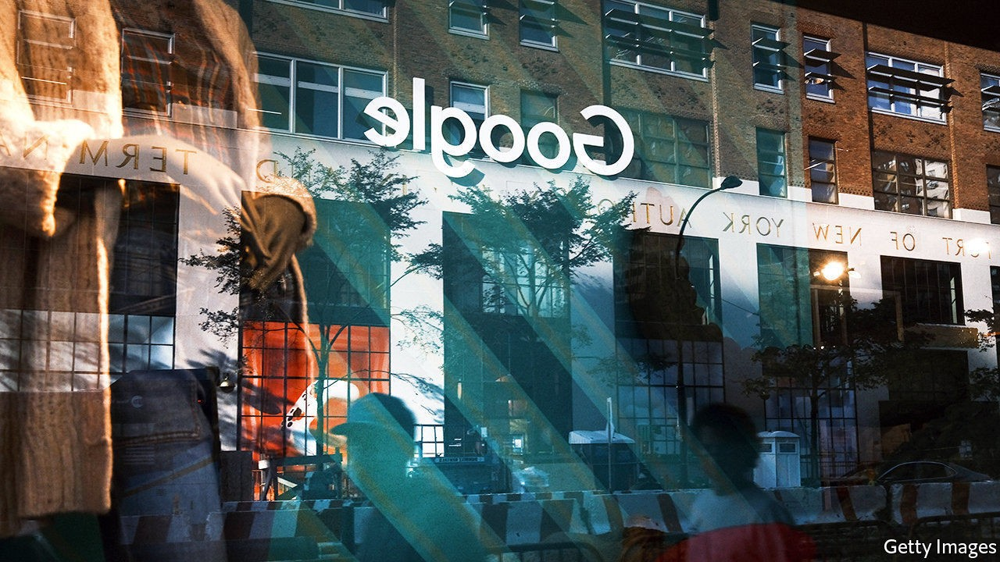

## Search query

# American trustbusters take on Google

> The case against the technology giant is at once narrow and grand

> Oct 21st 2020NEW YORK

IT WAS A long time coming. On October 20th the Department of Justice (DoJ) at last launched a federal antitrust lawsuit against Google. It is the first time American trustbusters have gone after big tech since their protracted battle against Microsoft 20 years ago. Eleven states signed on to the suit, in which the DoJ accuses the technology giant of abusing its online-search monopoly. Others are likely to bring their own cases against the firm. William Barr, the attorney-general, called it “monumental”. He is both right and wrong.

Google and its parent company, Alphabet, are not the only ones to come under pressure. Amazon, Facebook and Apple (though not Microsoft, which has trodden carefully since its antitrust run-in) have been variously lambasted for enabling election manipulation, violating privacy and abusing their digital monopolies.

In that grand scheme of things, the Google case can seem piffling. It carves out only some alleged misdeeds in one part of the business of a single firm. Specifically, the DoJ’s lawyers accuse Google of an illegal monopoly in “general search services, search advertising, and general search text advertising”. They say that to retard rivals like Microsoft’s Bing search engine, Google uses a web of “exclusionary” contracts with smartphone-makers which, they claim, cover 80% of American search queries on mobile devices. They say Google pays Apple over $8bn a year in advertising revenue to ensure its search engine is the default on Apple devices, and has similar deals with manufacturers using its Android operating system. Google denies wrongdoing.

The sums involved are large but the charges are narrow, argues Mark Shmulik of Bernstein, a research firm. They cover only text search, not images or video. Fiona Scott Morton of Yale University, an antitrust expert critical of Google (and an adviser to Apple), notes that the suit does not tackle allegations that Google abuses its market power in digital advertising or the claims that it handicaps potential rivals in specialised searches such as travel.

The DoJ’s narrow focus may be shrewd. It is harder to prove Google has cornered digital advertising more broadly: it has less than a third of that market, and Facebook on its heels with a quarter. In product-specific search Google has been eclipsed by Amazon. An antitrust expert who supports Google acknowledges that the complaint is “well-crafted” and “is going to have legs”.

If so, it has a lot of walking to do—and could end in an unremarkable settlement, with Google making token changes to its behaviour and paying a fine that looks hefty until you consider its annual net profit of $34bn. By then, technology may have evolved to make the suit appear less relevant, as happened with Microsoft.

Nonetheless, the DoJ’s move does carry a whiff of grandness. It could rejuvenate America’s antitrust apparatus, decrepit after two decades of relaxed enforcement that has let many industries grow concentrated. It may prompt monopolists to curb bad behaviour, unleashing long-suppressed creative destruction. As Mr Barr put it, “If we let Google continue its anticompetitive ways…Americans may never get to benefit from the ‘next Google’.”■

## URL

https://www.economist.com/business/2020/10/21/american-trustbusters-take-on-google
