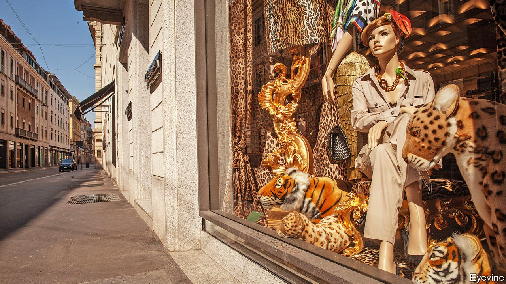
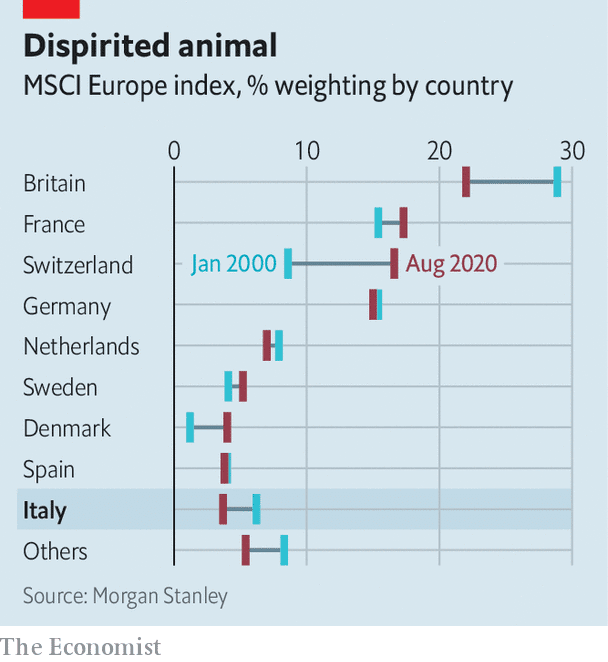

## Italian business

# Italy SpA offers an object lesson in corporate decline

> How the leopard lost its spots

> Oct 22nd 2020MILAN

FEW WORKS of literature capture the challenges of managing decay better than “The Leopard”, Giuseppe Tomasi di Lampedusa’s masterpiece about Sicilian blue bloods struggling to adapt to the changes ushered in by Italian unification in the 1860s. Replace the “shabby minor gentry” with Silicon Valley parvenus and recently impoverished but now monied masses with emerging China, and the novel also serves as an apt metaphor for the decline of once-princely corporate Italy. 

“We had the richest and most perfect region of the world but we are old aristocrats who are losing our momentum,” sighs Marco Tronchetti Provera, boss of Pirelli, a 148-year-old tyremaker based in Milan. Many of his fellow chief executives echo di Lampedusa’s Don Fabrizio, who pined for the days when “We were the leopards, the lions.” Like the fictional patriarch, they see the world in upheaval but find themselves unable to do much about it.

Ironically, when di Lampedusa’s novel was published in 1958 Italy was the opposite of decaying. Its GDP doubled between 1951 and 1963, and by 1973 added another two-thirds. Gianni Agnelli, Fiat’s dashing owner, hobnobbed with the Kennedys. The Red Brigades’ campaign of terror launched in 1970 shook business for over a decade but did not cripple it. Olivetti became the world’s second-biggest computer-maker, behind IBM. Montedison was its seventh-largest chemicals firm. Mediobanca rivalled Lehman Brothers and Lazard in merchant-banking prowess. Benetton brought colourful sweaters to the masses; Giorgio Armani, Gianni Versace and Dolce & Gabbana shoulder-padded Wall Street and Beverly Hills. 

These days Italy SpA is out of style. The country’s doldrums aren’t news; The Economist called it “the real sick man of Europe” 15 years ago. “It escapes no one, and certainly not business,” says Carlo Bonomi, head of Confindustria, Italy’s main business lobby. Even before covid-19, its economy was smaller than it had been before the financial crisis of 2007-09. Its stockmarket is worth under €500bn ($590bn). It accounts for 3.7% of the MSCI index of European stocks, down from 6.2% in 2000, according to Morgan Stanley, a bank (see chart). Only seven Italian firms feature among the world’s 1,000 biggest listed ones. The €77bn market capitalisation of the most valuable, Enel, an electric utility, is a rounding error relative to that of America’s trillion-dollar tech titans. 

Rather than confront these challenges, plenty of Italian tycoons have been flogging the family silver. Treasured Italian brands that have gone into foreign hands in the past decade include Bulgari, a jeweller (sold to LVMH, a French luxury group); Luxottica, which makes Ray-Ban shades (and merged with Essilor, a French spectacles firm) and Versace (bought by Michael Kors, an American fashion house). Since 2015 Pirelli’s biggest shareholder has been ChemChina, a state-owned giant. In 2018 Federico Marchetti sold Yoox Net-a-Porter, his online luxury startup and Italy’s rare tech success, to Richemont, a Swiss group.

Others have been departing il bel paese. After merging with Chrysler in 2014 Fiat moved its headquarters to London and legal seat to the Netherlands; it is now combining with PSA Group, a French carmaker. (Exor, the Agnelli family’s Dutch-domiciled investment vehicle which owns 28.9% of Fiat-Chrysler’s shares, is also a shareholder in The Economist’s parent company.) Ferrero, the maker of Nutella, has decamped to Luxembourg. This year Campari, producer of the bitter apéritif owned by the Garavoglia clan, picked the Netherlands. It may be joined by Mediaset, Italy’s biggest private broadcaster controlled by Silvio Berlusconi, a scandal-prone former prime minister, which is seeking to move the headquarters of its holding company there. “I keep less than 5% of my total wealth in Italy. I am very careful with this country,” confessed Francesco Trapani, scion of the Bulgari dynasty, in 2018.

Many other firms are shadows of their former selves. In 20 years the market value of Generali, an insurer, has more than halved, to €19bn. Telecom Italia’s has shrivelled by nearly 90%, to €7bn. Intesa Sanpaolo and UniCredit, two big banks, tried their hand at consolidation with ambitious deals in Europe, only to retrench.

Three main reasons explain corporate Italy’s slide into irrelevance. They have to do with a self-reinforcing lack of financial, social and human capital.

According to the OECD, a club of industrialised countries, 40% of Italian corporate assets are financed by short-term debt, more than among big European peers. Credit is granted on a basis of history, so new firms find it hard to raise money. Political risk—embodied by the rise to power in 2018 of the antibusiness Five Star Movement (M5S)—plays on the nerves. Reliance on banks means that when they get into trouble—as in the financial crisis and the ensuing euro crisis—all their corporate clients suffer, not just the delinquent ones.

All this constrains investment and makes Italian companies more vulnerable to macroeconomic shocks—of which the covid-19 pandemic is the latest. Cerved, a ratings agency, reckons that even in the best case perhaps 7% of non-financial firms are at risk of default this year. In the worst case that could rise above 10%. 

Italy’s capital markets are shallow compared with the rest of Europe, let alone America. It has no venture-capital industry to speak of. Business elites grumble about Italians’ aversion to investing in their own stockmarket, despite being among the world’s most prodigious savers. Domenico Siniscalco, a former finance minister, likens it to “an oil producing country without an oil industry”. Investors are wary of putting money into listed firms controlled by founding families or the state, which dominate Italy’s shareholder registers—and which prevent their companies from raising new shares, fearing dilution.

Confidence in big business is further eroded by a constant gusher of scandals. Every few months a business bigwig gets into hot water. In July prosecutors requested an eight-year prison sentence for the boss of Eni, an oil major, for allegedly bribing Nigerian officials to secure an oil block. He and the company deny wrongdoing.

Disenchantment with corporate Italy sows more mistrust, depleting its already thin social capital. A recent report found that nine in ten Italians want caps on executive pay, the highest share among seven Western countries. That would add to already baroque red tape that is a barrier for upstart firms. Italy ranks 58th out of 190 countries in the World Bank’s “Doing Business” survey. It comes a dismal 97th on securing building permits, 98th for starting new businesses, 122nd at enforcing contracts and 128th on tax rules. 

Rather than improving the physical and legal infrastructure that would help all firms, government money goes to bailing out perennial failures. This year the state once again rescued Alitalia, the endlessly loss-making flag-carrier. Italy has no equivalent of the Fraunhofer institutes that help Germany’s medium-sized firms stay at the cutting edge of their fields, observes Fabrizio Barca, an economist and former development minister. “If we had the infrastructure of the Germans we would be six or seven times more competitive,” says Marco Giovannini, boss of Guala Closures, a global leader in the niche market for bottle tops. “We have to compete against inefficiency.” In 2017 he opened Guala’s main research centre not in its Piedmont home but in Luxembourg.

Di Lampedusa’s characters might recognise the third shortage—of human capital—as the flipside of pride. In the post-war era, when it fuelled founders’ devotion to their creations, this was a virtue (as to some extent it is today in Silicon Valley). Now it looks like obstinacy. Bankers talk of multiple failed attempts to persuade Mr Armani to build a bigger group in the mould of LVMH. During Italy’s lockdown a photo of him dressing the windows of his Milan store added to the myth of Italian creative genius. LVMH’s billionaire owner, Bernard Arnault, gets others to do that menial task, so he can focus on business. 

In 2017 Guido Corbetta of Bocconi University estimated that half of first-generation Italian firms have an owner-boss who is over 60, and a quarter have one who is at least 70. Italian boardrooms’ denizens seem almost as ancient as the Renaissance art adorning their walls. Italy’s most prominent businessmen—they are almost exclusively male—are octogenarians: Mr Berlusconi (84), Leonardo Del Vecchio of Luxottica (85), Luciano Benetton, the clothing clan’s patriarch (85), Mr Armani (86). 

No wonder Italians feel the system is rigged in favour of a few ageing billionaires and plump for populists like the M5S. Talented youngsters shy away from a career in the unloved business world. “There is now little opportunity anywhere in Italy, even for the wealthy and well-connected,” says Andrea Alemanno of Ipsos, a research firm.

Despite this self-perpetuating cycle, examples of Italy’s post-war industrial vigour persist. Enel is a world leader in clean energy. In certain areas “pocket multinationals”, as Vittorio Merloni, an entrepreneur, dubbed them in the 1990s, churn out wares admired the world over: Lavazza and Illy (coffee), Moncler and Ermenegildo Zegna (fashion), IMA and Marchesini (packaging), or Technogym (fitness kit)

And Italy remains a country of enterprise. The OECD reckons nearly a quarter of Italian firms are high-growth, more than in most big European countries. Johann Rupert, the South African financier behind Richemont, has mused that Italy’s craftsmen might benefit from a failure to adapt to globalisation as the world comes to prize their old-fashioned skills. Pirelli’s Mr Tronchetti Provera praises the deal with ChemChina, which let the tyremaker’s headquarters and technology stay in Milan, as “an opportunity to further strengthen our position in China without giving up Italian roots”. Some see Italy’s less hard-edged capitalists as an antidote to Wall Street; last year Jeff Bezos made a pilgrimage to Brunello Cucinelli, founder of a posh-sweater company who advocates a humanistic capitalism. 

In 2011, shortly before he became governor of the European Central Bank, Mario Draghi warned fellow Italians that Venice in the 17th century and Amsterdam in the 18th century planted the seeds of their collapse by putting elite privilege ahead of innovation. Corporate Italy can hang on to what is left of its sheen. But, as Don Fabrizio’s thrusting nephew, Tancredi, told his uncle, “If we want things to stay as they are, things will have to change.”■

## URL

https://www.economist.com/business/2020/10/22/italy-spa-offers-an-object-lesson-in-corporate-decline
