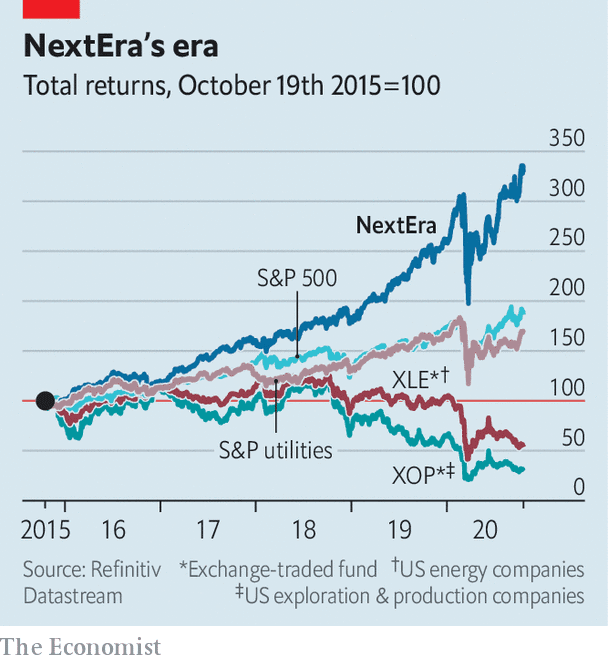

## What next

# Meet NextEra, America’s most valuable energy firm

> The clean-energy utility has surpassed ExxonMobil in market capitalisaion—and shows no signs of slowing

> Oct 24th 2020NEW YORK

TO MANY INVESTORS, backing an American oil company looks only slightly shrewder than stuffing cash in a blender. Facing covid-19 and old concerns over low returns, the industry is scrambling to boost efficiency. On October 19th ConocoPhillips said it would pay $9.7bn for Concho Resources, a Texan fracking firm. The next day two other frackers, Pioneer Natural Resources and Parsley Energy, announced a $4.5bn tie-up. Across the sector, oilmen are vowing to put profits before growth. How about a firm that offers both?

As America’s oil industry flails, its most valuable utility, NextEra, has soared. It is already the world’s top generator of wind and solar electricity. When NextEra presented its latest quarterly results on October 21st, it said it now has about 15 gigawatts of renewable projects in its pipeline, larger than its entire existing renewables portfolio. Net profit jumped to $1.3bn, up by 13% year on year.

Oil bosses have long dismissed utilities as solid but staid, less energy goliath than grandpa. “We have much higher expectations for the returns on the capital we invest,” Darren Woods, boss of ExxonMobil, proclaimed in 2018. Since then his oil major’s market capitalisation has sunk, by 60%. NextEra’s has soared past it to $147bn. It is now America’s most valuable energy company. And it is not slowing down. 

NextEra does not have the global reach of European utilities, with foreign outposts from the Amazon to South Africa. But under the leadership of Jim Robo, it has become a titan. It has two main businesses. Florida Power & Light, a utility that earns a regulated rate of return, serves more than 5m customers in the sunshine state. NextEra Energy Resources builds and operates energy projects—mostly wind farms, but also solar and nuclear, as well as gas pipelines and transmission lines. In 2020 neither business seems revolutionary. But NextEra set winning strategies early and pursued them well, argues Michael Weinstein of Credit Suisse, a bank.

Florida Power & Light, for instance, was among the first to replace coal-fired power plants with gas, benefiting from cheap supply from America’s fracking boom. The company improved reliability by being an early adopter of machine learning, notes Vivek Wadhwa, who has advised the company and features NextEra in a new book on innovation. The utility is growing healthily—earnings jumped by 11% in the third quarter—and customers’ bills have remained relatively low. 

But it is large-scale renewables that are NextEra’s forte. It was quick to take advantage of generous tax credits to build wind farms across the Midwest. When Mr Robo became its president in 2006, it was already America’s top producer of wind power. And it bet that renewables would grow as costs fell while those of coal-fired power stayed flat. The unsubsidised cost of wind and solar farms (spread over their lifetime) has fallen by about 70% and 90%, respectively, since 2009. Green-minded voters have pushed things along. More than half of American states now mandate that a share of their electricity comes from renewables. The logic for replacing old coal plants with renewables that run on costless inputs—wind and sun—looks obvious. 

Investors agree. NextEra has outperformed not just other utilities and oil firms but the stockmarket as a whole. Total shareholder returns over the past three years have declined by 47% for an index of American energy companies, and 52% for ExxonMobil. NextEra’s have jumped by 112%, more than the broad S&P 500 index (see chart). Credit-rating agencies like the stability provided by Florida Power & Light. NextEra Energy Resources has used its expertise to make competitive bids for contracts, and its scale to lower costs, explains Stephen Byrd of Morgan Stanley, a bank. Sometimes NextEra sells assets to a company in which it has a stake and which uses power projects’ cashflows to pay reliable dividends.

Other utilities have cottoned on. Mr Byrd points out that Xcel Energy, a midwestern utility that is one of NextEra’s biggest customers, is now building its own wind farms. But NextEra’s size and know-how give it an edge. 

It may grow further through acquisition. In 2019 it completed the purchase of Gulf Power, another Floridian utility. It is rumoured to be eyeing Duke, a regulated utility in North Carolina. “There is not a utility in the country that we couldn’t run more efficiently and better for customers,” Mr Robo declared in July. 

NextEra will also keep investing in generation and grids—this month it raised planned capital spending to $60bn between 2019 and 2022. In the second quarter capital expenditure exceeded that of all but nine American firms. In the energy industry only ExxonMobil spent more. Projects include big solar farms and underground power lines in Florida to make the grid more resilient to storms.

NextEra has already bought or leased many of America’s most attractive remaining sites for wind and solar energy, says Mr Weinstein. As the grid becomes more reliant on intermittent renewables, demand will rise for batteries. With trademark foresight, NextEra is investing in those, too. ■

For more coverage of climate change, register for The Climate Issue, our fortnightly [newsletter](https://www.economist.com//theclimateissue/), or visit our [climate-change hub](https://www.economist.com//news/2020/04/24/the-economists-coverage-of-climate-change)

## URL

https://www.economist.com/business/2020/10/24/meet-nextera-americas-most-valuable-energy-firm
