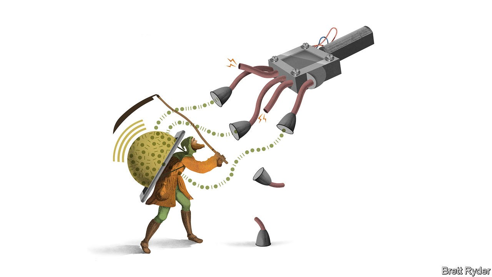

## Schumpeter

# Who owns the web’s data?

> The fightback against Big Tech’s feudal lords has begun

> Oct 22nd 2020

SIR TIM BERNERS-LEE had a Romantic vision when he created the World Wide Web in 1989. In his words, he helped “weave” it together as a way of connecting anything to anything—as if he were sitting at a loom, not at CERN, a particle-physics laboratory in Geneva. But those were halcyon days. Now the web risks falling into what he has called a dystopia of prejudice, hate and disinformation. People around him talk of “digital feudalism” to describe the control big technology platforms have over data. As a result, Sir Tim has co-founded a startup, Inrupt, that aims to shift the balance of power. It is one of many incipient efforts aimed at putting data back into the hands of the people.

It sounds quixotic. The use of data, after all, is now the world’s biggest business. Some $1.4trn of the combined $1.9trn market value of Alphabet (the owner of Google) and Facebook, comes from users’ data and the firms’ mining of it, after stripping out the value of their cash, physical and intangible assets, and accumulated research and development. They are not sated yet. Around the world, sensors on everything from cars to kitchens are expected to churn out exponentially more personal information as the “Internet of Things” expands. The tech giants have their beady eyes on it.

Their relentless appetite for data is a mounting concern for policymakers in two ways. The first is political. The platforms’ business models depend on network effects and scale to keep users engaged and to sell more advertising. The result is a culture of virality that, while entertaining, poisons public discourse and disquiets governments. The second is economic. The bigger the tech firms are, the harder it is for potential rivals to overcome their data advantage, which suppresses innovation. Viktor Mayer-Schönberger of Oxford University notes that access to capital is no longer the biggest problem for startups. It is access to data.

So trustbusters are on the warpath. The Department of Justice lawsuit in America against Google, filed on October 20th, accuses the company of using contracts with device-makers, such as Apple, to block other search engines. Google denies this, saying people use its services because they choose to, not because they have to. Whatever the merits of the case, for some the only remedy is to break up the tech giants. That is simplistic. The problems will not be solved just by cutting big tech down to size. Any solution must make data more evenly accessible so that potential rivals can grow.

This can be done in several ways. One is to empower individuals. Another is to consider collective action. A third is to rely on governments. All three will need to reinforce each other to have a chance of success.

Start with the individual. It is seductive to argue that each person should have ownership rights over their data. Yet unless laws change radically, in practice it is hard to wrest control back from the tech platforms, because an individual’s bargaining power is woefully weak. Fortunately, other options are surfacing.

One is a subscription model, along the lines of Netflix or Spotify. MeWe, an “anti-Facebook” social network (with Sir Tim on its board), spares its users bombardments of advertisements and targeted news, and charges fees instead. Another option is to start gathering data on behalf of the individual from all sorts of sources. Inrupt, for instance, is working with the government of Flanders, a region of Belgium, to give every citizen a “pod” to store personal data. It hopes private firms will build user-friendly apps around the data, with people’s consent, says John Bruce, its co-founder. The better the apps, the more eager people will be to furnish it with their data. In India something similar is happening in financial services. Individuals’ and firms’ financial data can be transferred to financial-services firms via “account aggregators” that obtain the owners’ consent. This can help speed up credit-scoring and loan underwriting. It could also be an alternative to huge data guzzlers such as Ant Financial, a Chinese fintech firm.

A second way to strengthen the power of those who provide data is by collective action—particularly important when so much value on the web comes not from individuals’ data but from their interactions with others. Glen Weyl, an economist at Microsoft, a software colossus, proposes “unions” that bargain on behalf of groups of people for a share of the income generated from the use of their data. The aim, says Mr Weyl, is not to destroy the platforms, just as labour unions do not want to shut down factories. Andrew Yang, a former American presidential hopeful, has proposed a “digital dividend” to individuals via collective bargaining.

These efforts, however valiant, are in their infancy. They may not amount to anything unless governments, too, weigh in—as they have done with the European Union’s General Data Protection Regulation, and the California Consumer Privacy Act. Though the chief aim of both is privacy, they have dramatically bolstered individuals’ rights over their own data. The European Commission, the EU’s executive arm, long more interventionist than America on tech regulation, plans to go a step further, proposing a Data Act in 2021 that will seek to wrench open the bloc’s public and private data vaults. As with the American government, the EU continues to threaten the cudgel of antitrust law against the tech giants.

Silicon Valley says it has got the message. This year Facebook offered to pay users for recordings of their own voice, to improve speech recognition. The tech firms are making it easier for users to shift photo files to other platforms. But they are token moves. Switching platforms remains fiendishly hard. Scale and virality are so vital to their business models that they lobby fiercely against regulation. They reassure themselves that most consumers continue to support the exchange of data for free stuff. Yet they must be aware that access to data is becoming one of the philosophical issues of the age. Feudalism eventually gave way to greater property rights. One day data serfdom will go the same way, too.■

## URL

https://www.economist.com/business/2020/10/22/who-owns-the-webs-data
