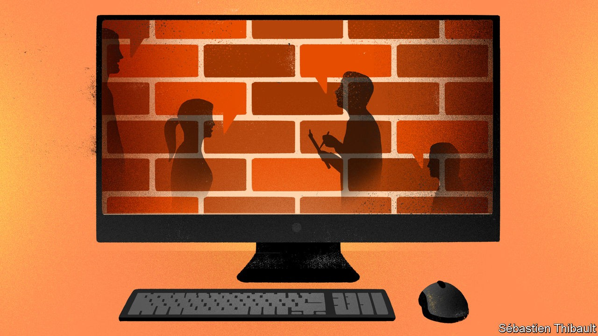
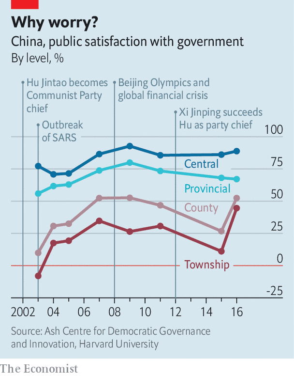

## The 1.4bn-people question

# Apparatchiks and academics alike struggle to take China’s pulse

> Pollsters have to use roundabout ways to find out what people are thinking

> Oct 24th 2020BEIJING

AMONG THOSE arrested after the nationwide pro-democracy protests of 1989 were students, playwrights, poets—and a pollster. Earlier that year Yang Guansan had sent the results of China’s first public-opinion surveys to Zhao Ziyang, then the Communist Party’s chief. To Mr Yang, they suggested that unrest was imminent. After Zhao was purged for opposing the use of troops to crush the demonstrations, investigators discovered Mr Yang’s submission. Found guilty of inciting the protests, the researcher was locked up for two years.

For decades the party had scorned opinion polls as bourgeois and unnecessary—it embodied the will of the Chinese people, so why ask them what they thought? But it has become more open to pulse-taking since Mr Yang’s ordeal, which was described in an article by Tang Wenfang of Hong Kong University of Science and Technology, published in 2018. Mr Yang says the party is “more paranoid” about public opinion than its democratic peers because it lacks elections or a free press for feedback. Now ministries and official media have their own polling units. Universities run state-funded social surveys.

In the internet age the party has been trying to gauge popular feeling in real time. Tech giants and consultancies such as Womin Technology offer help. In a report circulated online, apparently sent to the “central authorities” in February, Womin gave advice on how to handle swelling anger online over the death of a whistle-blowing doctor from covid-19. It suggested that recognising the doctor’s contribution and blocking information put out by “foreign forces” would restore calm. (Perhaps coincidentally, that was the tactic adopted.)

But social-media chatter can be hard to interpret, in part because the government’s own censors work hard at suppressing subversive comments and injecting pro-party ones. Netizens often use coded messages, self-censor, or avoid posting on sensitive topics. Hu Yong of Peking University has identified two types of online public opinion in China: popular sentiment and views crafted or given prominence by the state. It is often hard to tell the genres apart.

In a crisis, while officials are still unsure what line to impose, the job can be a little easier. “If you act fast, you can get good results,” says Mr Tang, noting a brief period of openness on the Chinese web early in the covid-19 epidemic. Sometimes critical opinions on public health, the environment and even official corruption are left uncensored, providing they do not support collective action. But views expressed online offer only a partial picture. It is mainly young, urban and tech-savvy Chinese who use social media.

For all its embrace of opinion polls, the government often does not publish the results of state-sponsored ones. Many are narrowly focused, aiming to gauge feelings about a particular local-government project, for example. The few Chinese universities that conduct nationwide social surveys are cautious, too. They avoid sensitive social or political questions. One academic recalls having to push for questions related to labour disputes among migrant workers to be included in a survey. He succeeded, but the findings were kept confidential. Foreigners are banned from conducting direct surveys in China, forcing them to team up with Chinese pollsters or outsource to them. Between 2003 and 2016 scholars at Harvard University, working with a Chinese partner, conducted a nationwide survey of political trust. Its key finding was that levels of confidence in the central government were high (see chart).

But in the past five years it has become much harder for scholars abroad to find partners in China who are willing to help with such surveys. And in China’s increasingly repressive political environment, researchers struggle to ensure that results are not skewed by respondents’ nervousness. More are resorting to workarounds, says Xu Yiqing of Stanford University. The “list experiment”—often used in polls globally to ask about racism or drug use—can shield someone from having to give a direct answer to a political question. It involves asking respondents to give the total number of affirmative answers to a list of questions (eg, “Did you travel abroad this year?”). But half of them get the same list with one additional sensitive question (“Did you join a protest this year?”). Another way is to let respondents toss a coin and answer “yes” to a question if they get heads, or honestly if they get tails, allowing researchers to calculate a proportion from half of the total pool of survey-takers. Using the list experiment, Mr Tang finds that answers on trust in the party are inflated by only about eight percentage points (those on bribe-giving vary by up to 35).

So why not encourage independent pollsters to conduct more big-picture surveys of the public mood? Would they not help the party to sense trouble long before it erupts, and avoid another 1989-style calamity? Good questions, but those about the party’s own anxieties are among the most difficult to raise of all. ■

## URL

https://www.economist.com/china/2020/10/24/apparatchiks-and-academics-alike-struggle-to-take-chinas-pulse
