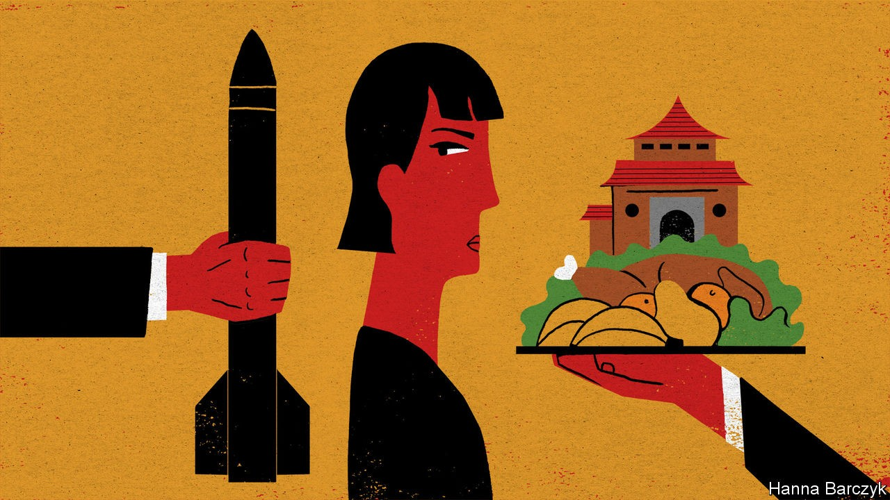

## Chaguan

# China’s half-loving, half-threatening pitch to Taiwan doesn’t work

> The contradictions of a half-loving, half-threatening pitch to Taiwan

> Oct 22nd 2020

CHINA’S COMMUNIST PARTY is not known for bumper stickers—those slogans that fit a political philosophy into a six-inch space next to a car’s brake lights. (Chaguan once covered an election in Kentucky in which the Republican candidate’s bumper sticker read, in its entirety: “Coal. Guns. Freedom.”) Party slogans need not trip off the tongue to be printed on red banners and displayed on streets, as in: “Hold high the great banner of Xi Jinping Thought on socialism with Chinese characteristics for a new era.”

A tolerance for complexity comes in handy when trying to comprehend the approach of Chinese leaders to Taiwan, a democratic island which China deems a province that must unite with the mainland. For their pitch is a mess of contradictions. On the one hand China’s rulers talk of deep ties of blood and kinship with Taiwan’s 24m people, even as the proportion of islanders who define themselves as Chinese falls each year. This campaign does not just involve wooing Taiwanese business bosses with access to mainland markets. Despite covid-induced travel headaches, a small legion of Chinese officials remain employed in a hearts-and-minds industry, planning summer camps, study tours and other people-to-people exchanges across the Taiwan Strait.

On the other hand, China’s honeyed words for Taiwan are becoming hard to hear over the pounding of war drums. Each night for a whole week recently, state television carried taped confessions from alleged Taiwanese spies caught in a nationwide campaign. The People’s Daily, the party’s mouthpiece, carried a commentary on the spy probe written by the state security ministry. It restated China’s resolve to use force if needs be, using a phrase—“Don’t say we didn’t warn you”—that has preceded Chinese military action against other countries in the past. In recent months China has sent its warplanes more often than usual on sorties near Taiwan, notably during visits to the island by Trump administration officials. It has also stepped up the tempo of its military exercises. The Global Times, a strident tabloid, noted “rumours” about the recent deployment of advanced hypersonic missiles to coastal bases, and helpfully explained that they are ideal for scaring American and allied warships away from intervening in any war with Taiwan. Not to be outdone, on October 8th Chinese diplomats posted to the Pacific island of Fiji were involved in a brawl at a party celebrating Taiwan’s national day, staged at a local hotel by Taiwanese officials. Though the skirmish sent a Taiwanese envoy to hospital with head injuries, a foreign ministry spokesman in Beijing blamed the event’s Taiwanese hosts for the violence, and for provocatively displaying their island’s “self-styled flag” on a cake.

This uptick in bellicose rhetoric reflects Chinese anger at growing support for Taiwan in Washington and a desire to teach the island’s government and people that relying on America for protection will lead to their doom. Communist Party bosses will only engage with Taiwanese who agree that their island is part of a country called China. That rule allows them to talk to the Nationalist Party, heirs to the regime that ran the Republic of China until 1949, lost a civil war to Communist forces and retreated to exile in Taiwan. It excludes the island’s president, Tsai Ing-wen, and her ruling Democratic Progressive Party. Ms Tsai, a cautious, cat-loving moderate depicted as a dangerous radical in China, says that the island she governs is a country in its own right, though to avoid a crisis she fudges what is meant by that. Chinese threats are typically accompanied by a line or two about the prosperous future that awaits Taiwan if it accepts the motherland’s embrace. Distilled to sticker-length, the double-edged message to Taiwan amounts to: “Come home, or China will kill you.”

The hearts-and-minds industry is ready to invest in Taiwanese who are receptive to talk of shared blood ties. Just 360,000 people live in Jimei, a district of Xiamen, the coastal city nearest to Taiwan. In Chinese terms, it is a speck on the map. But the district government spent 50m yuan ($7.5m) on a hotel-sized “cross-strait exchange base”. It opened in 2019 to offer subsidised study camps to Taiwanese youngsters, who are mixed with mainland students to enhance the experience. Up to 500 students can be housed in its smart dormitories. Young visitors are greeted by a portrait of President Xi and his words declaring the two sides of the strait to be “one family, their hearts connected from a young age”. They are encouraged to explore such totems of shared culture as a puppet theatre, an opera house, a dragon boat and a giant floor map of China (Taiwan included). They can build moon rovers in a classroom dedicated to China’s space programme, construct model sailing-junks and pilot a drone. Some 140,000 students visited last year, 5,000 of them Taiwanese. In this pandemic year the centre hosted over 1,000 Taiwanese whose families live on the mainland. Jimei is building a second study base with room for 2,400 students, which is due to open next year. A wall plaque immortalises a tribute paid by a Taiwanese student who called Xiamen “much grander” than his island’s capital, Taipei. “It’s scary, how fast they are advancing,” he is quoted as saying.

Young Taiwanese are far warier of China than their elders are. So China’s soft-power sector also caters to retired Taiwanese military officers and ageing members of clan associations seeking mainland roots. The Guandi temple in Dongshan, south of Xiamen, is a “mother temple” to religious sites on Taiwan and a favoured spot for cross-strait events. This week a straw poll of Chinese tourists at the temple found several who think there may be a war with Taiwan. Yet when asked whom they blame for tensions, few seemed curious about hearts and minds on the island. They described Taiwanese as Chinese and China’s armies as crushingly superior. “It’s not about who’s in the wrong, just who’s stronger,” said a woman who declined to give her name. If China allowed political bumper stickers, the cynical nationalism of her words would be a hit. ■

## URL

https://www.economist.com/china/2020/10/22/chinas-half-loving-half-threatening-pitch-to-taiwan-doesnt-work
