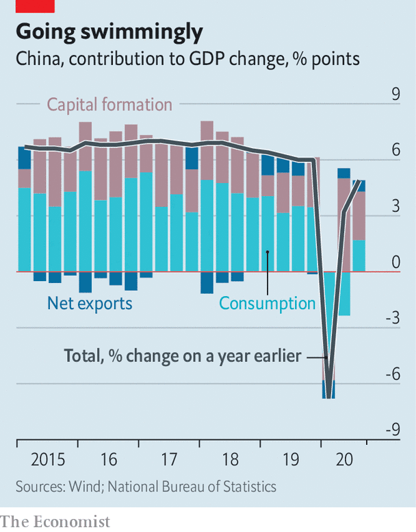

## A big splash

# In a world mired in recession, China manages a V-shaped recovery

> Its rebound is also starting to look more sustainable

> Oct 24th 2020

ONE SCENE more than any other from China’s coronavirus recovery has caught the world’s attention: a giant pool party in August in Wuhan, the city where the pandemic began. Nearly four months after their 11-week lockdown, revellers were crammed together in waist-high water, jumping and shouting in exhilaration as a DJ spun bass-heavy beats. The video went viral. It was a moment of pure release and a sign of how China is far ahead of most other countries in returning to normality (of a sort). Economic data are rarely as exciting as pool parties, but China’s latest GDP figures, released on October 19th, were, roughly speaking, the statistical equivalent of Wuhan’s aquatic festivities.

Officials reported that the economy expanded by 4.9% in the third quarter compared with a year earlier, just shy of its pre-pandemic pace. Whereas most other countries are mired in recession and grappling with a new wave of covid-19 cases, China has just about completed the upward leg of a V-shaped rebound. Analytically, its success is easy to explain. China got one crucial thing right. By almost stamping out the virus it was able to allow activity to resume with few restrictions. Schools are fully open, factories are humming and restaurants are buzzing. China is also lucky in one crucial way. It is better insulated from weak global demand than smaller peers such as New Zealand that have done a good job of containing the pandemic, too. Until vaccines are rolled out, others will struggle to match China’s feat.

Yet China’s headline resilience has masked an unbalanced recovery. Back in February, when the government began cautiously to relax its lockdown, it focused on reopening factories and launching infrastructure projects. It correctly reasoned that maintaining strict health protocols in factories and on construction sites, which can be managed as semi-closed environments, would be easier than in shopping malls or schools. On top of that, China’s meagre provisions for unemployment insurance meant that the millions of people who found themselves out of work had to cut back on spending. Early in its recovery, China’s economy was thus fuelled by factory production and investment. Capital formation—the category in GDP accounting that encompasses these endeavours—contributed five percentage points to growth in the second quarter, whereas consumption subtracted more than two percentage points. Back then that left China with a 3.2% year-on-year growth rate.

The latest data reflect a slightly more balanced recovery (see chart). The contribution to third-quarter growth from capital formation fell to less than three percentage points, in line with the pre-pandemic norm, as infrastructure spending tailed off. Consumption added nearly two percentage points, which was below its pre-pandemic heights but a big improvement—easily noticeable in the crowds that have returned to tourist sites, restaurants and shops. Trade was the cream on top. China’s share of global merchandise exports has risen to a record high during the pandemic. It received a boost by being the first manufacturing power to resume operations, in addition to being the world’s biggest producer of protective equipment, from masks to surgical gowns.

Whenever Chinese data look so rosy, it is natural to ask whether they are believable. In this case a range of non-GDP indicators, including other countries’ exports to China, lend credence to the picture of a robust rebound. The bigger worry is whether the recovery has been at the expense of efforts to rein in debt. The initial sharp economic slowdown followed by a government-directed boom in bank lending will push China’s debt-to-GDP ratio to about 275% this year, up by 25 percentage points. It will be the biggest annual increase since 2009 during the global financial crisis.

Yet China is far from alone. Governments around the world have run up huge tabs to lessen the economic fallout from the pandemic. With its growth back on track, China has a chance to tighten the spigots again. S&P, a credit-rating agency, notes that the country’s real lending rates (ie, adjusted for inflation) have recently climbed to a five-year high, a dampener on investment. If successful, China will confine irrational exuberance to pools. ■

## URL

https://www.economist.com/china/2020/10/24/in-a-world-mired-in-recession-china-manages-a-v-shaped-recovery
