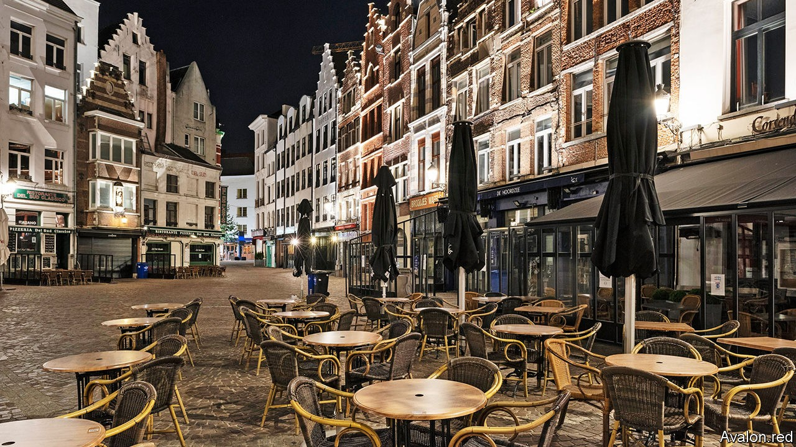
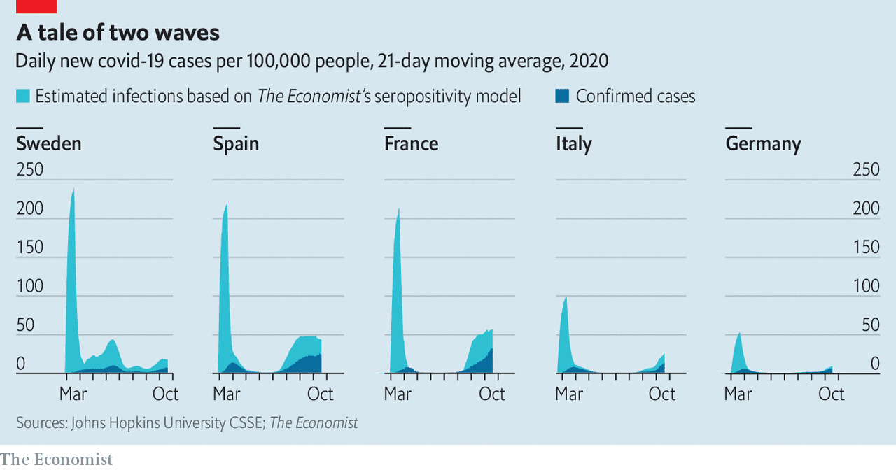

## A patchwork of red, yellow and green

# A second wave of covid-19 sends much of Europe back into lockdown

> Even the Germans and Nordics cannot be complacent

> Oct 22nd 2020AMSTERDAM

FOR A FEW months this summer it was almost possible for Europeans to believe that life had returned to normal. Parisian museums and Barcelona’s cafés were open, if less crowded. Germans, Dutch and Danes jetted off to holidays on Mediterranean beaches. In August and September, as children across the continent returned to school, covid-19 infections began to rise. Yet governments, worried about a backlash, chose not to reintroduce harsh social-distancing measures.

Their decision has had a price. A second wave of covid-19 is now washing over Europe. In many countries the daily numbers of confirmed cases exceed their spring peaks, though this is mostly because there is a lot more testing; death rates are substantially lower. A model developed by The Economist, based on serological tests showing how many people have been exposed to the virus, suggests the second wave has yet to match the first (see chart), though numbers are clearly rising, as are hospitalisations. Most countries failed to use the summer to build robust testing and tracing operations. Now they are falling back on blunt measures: shutting restaurants and introducing quarantines and curfews.

Spain is among the hardest-hit countries. That is partly because its left-wing minority government and the conservative opposition have failed to agree on a national strategy. Only some regions have set up effective test-trace-isolate systems, and rates of infection vary wildly. Madrid is under a 15-day state of emergency that bars non-essential movement in or out of the city, limits social gatherings to six people and closes restaurants at 11pm. Catalonia and Navarre have been even tougher.

France is in just as bad a pickle. The share of tests that come back positive has climbed from 4.6% on August 31st to 13%. On October 17th the government imposed a curfew on nine big cities from 9pm to 6am. Arnaud Fontanet, an epidemiologist at the Institut Pasteur, says the country must reduce new infections to 3,000 a day before it can get the epidemic under control; they are currently at around 28,000.

When covid-19 first arrived, northern Europeans snidely linked its virulence in Italy and Spain to their physically effusive cultures. That idea is harder to sustain this time: among the hardest-hit countries are Belgium and the Netherlands. “We are really very close to a tsunami. We no longer control what is happening,” warns Frank Vandenbroucke, Belgium’s health minister. The government has closed restaurants and bars and brought in a curfew from midnight until 5am. The virus is also exacerbating regional divisions. Flemish nationalists resent the national lockdown, since transmission rates are higher in French-speaking regions.

In the Netherlands the government dithered while daily cases per million rose steadily. They are now higher than in Spain or France. This month the government at last closed restaurants for four weeks and required masks in public indoor spaces. But when Mark Rutte, the prime minister, apologised last week, it was only for letting the royal family take an autumn holiday in Greece. (They cut it short.)

In south-eastern Europe and the Balkans, which tamed the virus effectively this spring with harsh lockdowns, there has been little appetite to reintroduce restrictions. Serbia’s prime minister, Ana Brnabic, vowed to “act differently” if the virus resurged, yet is taking little action now that it has. But Bulgaria, where hospitals are complaining of a shortage of doctors, has now made mask-wearing compulsory. So has Bucharest, the capital of Romania, where schools have been told to move to online learning and cinemas and theatres have been closed.

One step the EU did take this month was to settle on a Europe-wide map of regional epidemic severity, after a disagreement over the colours. Almost every province in Europe shows up red (a high rate of the virus). But one can easily discern the outlines of the success stories: Germany, Italy and the Nordics, which are mostly yellow (medium) with patches of green (low). Italy may not stay a success for long. It drove transmission rates down with aggressive lockdowns in the spring, but new cases are rising fast. On October 18th it implemented new restrictions. But they were surprisingly lax, thanks to intra-coalition rows.

Germany and the Nordics remain Europe’s star performers, though there are difficulties. Germany has the continent’s best track-and-trace systems, but in parts of Berlin there are now too many cases to follow. Hard-hit areas are imposing early closing-times for restaurants and requiring more mask-wearing. However, Germany’s federal system is causing fragmentation and disagreement. Angela Merkel, the chancellor, fears that going too slowly now could force more drastic restrictions later. That would erode the civic will needed to fight the virus. Where Europeans once embraced that battle with a spirit of shared sacrifice, many now grumble that their governments are blowing it. ■

Editor’s note: Some of our covid-19 coverage is free for readers of The Economist Today, our daily [newsletter](https://www.economist.com/https://my.economist.com/user#newsletter). For more stories and our pandemic tracker, see our [hub](https://www.economist.com//news/2020/03/11/the-economists-coverage-of-the-coronavirus)

## URL

https://www.economist.com/europe/2020/10/22/a-second-wave-of-covid-19-sends-much-of-europe-back-into-lockdown
