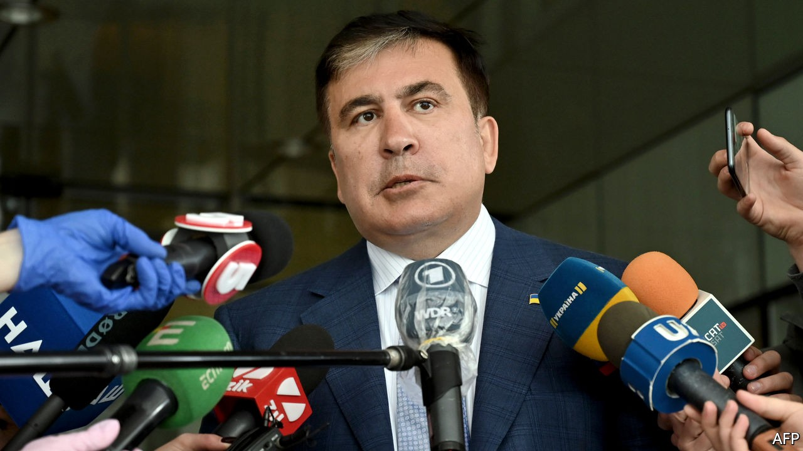

## Misha’s return?

# An exiled ex-president plans a comeback in Georgia

> Mikheil Saakashvili wants to be prime minister

> Oct 22nd 2020

IN THE GARISH style of a video game, the former Soviet republic of Georgia’s richest man is running around in a suit, knocking out golden coins with his head, when a rotund figure pops out of a chimney, destroying the oligarch and triggering “game over”. The victor—in the mock game—is Mikheil Saakashvili, independent Georgia’s best-known ex-president. He hopes to become Georgia’s prime minister in an election on October 31st.

Mr Saakashvili led the “Rose revolution” of 2003 that propelled Georgians from post-Soviet dourness to pro-European modern governance, cracking down on petty corruption and setting up reputable state institutions. But he then spectacularly plummeted from grace. Now he is conducting a re-election campaign from exile in Ukraine, through his United National Movement (UNM). Stripped of his Georgian citizenship, he has been indicted on several criminal charges by the current government, dominated by the Georgian Dream party led by Bidzina Ivanishvili, the country’s richest oligarch, who lives in an emerald-green glass palace overlooking Tbilisi, the capital. Mr Saakashvili, who has been sentenced to nine years in jail in absentia, would doubtless return if UNM were to win, though the odds are against it.

The election is getting nasty. On October 11th Mr Saakashvili was attacked during a rally for Georgian émigrés in Athens. Back in Tbilisi, the government ordered the arrest of two cartographers on charges of mismanaging negotiations to define the border with Azerbaijan 14 years ago, a dig at Mr Saakashvili, who was president at the time. Worse for Mr Saakashvili, he has riled Georgians by expressing support for Azerbaijan in its recent quest to recapture Nagorno-Karabakh, an enclave controlled by Armenia. Georgia, bordering both countries, has hefty Armenian and Azeri populations, and has been trying to mediate. Many young Georgians heartily wish it were game over for both men.

## URL

https://www.economist.com/europe/2020/10/22/an-exiled-ex-president-plans-a-comeback-in-georgia
