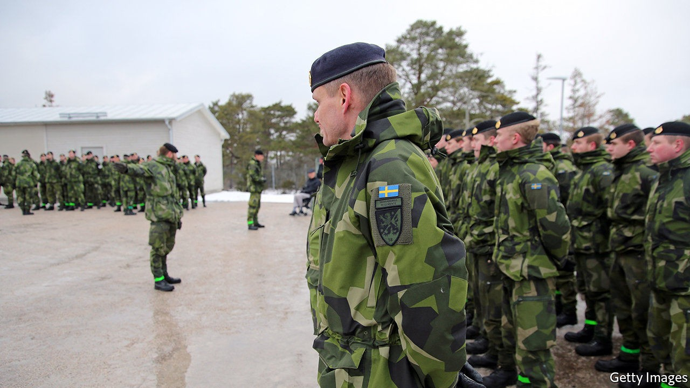
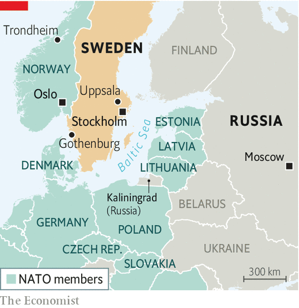

## Less neutral, more beefy

# Sweden embarks on its largest military build-up for decades

> The reason is Russia

> Oct 19th 2020

“AN ARMED ATTACK against Sweden cannot be ruled out,” warned Peter Hultqvist, Sweden’s defence minister, shortly after he introduced a new defence bill on October 14th. It promises the country’s largest military expansion for 70 years. The reason is plain. Russia’s assertive behaviour across Europe, from invasion to assassination, has alarmed Swedes.

In recent years, Sweden has accused Russia of violating its air space and waters several times. Accordingly, it has deepened military ties with NATO (though not a member of the alliance) and with America and its Nordic neighbours. If the new bill is passed, as is likely, the defence budget is set to rise by SKr27.5bn ($3.1bn) between 2021 and 2025, a 40% boost that will bring expenditure to around 1.5% of GDP—the highest level for 17 years.

The new cash will pay for a 50% increase in the armed forces to 90,000 people, including regular soldiers, conscripts and local reservists in the Home Guard (no longer the Dad’s Army of yesteryear). The army will grow from two mechanised brigades to three, each of around 5,000 soldiers, with a smaller additional brigade for the Stockholm area.

The draft, abolished a decade ago but brought back for both sexes in 2017, will double in size to 8,000 conscripts a year. Five new local-defence battalions will be set up around the country, tasked with protecting supply lines from the Norwegian ports of Oslo and Trondheim. An amphibious unit will be re-established in Gothenburg, Scandinavia’s largest port.

The air force can look forward to newer Gripen fighter jets with longer ranges and better radar, some of which will go to a new air wing in Uppsala, 70km (43 miles) north of Stockholm. The navy will get an extra submarine, money to design a new type of warship, and air-defence missiles which its ships have needed for 15 years.

Civil defence will get more funds for cyber-security, the electricity grid and health care. “We’ve begun to rebuild a newer version of what we had during the cold war,” says Niklas Granholm of FOI, Sweden’s defence-research agency. The aim is to enable Sweden to hold out in a crisis or war for at least three months until help arrives (assuming it does).

Much of this dramatic expansion is to patch up a creaking force. “The armed forces were in a state of crisis for the last 20 years,” says Henrik Paulsson of the Swedish Defence University. In 2013 Sweden’s top general admitted that his forces could defend only part of the country—and only for a week. Sweden’s army has just two dozen artillery pieces. They are in the north, more than ten hours’ drive from the brigades they are supposed to support, says Mr Paulsson. Under the new plan, the army will have a more respectable 72 pieces.

“We are finally getting our house in order,” says Mr Granholm. But “new budgetary black holes” may appear after 2026. “The debate about the bill after this one”, he says, “has already begun.” ■

## URL

https://www.economist.com/europe/2020/10/19/sweden-embarks-on-its-largest-military-build-up-for-decades
