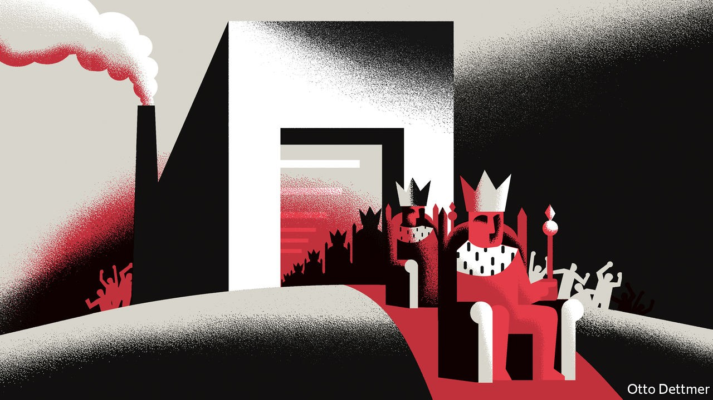

## Free exchange

# Can too many brainy people be a dangerous thing?

> Some academics argue that unhappy elites lead to political instability

> Oct 24th 2020

TEN YEARS ago Peter Turchin, a scientist at the University of Connecticut, made a startling prediction in Nature. “The next decade is likely to be a period of growing instability in the United States and western Europe,” he asserted, pointing in part to the “overproduction of young graduates with advanced degrees”. The subsequent surge in populism in Europe, the unexpected votes in 2016 for Brexit and then for President Donald Trump in America, and a wave of protests from the gilets jaunes to Black Lives Matter, has made Mr Turchin something of a celebrity in certain circles, and has piqued economists’ interest in the discipline of “cliodynamics”, which uses maths to model historical change. Mr Turchin’s emphasis on the “overproduction of elites” raises uncomfortable questions, but also offers useful policy lessons.

As far back as ancient Rome and imperial China, Mr Turchin shows, societies have veered from periods of political stability to instability, often at intervals of about 50 years. Consider America. Every pundit knows that Congress has become gridlocked, with Democrats and Republicans unwilling to compromise with each other. Fewer know that it was also highly polarised around 1900, before becoming more co-operative in the mid-20th century.

What causes these lurches from calm to chaos? Mr Turchin views societies as large, complex systems that are subject to certain patterns, if not laws. That is an entirely different approach from much of academic history, with its preference for small-scale, microcosmic studies, argues Niall Ferguson of Stanford University. In a paper published this year Mr Turchin (with Andrey Korotayev of the Higher School of Economics in Russia) examines the prediction of instability he made in 2010. His forecast model contains many elements, but like Karl Marx Mr Turchin seems to believe that “the history of all hitherto existing society is the history of class struggles.” Where Marx focused on the proletariat, though, Mr Turchin is more interested in the elite—and how its members struggle against each other.

Who counts as the elite, and how competition manifests itself, varies from place to place; one example could be a large number of highly educated folk relative to the number of government offices (and therefore jobs). But a struggle is most likely when economic inequality is high. The rewards for being at the top are then especially lucrative, both in terms of earning power and political influence, and those who miss out feel their loss more keenly. The feeling of resentment is particularly strong among people brought up to believe that they ought to be in the elite. Worse still, societies tend to produce ever more would-be elites, in part because access to education tends to improve over time. Mr Turchin sees all this as a recipe for political chaos. Articulate, educated people rebel, producing a scramble for political and economic power. Elites stop co-operating, counter-elites emerge, and order breaks down.

The argument undoubtedly papers over historical nuance. Yet focusing on dissatisfied elites is not a bad way of understanding political instability. Hugh Trevor-Roper, a historian, noted that “social crises are caused not by the clear-cut opposition of mutually exclusive interests but by the tug-of-war of opposite interests within one body.” The French Revolution was not primarily the product of misery but instead of a battle between an underemployed educated class and hereditary landowners. Historians identify “the problem of an excess of educated men” as contributing to Europe’s revolutions of 1848. Mr Turchin suggests that though slavery was the proximate cause of the American civil war, a more fundamental one was resentment from up-and-coming Northern capitalists towards stuck-in-their-ways Southerners.

Elite overproduction can also help explain the malaise gripping the rich world of late. It has become extraordinarily difficult for a young person to achieve elite status, even if she works hard and goes to the best university. House prices are so high that only inheritors stand a chance of emulating the living conditions of their parents. The power of a few “superstar” firms means that there are few genuinely prestigious jobs around. Mr Turchin reckons that each year America produces some 25,000 “surplus” lawyers. Over 30% of British graduates are “overeducated” relative to their jobs.

All this goes some way to explaining an apparently puzzling trend: why apparently well-off people are drawn to radicalism. Under Jeremy Corbyn Britain’s Labour Party attracted more upper-middle- and middle-class folk than it used to, even as it moved further left from the Tories; its lead among recent graduates was clear. Joe Biden’s lead over Bernie Sanders in opinion polls during the Democratic primaries was far smaller among college-educated Americans than among those who did not finish high school.

Mr Turchin’s theories predict that political tremors eventually subside. “Sooner or later most people begin to yearn for the return of stability and an end to fighting,” he argues. Already the data show that support for both left- and right-wing populist parties in Europe is waning. Polls suggest Mr Trump will soon be voted out of office. Another option for those looking to avoid instability is to reduce the number of aspiring elites. Boris Johnson, Britain’s prime minister, has pressed for better vocational education, saying that “We need to recognise that a significant and growing minority of young people leave university and work in a non-graduate job.”

Yet enlightened elites can prevent the emergence of political instability in more effective ways. In the early 20th century American reformers raised inheritance taxes to prevent the emergence of a hereditary aristocracy, and engaged in massive trust-busting. Modernising urban-planning systems could lower housing costs, and deregulating labour markets would help create good jobs for “excess” elites. Mr Turchin’s analysis of the structural forces governing societies is an intriguing explanation of political unrest. But cliodynamics need not be destiny. ■

## URL

https://www.economist.com/finance-and-economics/2020/10/24/can-too-many-brainy-people-be-a-dangerous-thing
