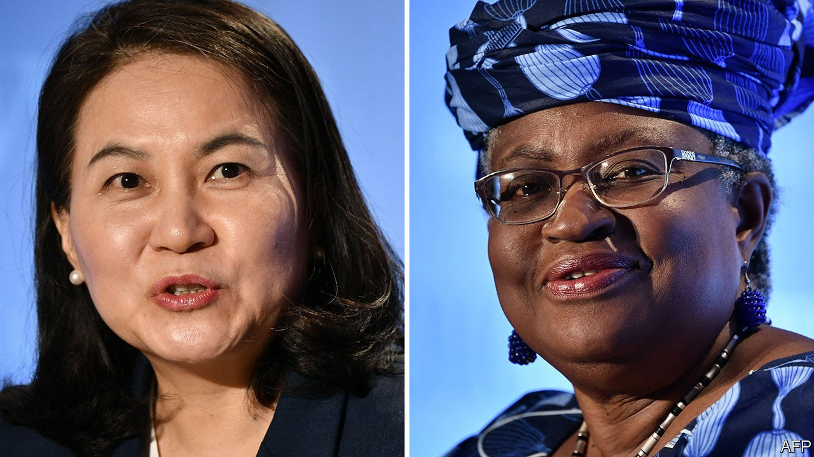

## The home straight

# Ngozi Okonjo-Iweala is the favourite to lead the WTO

> The leadership race tells you something about thorny trade issues

> Oct 22nd 2020WASHINGTON, DC

MEMBERS OF THE World Trade Organisation (WTO) are not known for co-operating with each other. So when in June they began the process of choosing a new director-general, many feared deadlock. But now, as the process draws to a close, officials are feeling hopeful. Two candidates are still in the running: Nigeria’s Ngozi Okonjo-Iweala, the chairwoman of GAVI, a vaccine-finance agency, and a former World Bank official and finance minister; and Yoo Myung-hee, South Korea’s trade minister. A winner is due to be announced between October 28th and November 7th, and support seems to be coalescing around Ms Okonjo-Iweala. Yet the contest says more about the discord in the trading system than the harmony.

The candidates themselves did a good job of highlighting various divisions in the course of the selection process (while dutifully noting that only members have the power to resolve them). Between them they identified a long list of problems: jammed negotiations that have left the WTO’s rule book out of date; a broken system of solving disputes; members’ lacklustre commitment to transparency; and a trade war between America and China.

Disagreements between members also explain the candidates’ rather limited ambitions. A bold agenda might include a grand bargain on agriculture that lowers tariffs in poor countries and limits subsidies in rich ones. Ms Myung-hee is a seasoned negotiator and not one to shy away from tricky talks. Even so, rather than shooting for a big deal, she now reckons that restoring the WTO’s credibility as a negotiating forum means just agreeing on something. She would prioritise ongoing talks to curb members’ fishing subsidies. (Even that narrower deal will be a stretch, given that negotiators do not yet agree on what counts as fish.)

Ms Okonjo-Iweala has emphasised her experience fighting covid-19 as her strong suit. As head of GAVI she understands the importance of open trade so that vital supplies can get to where they are needed. But this too is a thorny topic. Rich countries are more interested in lowering others’ tariffs than limiting their own right to apply export controls. They also hate a recent proposal from India and South Africa to suspend intellectual-property protection for products that could prevent, contain or treat the disease. So instead Ms Okonjo-Iweala has spoken only vaguely of exploring new trade rules and intellectual-property and licensing rights for drugmaking.

If she wins, Ms Okonjo-Iweala has also promised to empower the WTO’s secretariat. That could be controversial—some members will resist what they see as a threat to their power over negotiations. But it could also help poorer countries, some of which lack the capacity to draft proposals on their own, making it hard to participate in talks. Her political clout will be useful too. If the problems of the global trading system were purely technical, “they would have been solved long ago”, she told members in July.

But Ms Okonjo-Iweala’s success would also say something about the geopolitics of trade. China could reject Ms Myung-hee if that allows it to keep its deputy-director-general spot. (Historically, jobs have been divvied up among regions.) Japan’s nasty trade dispute with South Korea makes it unlikely to support Ms Myung-hee. Brazil, a big exporter of farm products, may be put off by South Korea’s membership of the G10 group of countries, which staunchly defends agricultural subsidies. The agreement on the next director-general could be born from a host of disagreements. ■

## URL

https://www.economist.com/finance-and-economics/2020/10/22/ngozi-okonjo-iweala-is-the-favourite-to-lead-the-wto
