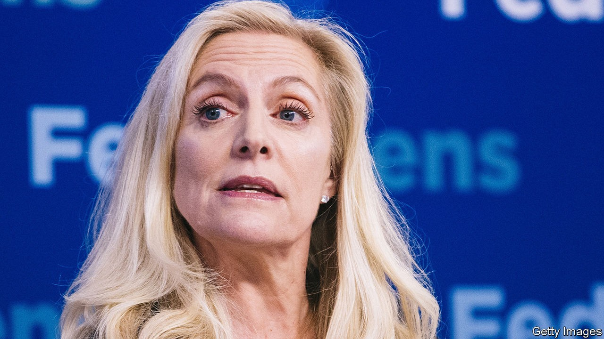

## Top contender

# The front-runner for Joe Biden’s Treasury boss has a mighty CV

> Lael Brainard, a Fed official, has worked for two presidents

> Oct 24th 2020

IN EARLY 2009, faced with an economic crisis and a host of jobs to fill, Barack Obama, the newly inaugurated president, went hunting for talent. For the role of the Treasury department’s top diplomat he chose a capable economist named Lael Brainard, who had also worked in Bill Clinton’s administration. Ms Brainard later moved from the Treasury’s stately headquarters next to the White House to the Federal Reserve, where she has been on its Board of Governors since 2014. Should Joe Biden defeat President Donald Trump on November 3rd, she may well make a return journey, this time to occupy the grander office of the treasury secretary.

If Mr Biden wins his choice of team will be watched closely for clues as to how he might govern. His party’s left wing remains sceptical of his commitment to the sort of progressive reforms championed by Bernie Sanders and Elizabeth Warren, his challengers during the primaries. Conservatives and business leaders, on the other hand, are bracing themselves for higher taxes and stiffer regulations. Ms Brainard’s appointment to the Treasury could help neutralise the worst fears of each.

A consummate technocrat, Ms Brainard was born in Hamburg, during her father’s foreign-service posting to communist East Germany and Poland. After completing a PhD in economics at Harvard University, she spent time with McKinsey, a consultancy, and as a professor at the Massachusetts Institute of Technology. Between spells in government she was a fellow at the Brookings Institution, a think-tank in Washington.

Her stints in government earned Ms Brainard a reputation for competence and toughness. She led America’s engagement with Europe during the euro-area crisis. Though the zone’s leaders sometimes bristled at advice from Uncle Sam—whose own missteps had so recently plunged the world into financial crisis—they gained respect for Ms Brainard’s calm but firm presence. Her familiarity with the continent, and fluent German, may have helped.

She is no populist; the Democratic left would prefer a treasury secretary with more anti-corporate credentials, like Ms Warren, also thought to be a contender for the role. But Ms Brainard has shown a willingness to buck Wall Street. At the Fed she repeatedly voted against measures to ease regulatory restrictions on financial institutions. In 2019 she was the lone member of its Board of Governors to support activating the countercyclical capital buffer, which forces banks to increase capital ratios during economic booms, to temper risky lending that might fuel financial instability. Earlier this year Ms Brainard objected to a measure to cap banks’ dividend payments (intended to nudge them to preserve capital), arguing instead for payments to be suspended entirely.

Ms Brainard has not dissented on interest-rate policy. In 2015-18 she voted to raise rates, alongside the majority. But in early 2016 she urged the Fed to move slowly, warning that rate increases would tighten global financial conditions, the growth-suppressing effects of which could spill back to the American economy. The argument proved prescient, as both global and American economic growth slowed in 2016, encouraging ratesetters to support a slower pace of rate rises. More recently she has been an advocate of the Fed’s move towards a more flexible inflation target and a greater emphasis on full employment.

Progressives look askance at parts of Ms Brainard’s record. When in the Clinton administration, she helped implement the North American Free Trade Agreement, and supported China’s accession to the World Trade Organisation; Mr Obama’s Treasury repeatedly refused to label China a currency manipulator. Yet both Democratic politics and economic orthodoxy have since moved leftward, and perhaps Ms Brainard with it. She would probably be far more open to deficit spending than past secretaries, including Tim Geithner, who ran the department during Mr Obama’s first term. Disputes with Europe over trade and technology may be put to rest. The demands of the moment are such that Ms Brainard’s Treasury could mark a progressive departure from the norm. ■

Dig deeper:Read the [best of our 2020 campaign coverage](https://www.economist.com//us-election-2020) and explore our [election forecasts](https://www.economist.com/https://projects.economist.com/us-2020-forecast/president), then sign up for Checks and Balance, our [weekly newsletter](https://www.economist.com//checksandbalance/) and [podcast](https://www.economist.com/https://play.acast.com/podcasts/2020/01/24/checks-and-balance-our-new-weekly-podcast-on-american-politics) on American politics.

## URL

https://www.economist.com/finance-and-economics/2020/10/24/the-front-runner-for-joe-bidens-treasury-boss-has-a-mighty-cv
