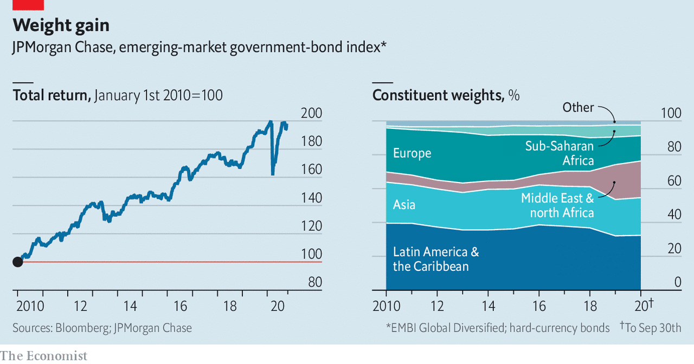

## The rule-makers

# Who decides what counts as an emerging market?

> A glimpse into the mysterious world of benchmark providers

> Oct 22nd 2020

WHAT DOES Saudi Arabia, with an income per head of $23,000, lavish public services and oodles of oil, have in common with Zambia, where incomes are 94% lower and the government is on the brink of default? Not much, on the face of it. But the two countries are lumped together, along with 71 others, in JPMorgan Chase’s definition of “emerging markets”.

Index providers build the gauges that passive funds track and active managers use as a yardstick. Those, like JPMorgan, that construct emerging-market-bond benchmarks are especially powerful. They wield influence over an asset class that amounts to $30trn, about a quarter of global fixed income. For borrowers, benchmark inclusion opens the door to foreign capital. The inclusion of onshore Chinese debt in three big benchmarks this year and next, for instance, is expected to draw in $450bn of foreign money. For investors, index changes can force them to overhaul their portfolios by selling holdings to make way for new debt. “Indices are almost tyrannical in their influence,” says Jan Dehn of Ashmore Group, a fund manager.

The main providers include Bloomberg, FTSE Russell and JPMorgan. The first two construct global bond indices that include emerging markets. JPMorgan dominates the market for dedicated emerging-market-debt investors; some $780bn tracks its set of benchmarks, launched in the 1990s. It is one of the few banks to still be in the business. Morgan Stanley, another bank, offloaded MSCI, its index unit, over a decade ago. Others, including Bank of America, Barclays and Citigroup, have also sold theirs; the industry has been trying to reduce regulatory risk after the rate-rigging scandal surrounding the London Interbank Offered Rate (LIBOR).

Classifying a country as an emerging market requires a great deal of subjectivity—more, say, than is needed to work out what companies should be included in a country’s benchmark equity index. In order to be representative and predictable, providers publish chunky rule books to help investors understand which bonds might be added or ejected. They also solicit views from investors to find out which bonds are liquid, accessible or otherwise fit enough for inclusion. Still, the rules can sometimes be applied in seemingly arbitrary ways. To see this, consider recent big adjustments to JPMorgan’s benchmarks, which have left investors scrambling to rebalance their portfolios.

In 2019 the bank added Gulf countries to its hard-currency government-bond index, after the oil-price crash of 2014 led to a rush of issuance. Places like Saudi Arabia and Qatar had been too rich to qualify, but the bank tweaked its rules to include them. It also slashed the weight on defaulted Venezuelan government bonds to 0% last year, instead of removing them altogether. That unprecedented move spared some bondholders from having to offload the debt, which is under American sanctions.

In February this year JPMorgan began adding a selection of debt issued by China’s government and its policy banks to its local-bond benchmark. As China will eventually make up 10% of the bank’s main benchmark, it will be risky for investors to stay uninvested. But some say the decision was rushed. They cite a long list of operational issues in trading the debt, including low liquidity and complications in settling transactions. Last month FTSE Russell said it would also include local Chinese bonds in its government-bond index from October 2021—contingent on reforms making it easier for foreigners to trade the debt.

JPMorgan’s clients include both issuers and investors, potentially posing conflicts. Other parts of the bank have dealings in emerging markets. (JPMorgan says it has Chinese walls in place to separate its businesses.) It won valuable deals to raise funds for Saudi Arabia’s mammoth oil firm, Aramco, months after the index group said the government’s debt was going into its benchmarks. The bank also has other interests in China’s bond market. It underwrites government bonds and is an official marketmaker on Bond Connect, a trading platform that allows foreigners to invest through Hong Kong.

Another concern is that some clients are listened to more than others. “It’s hard to avoid the impression that the index providers are responsive to the needs or the desires of their bigger clients,” says Paul McNamara at GAM, an investment manager. Bloomberg and FTSE Russell arrange roundtables for groups of clients on a regular basis. Some investors aren’t shy about giving providers their view. Hayden Briscoe of UBS Asset Management recalls pressing the man in charge of one of the popular bond indices to include Chinese debt three years ago. “The quicker you get the bonds into the index, the quicker you become a rock star,” he advised.

JPMorgan dismantled its advisory committees in 2015 in favour of individual conversations, in order to reach a wider group of investors. It says it strives to keep the playing field level, so nobody gets an early whiff of plans and front-runs the market. Still, small fund managers suspect their larger rivals have the index team’s ear and lobby for assets they own to be included.

Yet miffed investors cannot easily move away from established indices. The barriers to entry are high. Building a benchmark involves spending a lot of money on marketing to build a trusted brand; there is little sign of new entrants yet. A network effect encourages fund managers to use the same yardstick so that clients can compare performance. Switching indices involves heaps of paperwork to inform clients. As a result, even though JPMorgan has produced an ex-China version of its main gauge, interest has been low. Investors will be rule-takers for some time yet. ■

## URL

https://www.economist.com/finance-and-economics/2020/10/22/who-decides-what-counts-as-an-emerging-market
