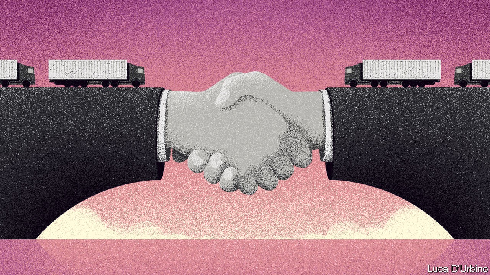

## Britain and Europe

# How a “no deal” Brexit can be avoided

> It starts with acknowledging the consequences of one

> Oct 22nd 2020

BRITAIN’S CONSERVATIVES are fond of Australia, an Anglosphere place with a flourishing economy, fine weather and fabulous beaches. So when trade talks with the European Union were briefly suspended before resuming this week, and Boris Johnson told Britons they might end up not with the Canada-style free-trade agreement he wanted, but instead leave on “Australian terms”, he made the prospect sound beguilingly sunny.

This is typical Johnsonian spin. If the latest face-to-face talks should collapse and Britain end up with no deal, the terms on which it leaves would not be those that apply to Australia, which has many side-deals and is seeking its own free-trade agreement with the EU. They would be closer to those of Afghanistan, Bhutan or Congo: Britain would have no trade deal at all with its largest trading partner, and little prospect of getting one.

The government’s own modelling suggests the hit to GDP after 15 years would be almost 8% with no deal, against less than 5% for a thin Canadian-style one. Many businesses would be devastated by tariffs, including 10% on cars and 5% on car parts, threatening an industry that employs 800,000 people and accounts for 14% of Britain’s goods exports. The food industry would suffer from EU protectionism, with farmers facing tariffs of 40% or more on lamb and beef exports. Research by UK in a Changing Europe, an academic think-tank, suggests that food prices would rise by as much as 4%.

Non-tariff barriers now matter more than tariffs, and for services they would be erected with or without a deal. But in two cases an acrimonious no-deal Brexit could be damaging. The financial-services industry (see [article](https://www.economist.com//node/21793464)) would suffer more than it already has if the EU refused to accept the equivalence of Britain’s regulation, and many firms, especially those in the digital economy, would struggle without a similar agreement on the adequacy of data protection. Failure to reach a deal would probably exclude Britain from the lucrative European energy market, and might even threaten mitigation measures to allow lorry-drivers and airlines to keep operating on the continent.

Then there is Northern Ireland. No deal would resurrect the threat of a border in Ireland between north and south, which all sides wish to avoid. It would also create problems within the United Kingdom. The protocol that is part of January’s Brexit withdrawal treaty in effect keeps Northern Ireland inside the European single market and customs union, with Great Britain outside. As Mr Johnson has belatedly conceded, that necessitates controls on goods moving between the two. These could be manageable with a trade deal; without one, which would mean not just customs checks but tariffs, the protocol would be far more intrusive. The government’s solution would be to rewrite it unilaterally, but that would create new problems. As the House of Lords made clear in voting against it this week, such a naked breach of international law would undermine trust in Britain.

Worst of all, leaving without a deal would make it hard to talk further. Even a thin trade agreement could be built on, for instance, with renewed efforts to extend its range to more services. Most security co-operation, crucially including access to common intelligence databases, would halt completely after no deal. The bad blood would imperil broader joint diplomacy, a serious loss in a dangerous world. And it would be difficult to restart negotiations, because the EU may well begin by putting back on the table the demands that had prevented a deal in the first place.

Time is short: Britain’s final departure from the EU is on December 31st. However, the latest talks begin with a deal tantalisingly close. The only big obstacles are fish and the EU’s desire for a credible regime to police state aid to industry.

Compromise is possible on both. Given that Britain resorts to subsidies less than other European countries, it is mystifying why a Conservative government would hold out against a deal in order to gain the dubious privilege of handing out lots more taxpayers’ money to private companies. As for fisheries, which contribute barely 0.2% of European GDP, both sides would suffer from there being no deal. European vessels would lose access to richer British waters; British fishermen would lose tariff-free access to the EU market, which buys 70% of their catch. The French are insisting that the EU’s over-generous quotas should persist after Britain leaves. They need to budge on fish, and Britain should drop its newfound enthusiasm for subsidies and its bid to rewrite the Northern Ireland protocol. With those concessions, a deal would be eminently doable.

Britons did not vote to leave the EU without a trade deal in 2016; rather, they were told they would have the easiest trade deal in history. Walking out of talks was not in the manifesto in the election in 2019: an accord was “oven-ready”. A year ago Mr Johnson said that to leave the EU without an agreement would be a failure of statecraft. He was right. It is past time to seal the deal. ■

## URL

https://www.economist.com/leaders/2020/10/22/how-a-no-deal-brexit-can-be-avoided
