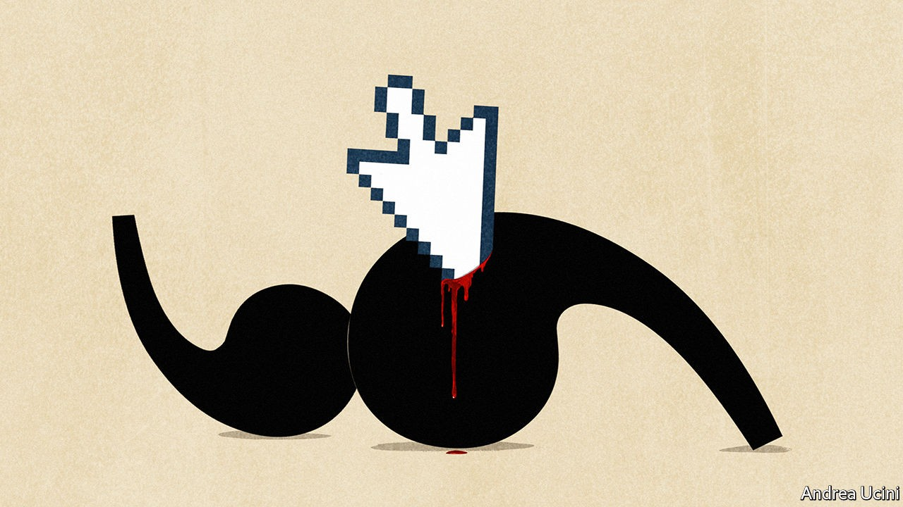

## Who controls the conversation

# How to deal with free speech on social media

> It is too important to be determined by a handful of tech executives

> Oct 22nd 2020

IT IS THE biggest antitrust suit in two decades. On October 20th the Department of Justice (DoJ) alleged that Google ties up phone-makers, networks and browsers in deals that make it the default search engine. The department says this harms consumers, who are deprived of alternatives. The arrangement is sustained by Google’s dominance of search which, because of a global market share of roughly 90%, generates the advertising profits that pay for the deals (see [article](https://www.economist.com//business/2020/10/21/american-trustbusters-take-on-google)). The DoJ has not yet said what remedy it wants, but it could force Google and its parent, Alphabet, to change how they structure their business. Don’t hold your breath, though: Google dismisses the suit as nonsense, so the case could drag on for years.

Action against Google may seem far from the storm gathering against Facebook, Twitter and social media. One is laser-focused on a type of corporate contract, the other a category 5 hurricane of popular outrage buffeting unaccountable tech firms for supposedly destroying society. The left says that, from the conspiracy theories of QAnon to the incitement of white supremacists, social media are drowning users in hatred and falsehood. The right accuses the tech firms of censorship, including last week of a dubious article alleging corruption in the family of Joe Biden, the Democratic presidential nominee. And yet the question of what to do about social media is best seen through the same four stages as the case against Google: harm, dominance, remedies and delay. At stake is who controls the rules of public speech.

A tenth of Americans think social media are beneficial; almost two-thirds that they cause harm. Since February YouTube has identified over 200,000 “dangerous or misleading” videos on covid-19. Before the vote in 2016, 110m-130m adult Americans saw fake news. In Myanmar Facebook has been used to incite genocidal attacks against the Rohingyas, a Muslim minority (see [article](https://www.economist.com//asia/2020/10/22/in-myanmar-facebook-struggles-with-a-deluge-of-disinformation)). Last week Samuel Paty, a teacher in France who used cartoons of the Prophet Muhammad to talk about free speech, was murdered after a social-media campaign against him (see [Obituary](https://www.economist.com//obituary/2020/10/22/samuel-paty-was-killed-on-october-16th)). The killer tweeted an image of Mr Paty’s severed head, lying in the street.

The tech firms’ shifting attempts to sterilise this cesspool mean that a handful of unelected executives are setting the boundaries of free speech (see [Briefing](https://www.economist.com//briefing/2020/10/22/social-medias-struggle-with-self-censorship)). True, radio and TV share the responsibility for misinformation and Republican claims of bias are unproven—right-wing sources often top lists of the most popular items on Facebook and Twitter. But pressure is growing on the tech firms to restrict ever more material. In America the right fears that, urged on by a Democratic White House, Congress and their own employees, the firms’ bosses will follow left-leaning definitions of what is acceptable. Contrast that with the First Amendment’s broad licence to cause offence.

Elsewhere, governments have also used social media companies to go beyond the law, often without public debate. In London the Metropolitan Police requests that they take down legal, but troubling, posts. In June France’s Constitutional Council struck down a deal between the government and the tech companies because it curbed free speech—an initiative that is sure to be revisited after Mr Paty’s murder. Citing Western precedents, more authoritarian governments in countries such as Singapore expect the tech firms to restrict “fake news”—potentially including irksome criticism from opponents.

This might not matter were the networks less dominant. If people could switch as easily as they change breakfast cereal, they could avoid rules they dislike. But switching is like giving up your mobile-phone number: it cuts you off from your friends. Social networks have also become so central to distributing news and opinion that they are, says Mark Zuckerberg, Facebook’s founder, a “town square”. If you want to be part of the conversation you have no choice but to be there, soapbox in hand.

This hold over users has one further dismal implication for truth and decency. In order to sell more ads, the tech companies’ algorithms send you news and posts that they think will grab your attention. Political cynics, con artists and extremists take advantage of this bias towards virality to spread lies and hatred. Bots and deep fakes, realistic posts of public figures doing or saying things that never happened, make their job cheaper and easier. They are rapidly becoming more sophisticated.

The purest remedy for this would be to change the tech firms’ business model and introduce more competition. That is already working well in other areas of tech, like the cloud (see [Leader](https://www.economist.com//leaders/2020/10/22/is-tech-getting-more-competitive)). One idea is for people to own their data individually or collectively (see [Schumpeter](https://www.economist.com//business/2020/10/22/who-owns-the-webs-data)). The social networks would become utilities paid a flat fee, while people or collectives earned the rent from advertisers and set the parameters for what was served up to them. At a stroke that would align the gains from advertising with the burden upon the people being advertised to. If users could port their data to another network, the tech firms would have to compete to provide a good service.

The obstacles to this are immense. The tech firms’ value would tumble by hundreds of billions of dollars. It is not clear you own the data about your online connections. You could not migrate to a new network without losing the friends who stayed behind unless the platforms were interoperable, as mobile-phone networks are. Perhaps the authorities could impose less sweeping remedies, such as giving users the right to choose feeds set by a neutral rule, not an attention-grabbing algorithm.

Such ideas cannot be implemented quickly, but societies need solutions today. Inevitably, governments will want to set the basic rules at the national level, just as they do for speech. They should define a framework covering obscenity, incitement and defamation and leave judgments about individual posts to others. International human-rights law is a good starting-point, because it leans towards free speech and requires restrictions to be relevant and proportionate, but allows local carve-outs.

Social-media firms should take those standards as their basis. If they want to go further, attaching warnings to or limiting content that is legal, the lodestars should be predictability and transparency. As guardians of the town square, they ought to open their processes to scrutiny and particular decisions to appeal. Ad hoc rule changes by top executives, as with the recent Biden decision, are wrong because they seem arbitrary and political. Hard cases, like kicking opponents of Bashar al-Assad in Syria off a platform for mentioning terrorists, should be open to review by representative non-statutory boards with more power than the one Facebook has created. Independent researchers need much freer access to anonymised data so that they can see how platforms work and recommend reform. Such rule-making should be open to scrutiny. In America politicians can use removing the protection from prosecution granted by Section 230 of the Communications Decency Act as a lever to bring about change.

This will be messy, especially in politics. When societies are divided and the boundary between private and political speech is blurred, decisions to intervene are certain to cause controversy. The tech firms may want to flag abuses, including in post-election presidential tweets, but they should resist getting dragged into every debate. Short of incitement to violence, they should not block political speech. Politicians’ flaws are better exposed by noisy argument than enforced silence. ■

## URL

https://www.economist.com/leaders/2020/10/22/how-to-deal-with-free-speech-on-social-media
