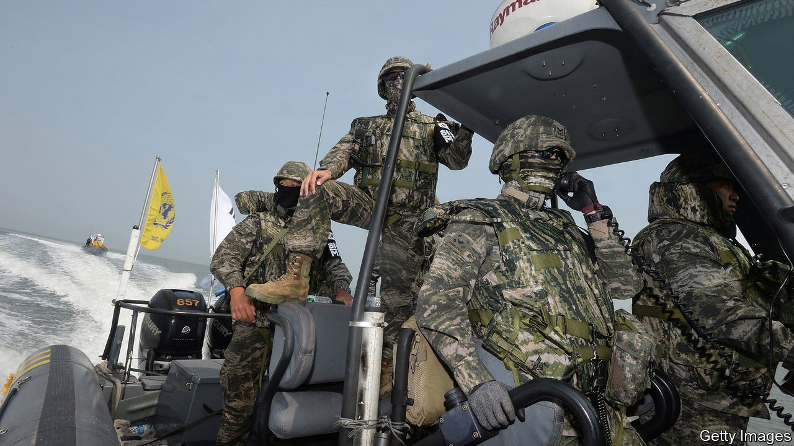
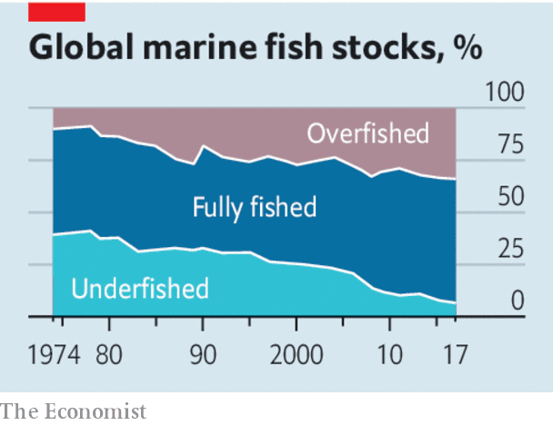

## Monsters of the deep

# Illicit fishing devastates the seas and abuses crews

> Here’s how to hook the culprits

> Oct 22nd 2020

For more coverage of climate change, register for The Climate Issue, our fortnightly [newsletter](https://www.economist.com//theclimateissue/), or visit our [climate-change hub](https://www.economist.com//news/2020/04/24/the-economists-coverage-of-climate-change)

“CONSIDER THE subtleness of the sea,” warned Herman Melville in “Moby Dick”; “how its most dreaded creatures glide under water...treacherously hidden beneath the loveliest tints of azure.” Nearly 170 years later, another marine horror is just becoming visible. Satellite and other imagery has revealed “dark fleets” of fishing boats that turn off their transponders and plunder the ocean’s bounty. Illegal, unreported and unregulated fishing accounts for a staggering 20-50% of the global catch. It is one reason fish stocks are plummeting: just a fifth of commercial species are sustainably fished. Illegal operators rob mostly poor coastal states of over $20bn a year and threaten the livelihoods of millions of small fishermen. North Korean coastal waters have been so pillaged that its fishermen have to motor their rickety craft far out into stormy seas to fill their nets. Thousands have drowned.

A huge amount of illicit fishing happens on licensed boats, too. They might catch more than their quota, or falsely declare their catch as abundant albacore tuna instead of the more valuable bigeye. In port fisheries inspectors are always overstretched. If an operator is caught, for instance, fishing with too fine a net, the fine and confiscation are seen as a cost of doing business. Many pay up and head straight back out to sea.

The damage from illicit fishing goes well beyond fish stocks. Operators committing one kind of crime are likely to be committing others, too—cutting the fins off sharks, or even running guns or drugs (see [article](https://www.economist.com//node/21793451)). Many are also abusing their crews. Tens of thousands of migrant workers, mainly from South-East Asia, man the world’s fleets. Many toil at sea in vile conditions with violent masters, sometimes for years at a time. A lot of them are in debt bondage; and a fishing boat is a lot harder to escape from than a factory.

Too often, the ultimate beneficiaries of this trade are hard to hook because they hide behind brass-plate companies and murky joint ventures. Pursuing them requires the same kind of sleuthing involved in busting criminal syndicates. An initiative led by Norway to go after transnational-fisheries crime is gaining support. Much more cross-border co-operation is needed.

At sea, technology can help. Electronic monitoring promises a technological revolution on board—Australian and American fleets are leading the way. Cameras combined with machine learning can spot suspicious behaviour and even identify illicit species being brought on board. They should be compulsory as a condition of access to the exclusive economic zones that define a country’s control over resources such as fish. They should also be made compulsory even when vessels are on the high seas. Equally, national regulators should set basic labour standards at sea. If countries fail to follow the rules, coastal states should bar their fishing fleets from their waters. Fish-eating nations should allow imports only from responsible fleets.

Above all, governments should agree at the WTO to scrap the subsidies that promote overfishing. Of the $35bn a year lavished on the industry, about $22bn helps destroy fish stocks, mainly by making fuel too cheap. Do away with subsidies and forced labour, and half of high-seas fishing would no longer be profitable. Nor would that of China’s environmentally devastating bottom-trawling off the west African coast. Such abuses would disappear overnight. Some of the money that was saved could help restore coastal fisheries for millions of small-scale fisherfolk—underwriting temporary moratoriums on fishing and creating no-catch zones. And it could help establish fish farming, nourished by insect larvae. Fishing does not have to be a fishy business.■

## URL

https://www.economist.com/leaders/2020/10/22/illicit-fishing-devastates-the-seas-and-abuses-crews
