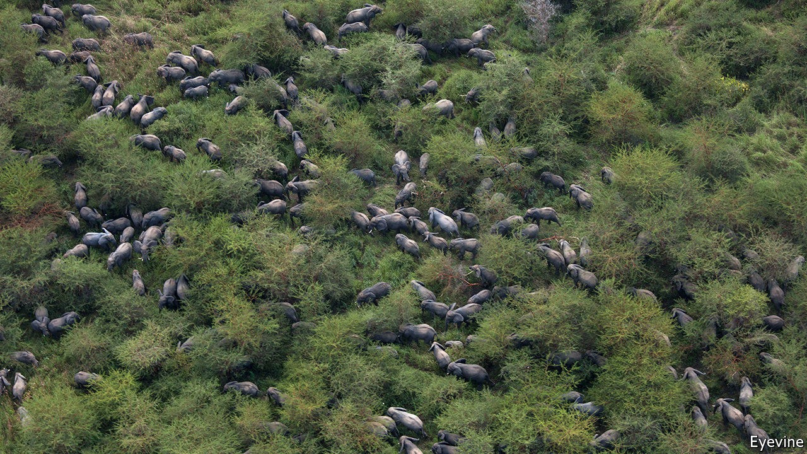
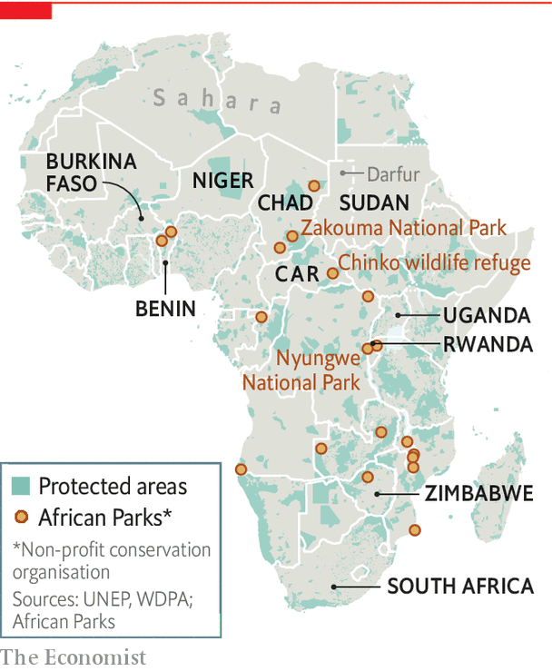

## Elephants’ graveyard no more

# African governments are outsourcing their natural areas

> Covid-19 may accelerate the trend

> Oct 22nd 2020ZAKOUMA

“ALL OF THESE bulls will have AK-47 bullets in them,” says Leon Lamprecht. From his porch the manager of Zakouma National Park, in southern Chad, has quite a view. A dozen or so elephants slosh around in muddy puddles. These days they are safe. But between 2002 and 2010 some 4,000 elephants, 95% of Zakouma’s population, were slaughtered for their ivory by poachers from Sudan.

At that point Chad took a step that other African countries are increasingly following. It handed management of the park to an NGO. Since African Parks took over, the elephant population has begun to rise. In 2011 just one calf was born; in 2018, 127 were. The revival is emblematic of broader success that public-private partnerships (PPPs) are having in conserving some of the most precious parts of the planet. In the wake of covid-19 it is a model that may become more attractive to African governments that are short of the cash needed to protect animals and also desperate for the tourists who come to see them.

Sixty years ago, when decolonisation was sweeping the continent, the UN counted 3,773 “protected areas” in Africa and its surrounding waters. By 1990 the figure was 6,075; today it is 8,468. Some 14% of the continent’s land has been categorised as protected, according to the World Database on Protected Areas (see map).

The protected designation belies reality, however. Most such areas are managed by cash-strapped government wildlife authorities. They struggle to deal with myriad pressures on the environment, such as land grabs, illegal poaching and climate change. “[W]ith few localised exceptions, African conservation was in crisis even before covid-19 hit,” notes Peter Lindsey, a Zimbabwean conservationist and co-author of a recent article in the journal Nature Ecology & Evolution.

Most “protected areas” are “paper parks”, argues Peter Fearnhead, the chief executive of African Parks. In theory their demarcation denotes stewardship; in practice there is often very little care. Since its founding in 2000 the NGO has grown to manage 19 parks in 11 countries. It is the largest of an expanding number of PPP operators across the continent.

The African Parks model relies on “three Ms”, explains Mr Fearnhead: a clear mandate from a government (which keeps ownership of the area but hands over the running to the NGO); sound management; and money from donors such as the EU.

Zakouma is African Parks’ flagship operation. When it took over its management the priority was security. The national park was caught up in Chad’s civil conflicts in the 2000s, when rebel groups, some backed by Sudan, took on government forces. Janjaweed militias, notorious for mass murder and rape in Darfur, took advantage of the vacuum to slaughter Zakouma’s elephants and launch attacks on nearby villages.

The approach to security is a blend of low and high tech. It relies on residents of surrounding areas to alert it to poachers. Local intelligence is then combined with satellite tracking of the elephants. This helps anti-poaching rangers to know where to go.

Winning the support of people on the edge of the park has been crucial. Locals are happy to help report sightings of the Janjaweed, since they fear being robbed or murdered by them. African Parks also negotiates with nomads to ensure their caravans of camels do not go through the park.

Securing the park has helped its ecosystem. Wedged between the Sahara desert to the north and rainforest to the south, Zakouma is a haven for birds as well as mammals. The park is a dream for twitchers, explains a South African guest, pointing out a red-throated bee-eater and an Abyssinian roller. Such sights, as well as elephants, lions and Kordofan giraffes, were attracting ever more tourists before covid-19 hit. In 2019 Zakouma made more than $1m from visitors, mostly from rich guests staying at the private Camp Nomade. (During a visit your correspondent bumped into another flamboyant species, Evgeny Lebedev, the owner of the London Evening Standard, and his erstwhile editor, George Osborne, who were staying at the camp.) The tourism business helps make Zakouma the largest taxpayer in that region of the country.

African Parks’ work in Zakouma is encouraging other governments to ask for its help. In May it signed an agreement with the Central African Republic, a country in which militias hold sway over vast tracts of countryside, to expand its footprint in the Chinko wildlife refuge, which could become the single largest protected wilderness in Africa. In July African Parks announced it would extend its operations in northern Benin, ensuring it has a role in trying to prevent the spillover of violence from Burkina Faso and Niger. In October it agreed to manage Rwanda’s Nyungwe National Park for 20 years.

Some governments are understandably wary about relinquishing control of their natural assets. But that may change as the impact of the pandemic squeezes budgets. The IMF reckons that sub-Saharan Africa’s GDP will contract by 3.2% in 2020—with a knock-on effect on tax revenues.

Covid-19 has brought other challenges to protected areas. Urban lockdowns have forced people to return home to farms and villages, adding to environmental pressures. Millions of tourism jobs, often in areas with little other industry, are at risk. And in many countries tourist fees help cover the budgets of wildlife agencies; 88% of Uganda’s, for example.

It is therefore probable that more African governments will form partnerships with private bodies to protect ecosystems, bring in donor cash and help protected areas raise revenue of their own, through tourism and other ventures. It is a tricky task. But so too was reviving Zakouma’s elephant population. ■

For more coverage of climate change, register for The Climate Issue, our fortnightly [newsletter](https://www.economist.com//theclimateissue/), or visit our [climate-change hub](https://www.economist.com//news/2020/04/24/the-economists-coverage-of-climate-change)

## URL

https://www.economist.com/middle-east-and-africa/2020/10/22/african-governments-are-outsourcing-their-natural-areas
