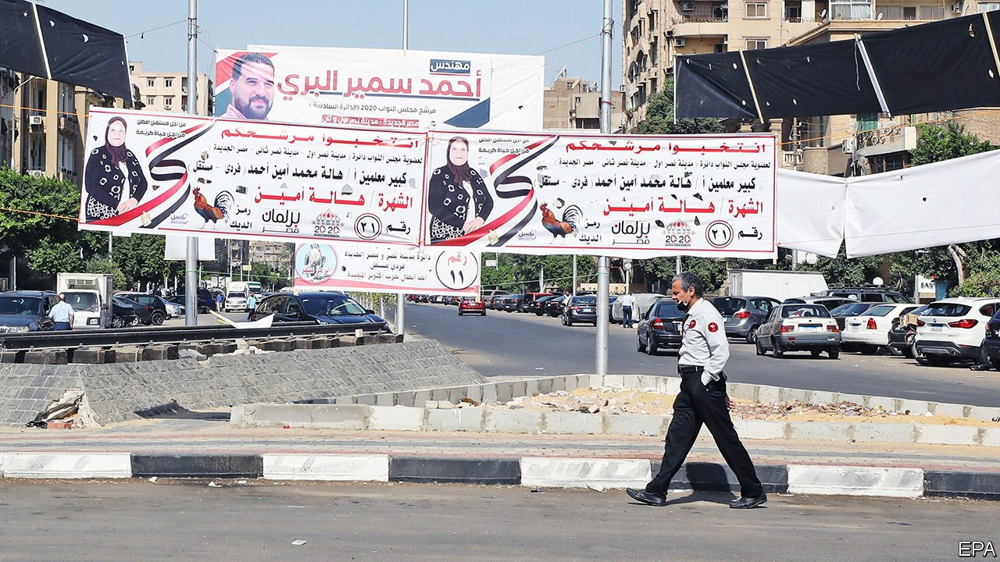
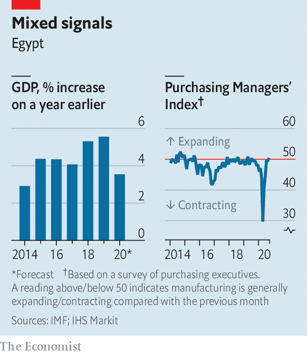

## No contest

# Another sham election highlights Egypt’s problems

> The country’s rulers are making a mess of politics and business

> Oct 22nd 2020

ALL THE publicly available evidence suggests that the Coalition of Hope was exactly what it claimed to be: a nascent political alliance that planned to field candidates in the election for Egypt’s lower house of parliament. The group, which included MPs, journalists, businessmen and labour leaders, aimed to shake up a legislature dominated by supporters of President Abdel-Fattah al-Sisi. Last year, though, the interior ministry accused the coalition of working with terrorists to “bring down the state”—a plot the ministry identified, with no hint of irony, as “The Plan for Hope”. As the election kicks off this month, several coalition members sit in jail.

Even by the standards of Egypt, where votes are routinely bought and opposition candidates imprisoned, this contest seems especially undemocratic. Using arrests, intimidation and bureaucratic hurdles, the regime has cleared the field of most of its critics. Candidates compete to sound the most pro-Sisi, while rich businessmen throw money at parties backed by the state. The results are not expected until December, but the outcome is not in doubt. Parliament will again be full of politicians who fawn over the president.

Mr Sisi, a former general, claims to disdain politics. Since leading a coup against Egypt’s first democratically elected government in 2013 he has banned protests and crushed civil society. He won rigged elections in 2014 and 2018, and seems likely to break his vow to step down after his second term, since changes to the constitution made in 2019 allow him to stay on until 2030. He styles himself the leader of all Egyptians and, therefore, above politics. “I’m not a politician. They’re all talk,” he said in 2018. His cabinet is made up mostly of technocrats. Regional governors, appointed by the president, are typically veterans of the army or security services.

Mr Sisi acts as if he is above the fray, but his men are down in the mud. They control parliament—and milk supporters—through a few big parties. The largest, called the Nation’s Future Party, was reportedly created by military intelligence. Candidates allege that spots on its electoral list have been sold for millions of Egyptian pounds (tens of thousands of dollars). One state-aligned newspaper even made light of the alleged payments in a cartoon depicting an MP carrying his own chair to parliament because the ones inside were too expensive. When a pro-Sisi lawyer claimed in a video that seats were being given to “whoever can pay”, he was swiftly arrested. The regime denies selling seats.

Businessmen have good reason to splurge on elections. It’s not just that a seat in parliament offers immunity from prosecution, a handy asset for anyone trying to do business in a place where corruption is rife. A seat also gets the holder closer to power at a time when private firms must compete with Mr Sisi’s preferred institution: the army.

Businessmen grumble about the increasing size of the army’s economic footprint. Companies run by or associated with the force manufacture refrigerators, pave roads and make pasta. They manage hotels and hospitals. Most are exempt from value-added tax and import tariffs. With these advantages, they are wreaking havoc on the private sector. Take the cement industry, which was already suffering from a supply glut when the army began opening plants in 2018. Several private firms have since suspended production. Many will close for good if the oversupply crisis continues, warns an executive.

With few mechanisms to receive feedback, such warnings may not reach the president or his inner circle. They prefer praise from the IMF, which lent the government $12bn in 2016 as it floated the overvalued currency and cut unaffordable subsidies. Regime backers give it credit for restoring order and stability after a tumultuous period following the revolution of 2011. Tourism and foreign investment were trending upwards before covid-19 struck. The economy grew by 5.6% in 2019, one of the fastest rates among emerging markets.

But much of the growth is due to a boom in oil and gas, which are controlled by the state. Private firms are doing less well. The Purchasing Managers’ Index, a survey-based gauge of the non-oil private sector, has shown it shrinking during most months since Mr Sisi took over (see chart). Egyptians are earning less in real terms than they did four years ago. The share of people classified as poor by the government rose from 28% in 2015 to 33% last year. Meanwhile, the pain of the government’s austerity measures has been borne mostly by the lower and middle classes. The pandemic has only made matters worse. Hundreds of people defied the ban on protests last month to express their discontent.

Under their previous dictator, Hosni Mubarak, who ruled from 1981 to 2011, Egyptians had more freedom to complain. Businessmen exerted influence through the regime’s National Democratic Party. Opposition parties were tolerated (though still not given a fair shot). Dissident politicians could talk to voters, hear their grievances and raise them in parliament. Elections acted as a pressure valve of sorts—until 2010, when Mubarak tightened up, holding an especially fraudulent poll. Two months later millions of protesters pushed him out of office.

Mr Sisi, notoriously prickly, is not inclined to let Egyptians vent. The lesson he seems to have learned from Mubarak is that if you allow people too much freedom, they may overthrow you. Still, voters sent him a message in August, when over 85% of the electorate did not cast ballots in a sham election for the upper house. The state’s absurd response was to refer all of them—54m people—to trial for breaking Egypt’s compulsory-voting law. Perhaps the message didn’t get through. ■

## URL

https://www.economist.com/middle-east-and-africa/2020/10/22/another-sham-election-highlights-egypts-problems
