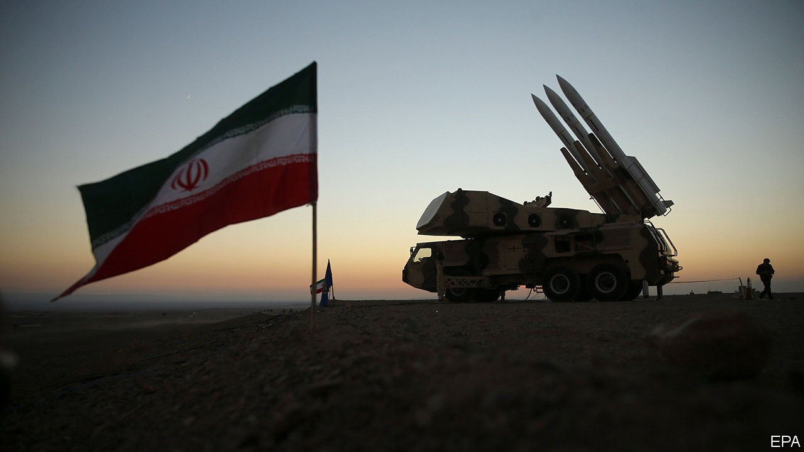

## Waiting game

# Leaders in the Middle East are watching the polls in America

> Big decisions have been put on hold until American voters make up their minds

> Oct 24th 2020BEIRUT

RESIDENTS OF THE Middle East sometimes quip that they deserve voting rights in America. For decades, after all, American presidents have pursued wars, sanctions and other schemes in the region. The current occupant of the White House is no different. Donald Trump’s first term has been marked by conflict with Iran, one that has brought assassination, acts of sabotage and a crippling economic blockade.

As America’s election nears, that conflict has settled into an uneasy pause. The whole region seems to be waiting. From the prospect of nuclear negotiations to the make-up of a new Lebanese government, Iran and its allies have put big decisions on hold until American voters make their own. Yet the election may matter less than leaders in the region expect.

Mr Trump took office vowing to withdraw from the nuclear deal between Iran and world powers, signed in 2015, which eased economic sanctions in exchange for limits on Iran’s nuclear programme. He did not formally pull out until 2018, though, and his term was half-over before renewed economic sanctions started to bite. Rather than negotiate a new deal, Iran’s leaders decided to wait. They saw little to discuss: Mr Trump has been unclear about his demands. And a belligerent American president was a useful foil for a regime that thrives on anti-American sentiment.

Still, it has tried to avoid overt confrontation with America, relying on proxies instead—though the veneer of deniability is thin. Iraqi militias who lob rockets at America’s embassy in Baghdad make no secret of their ties to Iran. But recently even their freedom has been limited. After Mike Pompeo, the secretary of state, threatened to close the embassy, the militias agreed to a ceasefire. The truce will last through the election, perhaps until the end of the year.

Three months after the catastrophic explosion at Beirut’s port on August 4th, Lebanese politics are paralysed. The prime minister resigned after the blast. In September the president asked a diplomat, Mustapha Adib, to form a new cabinet. His efforts failed after America imposed sanctions on Hizbullah, the Iranian-backed Shia militia and political party, and its allies. Other politicians grew nervous about joining a cabinet with Hizbullah (which won the most votes in the last election). Mr Adib handed back his mandate. Lebanon desperately needs a government to revive an ailing economy, but one seems unlikely until after America’s election.

All this creates the impression that Mr Trump has Iran on the ropes: strangled by sanctions, its allies nervous about a similar fate and its proxies on an unusually short leash. The president has ardent supporters in the Middle East who expect another four years of “maximum pressure” to reshape the region—and fear that Joe Biden will undo this progress.

Yet they may be disappointed. Whoever wins in November, Iran will probably be forced to negotiate a new nuclear deal. It cannot afford four more years of isolation. Neither candidate, though, will win many concessions on non-nuclear issues. Support for militant groups is not a bargaining chip for Iran: it is an ideological imperative and the core of its security doctrine. The supreme leader, Ali Khamenei, is 81 and keen to ensure his hardline policies survive him. So are the rough men of the Islamic Revolutionary Guard Corps, increasingly dominant in Iran’s politics.

Elsewhere, too, the election may matter less than both Iran and its foes believe. Iraq’s prime minister, Mustafa al-Kadhimi, would like to rein in the militias. But he fears moving too fast will cause bloodshed. Pressure from Washington will not change his calculus. And as Lebanon slides deeper into penury and instability, Hizbullah (like other factions) will only grow stronger, filling the void left by a failed state. America still looms large in the Middle East. But the region has its own politics as well. ■

Dig deeper:Read the [best of our 2020 campaign coverage](https://www.economist.com//us-election-2020) and explore our [election forecasts](https://www.economist.com/https://projects.economist.com/us-2020-forecast/president), then sign up for Checks and Balance, our [weekly newsletter](https://www.economist.com//checksandbalance/) and [podcast](https://www.economist.com/https://play.acast.com/podcasts/2020/01/24/checks-and-balance-our-new-weekly-podcast-on-american-politics) on American politics.

## URL

https://www.economist.com/middle-east-and-africa/2020/10/24/leaders-in-the-middle-east-are-watching-the-polls-in-america
