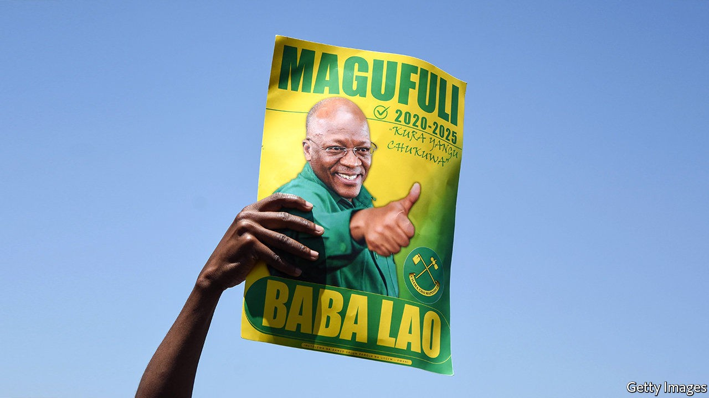

## The bulldozer rumbles on

# President Magufuli is likely to win an unfair vote in Tanzania

> With the opposition hobbled, Tanzanians are resigned to another five years of him

> Oct 22nd 2020GOMA

BACK IN JANUARY John Magufuli, Tanzania’s president, vowed that elections scheduled for October 28th would be free and fair. He has an odd way of ensuring it. He has banned local groups from monitoring the vote, harassed the opposition and journalists, closed a newspaper for its unfavourable coverage and banned a television station for daring to contradict his risible claim that there is no covid-19 in Tanzania. Foreign reporters must be chaperoned everywhere by an official, presumably to intimidate people they interview.

A principal target of harassment is Tundu Lissu, the main opposition candidate, recently back from self-imposed exile in Belgium. He took refuge there after being shot several times in 2017 outside his home in Dodoma, the capital. Despite needing crutches to walk and with a bullet still lodged near his spine, he has campaigned vigorously, drawing thousands of people to his rallies to hear him promise to restore democracy and boost business. He has also won the backing of Zitto Kabwe, another opposition leader, unifying much of the vote against Mr Magufuli. If the presidential poll were fair, Mr Lissu would stand a good chance of winning. But there is scant hope that the vote will be even remotely fair—a sharp deterioration for a country that turned its back on one-party rule and socialism in the 1990s.

Start with the electoral commission, which is seen as biased after the Court of Appeals ruled last year that Mr Magufuli, nicknamed “the bulldozer”, was allowed to stack it with party hacks. The commission has done little since then to suggest it is impartial. In early October it banned Mr Lissu from campaigning for a week, after he complained that the election was unfair. Electoral officials also imposed a five-day ban on Seif Sharif Hamad, an opposition leader in Zanzibar, a semi-autonomous archipelago, on similarly flimsy pretexts.

The government has also introduced various rules to stop the opposition from campaigning. Even sticking up posters is complicated, since the government put a new tax on promotional materials, making it expensive to distribute posters and flyers. Mr Lissu has decided to do without them. “Tanzania has weaponised the law to the point that no one really knows when they are on the right or wrong side of it,” said Amnesty International. Seven opposition members were arrested for “ridiculing the national anthem” because they sang it while hoisting their party flag.

Sometimes the government simply ignores the law. Policemen have fired tear gas at crowds of supporters gathering to hear Mr Lissu at rallies. They have arbitrarily stopped his convoy, in one case holding it up for most of the day. In June they arrested Mr Kabwe and eight others at an internal party meeting, accusing them of holding an “illegal assembly”. In August they arrested Joseph Mbilinyi, an opposition candidate, for organising an “unauthorised demonstration” after he went to collect his nomination papers from the electoral commission with a group of supporters.

The ruling party, known by its initials CCM, has run the show uninterrupted since 1977. Many Tanzanians are resigned to another five years under it and Mr Magufuli. Even the opposition is finding it hard to stay hopeful. “The whole process,” says Mr Kabwe, “seems to have been rigged.” ■

## URL

https://www.economist.com/middle-east-and-africa/2020/10/22/president-magufuli-is-likely-to-win-an-unfair-vote-in-tanzania
