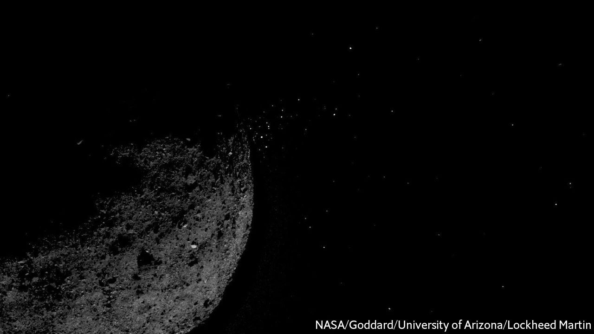

## Close encounter

# An American spacecraft, OSIRIS-REx, grabs a bit of an asteroid

> A sample should now be on its way to Earth

> Oct 21st 2020

ON OCTOBER 20TH an American spacecraft called OSIRIS-REx played tip and run with Bennu, an asteroid it has been orbiting since December 2018. At 10.12pm Universal Time its three-metre-long sampling arm puffed a blast of nitrogen onto Bennu’s surface. This liberated small pieces of rock, some of which, it is hoped, will have entered the arm’s collection chamber. The aim was to gather at least 60g of material. If that proves not to have happened, then the craft carries enough nitrogen for two more attempts to be made in future months.

The plan is that OSIRIS-REx will return its booty to Earth in September 2023. If all has gone well this will, by then, be the third asteroid sample brought back by a space vehicle. One was delivered in 2010 by Hayabusa, a Japanese probe. A second, now on board Hayabusa’s successor, Hayabusa2, should arrive on December 6th this year.

Bennu belongs to the C (for carbonaceous) class of asteroid. That its surface is rich in carbon compounds is known from the spectrum of its reflected sunlight. About three-quarters of asteroids so far discovered are C-class. They are thought to be composed mostly of material that has not been exposed to high temperatures since the beginning of the solar system (many other types of asteroid, by contrast, were once part of planetoids with stony mantles and metallic cores formed by melting of the materials those bodies coalesced from). That there were a lot of carbon-based molecules around so long ago is of particular interest to those trying to understand the origin of life.

Though bits of asteroids fall to Earth every day as meteorites, samples collected directly from those bodies provide material unaffected by the heat and chemical change caused by high-speed passage through Earth’s atmosphere and subsequent contact with the ground. Just how valuable it will be to have such pristine but costly material to study as well as the free stuff delivered from the sky remains to be seen. But as a demonstration of technological expertise, OSIRIS-REx’s pick-up was awesome.

## URL

https://www.economist.com/science-and-technology/2020/10/21/an-american-spacecraft-osiris-rex-grabs-a-bit-of-an-asteroid
