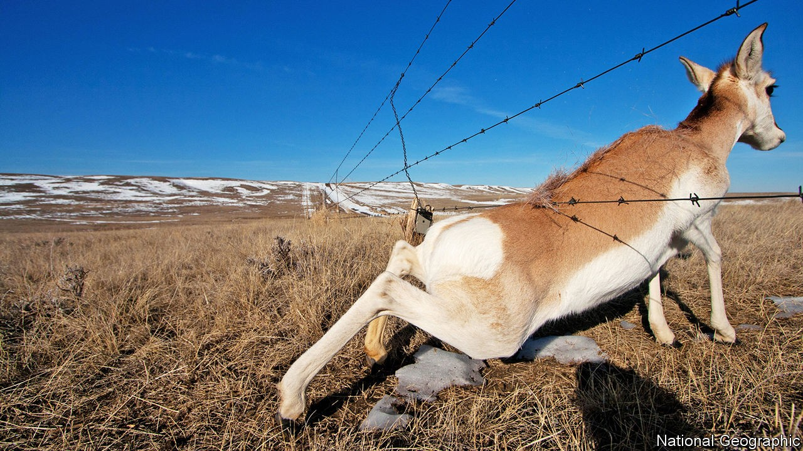

## Ecology

# Fences are bad for wildlife

> Where possible, they should be removed or redesigned

> Oct 24th 2020

EARTH’S LONGEST artificial structure is usually said to be the Great Wall of China. Just how long that is is hard to say, for northern China actually has many walls, built at different times and not always interconnecting. Earth’s second-longest artificial structure, though, is not a wall, but a fence. Its length is known exactly. It stretches for 5,614km across eastern Australia and is intended to stop the country’s native feral dogs, the dingoes, which live mainly to its north, from preying on sheep, which are farmed mainly to its south.

Australia’s dingo fence is remarkable. But it does not stand alone. Millions of kilometres of fences wrap the world, outstripping the collective length of its roads by something like a factor of ten. Some are intended to curb the movement of animals, some the movement of people, and some merely to mark the limits of territory, so that everyone knows who owns what.

Even fences built for other purposes, though, often serve to constrain animals, too. For example, some ecologists worry that the barrier now being erected along the border between America and Mexico, to stop the movement of human migrants, will also disrupt movement of endangered large mammals such as the Sonoran pronghorn and the desert bighorn sheep.

Such worries are not foolish. Hardening borders in Central Asia, coupled with the expansion of fenced railways, have reduced numbers of another large, endangered mammal, the saiga antelope. Highway fencing in Sweden, erected to separate elks from speeding Volvos, limits those animals’ ability to range freely, and thus to find enough food. The region around the Maasai Mara game reserve, in Kenya—one of the world’s most famous—has also suffered. Growth in the amount of local livestock has led to the erection of fences that restrict the migration of wildebeest, zebras and Thomson’s gazelles, threatening a severe decline in their population.

Until recently, data like these on the effects of fences on wildlife have been piecemeal. That has changed with the publication, in Bioscience, of a report compiled by Alex McInturff of the University of California, Santa Barbara. Dr McInturff and his colleagues have attempted a comprehensive review of the scientific literature about fences and their environmental impact.

One discovery they have made is that more than half of published fence research focuses on just five countries—America, Australia, Botswana, China and South Africa—with America alone making up over a fifth. A second is that only a third of these studies examined the impact of fences on anything other than the target species involved, meaning the animals explicitly intended to be kept in or out.

Non-target species, however, are often those that have their fortunes most drastically reshaped by the appearance of poles and wire. Australian fences intended to keep out dingoes and other pests are also barriers to long-necked turtles, which travel great distances over land when moving between nesting sites. In Botswana veterinary fences erected to spare cattle from wildlife-borne disease result, as in the case of the Mara, in serious interference with wildebeest migrations. Fencing intended to protect the Qinghai-Tibet railway, in China, has similarly affected the migration routes of Tibetan antelope. Pangolins curl up into a ball when endangered, in order to protect their soft underbellies. This is generally a wise move, but not when it causes them to embrace the wire of an electrified fence. Pronghorn tend to crawl under fences rather than jump over them (see picture), leading to hair loss that can increase the risk of hypothermia. And so on.

Not every creature fares badly. Hawks in Montana gladly perch on newly erected livestock fencing to prey on small herbivores, while fence-dwelling spiders in South Africa outperform their tree-based cousins when it comes to catching insects. Often, though, the winners are creatures that cause trouble for existing ecosystems. Excluding dingoes from large parts of Australia has allowed invasive red foxes to multiply, free from attack by what is, since the extinction of the thylacine, the country’s top predator. Native rodents have suffered as a result. Some have been brought to the brink of extinction. And fences erected around Tawharanui, a reserve in New Zealand, have successfully excluded many undesirable large mammals that threaten the indigenous birdlife, but also keep out predators of house mice, an egg-eating alien whose numbers continued to rise.

Smarter fencing can help. In the American West, for example, Montana and Wyoming are mounting campaigns to replace decades-old fences with ones that are more ecologically friendly. The changes required are often small. Making fences low enough for deer to jump over helps. So does raising the bottom wire sufficiently to allow pronghorn to crawl underneath. Adding horizontal poles improves a fence’s visibility, stopping unfortunate collisions at speed. And not all wire need be barbed.

There is, though, also a need to paint a clearer picture of where fences are, and to remove those past their prime. Such flimsy structures are seldom well-documented and are difficult to pick out in satellite photographs, so doing this can be hard. Jeffrey Masek, a specialist in Earth-imaging at NASA, America’s space agency, suggests instead using commercial drones, which fly at low enough altitudes to capture detailed pictures. Derelict fences are of use to neither man nor beast. To beasts, in fact, they are positively anathema.■

For more coverage of climate change, register for The Climate Issue, our fortnightly [newsletter](https://www.economist.com//theclimateissue/), or visit our [climate-change hub](https://www.economist.com//news/2020/04/24/the-economists-coverage-of-climate-change)

## URL

https://www.economist.com/science-and-technology/2020/10/24/fences-are-bad-for-wildlife
