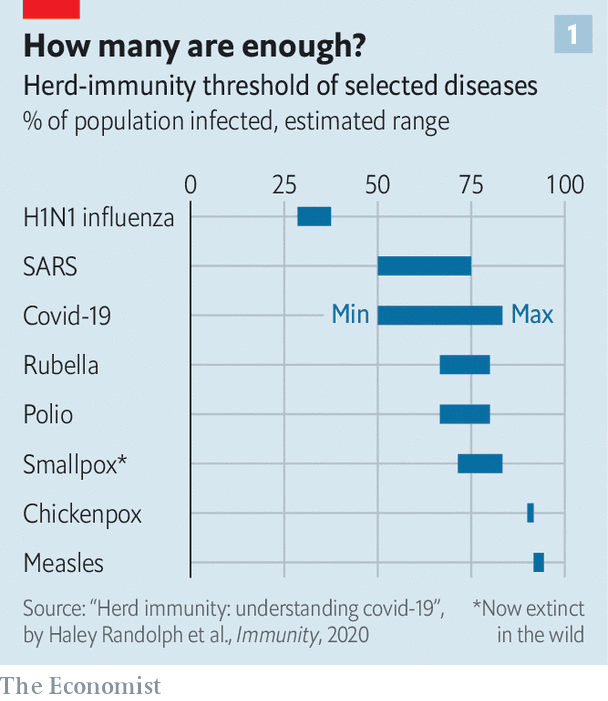
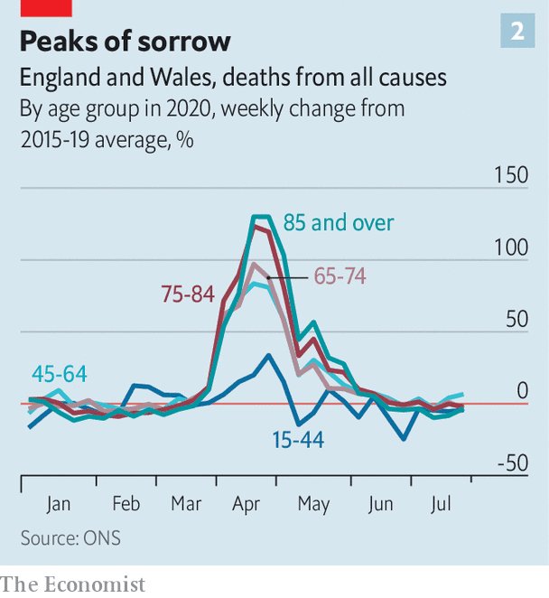

## Controlling the pandemic

# Should covid be left to spread among the young and healthy?

> Two petitions by scientists clash on the matter

> Oct 21st 2020

Editor’s note: Some of our covid-19 coverage is free for readers of The Economist Today, our daily [newsletter](https://www.economist.com/https://my.economist.com/user#newsletter). For more stories and our pandemic tracker, see our [hub](https://www.economist.com//news/2020/03/11/the-economists-coverage-of-the-coronavirus)

AS NEW WAVES of covid-19 sweep the world, lockdowns are back in fashion. This time, though, they are a harder sell. They certainly save lives. But it is now clear that the lost jobs, the disruption to education and medical services, and the harm to mental health that they cause all exact tolls of their own—and these are paid not just in misery, but in deaths. Systems of “test and trace”, intended to stop those exposed to the virus from passing it on, seem to have worked in some places, but not in others.

In the absence of a vaccine, or of effective drug treatments, the question of how much longer this can go on for is thus being asked more insistently. And on October 4th a trio of public-health experts from Harvard, Oxford and Stanford universities put out a petition calling on governments to change course in a radical way.

The Great Barrington Declaration, named after the town in Massachusetts where it was signed, proposes that the contagion be allowed to spread freely among younger and healthier people while measures are taken to protect the most vulnerable from infection. This approach rests on the concept of “herd immunity”, whereby the disease would stop spreading when a sufficient share of the population had become immune as a result of infection.

That is a controversial idea. And on October 14th another group of health experts published a rebuttal in the Lancet, calling the declaration “a dangerous fallacy unsupported by scientific evidence”. Their letter has a grand title, too: the John Snow Memorandum, named after an Englishman who established the principles of epidemiology in the 1850s. It urges governments to do whatever it takes to suppress the spread of SARS-CoV-2, the coronavirus that causes the illness. In particular, it calls for continuing restrictions until governments fix their systems to test, trace and isolate infected people. Online, the duelling petitions have each gathered thousands of signatures from scientists around the world.

The Great Barrington proposal is a risky one. Any judgment about whether natural infection can create herd immunity to SARS-CoV-2 is premature. It has not yet been established whether infected people develop durable immunity against reinfection—and if so, how common that immunity might be. Few cases of reinfection have yet been confirmed conclusively. (This is done by establishing that the genomes of the virus particles found the first and second times around are indeed different, meaning the second infection cannot be a continuation of the first.) Lots of reinfections could, though, be happening undetected. About 80% of those infected with SARS-CoV-2 have mild symptoms, or none at all. The vast majority of these mild cases are not getting tested, even in countries with ample testing capacity.

The ideal study to settle this uncertainty would involve retesting frequently a large cohort of people known to have been infected in the past, to see how many become infected again. But identifying those who have had mild or symptom-free infection is hard. Tests that look for antibodies against SARS-CoV-2 in big surveillance studies often fail to detect those antibodies in mild cases. Some studies have found that antibodies in these patients wane over time. But whether that equates to waning immunity is still unknown.

If the immune response to SARS-CoV-2 is anything like that to the other six coronaviruses which infect human beings, letting it spread would eventually slow transmission down—for a period. The question is how long that period would be. Four of the six cause symptoms described as “the common cold” (though other types of viruses cause colds as well). Infection with these confers protection that typically lasts for less than a year. The other two human coronaviruses, SARS and MERS, cause serious illness. Immunity to these is estimated to last for several years. If protection in the case of SARS-CoV-2 is short-lived or not particularly strong, the virus will keep surging in recurrent epidemic waves, much as happens each winter with other respiratory bugs. If it is longer-lived, the Great Barrington argument is more plausible.

The authors of the John Snow memorandum argue, though, that deaths and disability under the Great Barrington plan would be huge, even if the herd-immunity gamble is on the money. The share of the population which would need to be infected depends on how easily SARS-CoV-2 spreads. In its simplest form, the herd immunity threshold as a fraction of the population is 1-(1/R), where R is the average number of people who catch the virus from an infected person. With no social distancing, the R values for Europe are in the range of 3-4, meaning that herd immunity would kick in when two-thirds to three-quarters of people have been infected (see chart 1). This formula, though, assumes everyone has the same chance of infection, which is not the case in reality. If chances of infection vary, then the threshold is lower than the formula suggests. And this may matter. Young people, for example, have more contacts than oldsters, and are thus more likely to pick the virus up. Some models which assume plausible variety in contact rates have concluded that the herd-immunity threshold in western Europe could therefore be as low as 43%.

It is also possible that this threshold has been lowered by pre-existing immunity conferred by past infections with cold-causing coronaviruses. That sort of protection would come from memory T-cells, another part of the immune system’s armamentarium. Unlike antibodies, which are custom-made to attack a given pathogen, T-cells are less picky in recognising and going after a harmful invader. Several studies of blood samples taken before SARS-CoV-2 emerged have found T-cells that put up a robust reaction to that virus in 20-50% of cases. This is an exciting result. But it is not yet known whether people with such T-cells will have less severe covid-19 disease, or none at all, if they are exposed to SARS-CoV-2 in real life. An outbreak of covid-19 on a French aircraft-carrier did not come to a halt until 70% of the crew had become infected, which suggests that cross-protection from common-cold infections may just be a nice theory.

All this means that if SARS-CoV-2 is left on the loose perhaps half or more of people will become infected over the course of six months. The Great Barrington proposal is that, as this happens, countries must double down on protecting the most vulnerable. Identifying who these vulnerable people are is not a foolproof task, but knowledge about the worst combinations of risk factors is getting better. A paper published in the BMJ on October 20th describes a covid-19 risk calculator that predicts an individual’s probability of hospitalisation and death, using data on 6m people in Britain. Validation of this algorithm on 2m others showed that the 5% of people predicted to be at greatest risk by the calculator accounted for 75% of the covid-19 deaths.

But awareness of such risk scores or simpler markers of high risk (old age, obesity and diabetes in particular) is all too often of little use in practice. Most people cannot change their lives in ways that eliminate their risk of infection, particularly when there are lots of infections all around. Those who care for them, or live in the same home, would get infected at some point—and unwittingly pass the virus on. Though most deaths from covid-19 are among the elderly, many adults in younger age groups are at high risk. At the peak of the covid-19 epidemic in England and Wales deaths among people aged 45 to 64 years were 80% higher than usual (see chart 2) despite a lockdown and official advice to the most vulnerable to “shield” from the virus by not leaving their homes at all.

Although the vast majority of people do not get seriously ill if covid strikes, as many as 5% of those who develop symptoms may remain unwell for at least eight weeks (a condition known as “long covid”). Some of them have not recovered after six months, and there are fears that they may never get back to normal. Even if less than 1% of the infected end up in this unlucky group, for a country the size of Britain that would be hundreds of thousands of people with lifelong disability. Another big unknown is whether there are any hidden health consequences of the virus that may show up in the future. Some studies have found subtle heart changes following mild covid-19. It may not be clear for years whether these lead to serious heart problems for some people, or do not matter at all.

The Great Barrington plan, then, is a high-risk, high-reward proposition. The John Snow one, by contrast, would minimise covid deaths in the short term, but lives lost in the long-term, because of lockdowns and other disruptions, might end up being more numerous. Over time, as governments fix the test and trace systems that are needed to replace the broader restrictions, the motivation for the Great Barrington course of action will become less potent.

With luck, this whole debate will be rendered irrelevant by the invention of a vaccine or the development of suitable drugs to treat covid. The results of several efficacy trials of vaccines, and tests on promising pharmaceuticals, are expected in the coming weeks. If covid-19 is less deadly and some herd immunity comes from a vaccine, the paths charted by the two petitions will, eventually, come together. ■

## URL

https://www.economist.com/science-and-technology/2020/10/21/should-covid-be-left-to-spread-among-the-young-and-healthy
