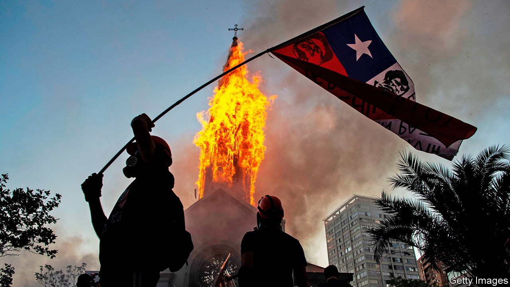

## In need of a new edifice

# Chile’s momentous referendum on its constitution

> The country will probably become more social-democratic. Will it become spendthrift?

> Oct 22nd 2020SANTIAGO

A YEAR AFTER the outbreak of huge protests in which at least 30 people died, Chileans assembled again. The combination of mass civility and minority mayhem was familiar. Tens of thousands of flag-waving demonstrators congregated peacefully on October 18th in Plaza Italia in central Santiago, the capital. In the afternoon fights broke out between football gangs. The day ended with attacks on police stations and two churches ablaze.

The pandemic has largely contained such protests. But a more enduring solution is supposed to come from a referendum, to be held on October 25th, on whether Chile should scrap its constitution and write a new one. “This provides a chance to channel in a civilised way something that got really scary,” says Javier Couso, a constitutional scholar at Diego Portales and Utrecht universities who advises the centrist Christian Democratic Party.

The problems with the current constitution start with its origins. Adopted in 1980, it is the work of the regime led by Augusto Pinochet, a despot who ruled until 1990. Although it acknowledged basic freedoms, a state of emergency suspended these until the regime’s final days. Under the influence of pro-market economists educated at the University of Chicago, it not only protected the private sector but gave it a big role in providing public services. “It is the one that most favours the private sector in the world,” says Mr Couso.

Chile prospered under Pinochet’s charter, which later governments amended dozens of times. Since 1990 the economy has grown rapidly, poverty has fallen sharply and politics have been stable. But the anger that flared last year has been building for more than a decade. Chileans fume about two-tier health care, which serves the rich better than ordinary folk; about the poor quality of state schools; and about privately managed pensions, which pay out less than many people expected.

Chileans largely blame the constitution. By giving citizens a choice of contributing towards the public health-care system or a private one, the charter makes it hard for the state to set up a taxpayer-financed health-care system like Britain’s NHS. When a left-leaning government sought to strengthen the consumer-protection agency, by allowing it to fine companies, the Constitutional Tribunal overruled it. The court might also strike down any attempt to replace privately managed pensions as an infringement of the right to choose between public and private systems. Changes to laws on education, policing, mining and elections require four-sevenths majorities in both houses of Congress.

In critics’ eyes the constitution is not just “neoliberal” but “hyperpresidential”. It gives the president the power to dictate which bills get priority in Congress. Members may not propose tax or spending bills. Regions cannot raise their own revenues, which concentrates power in Santiago. The constitution is “designed to neutralise democratic politics”, says Fernando Atria, a legal scholar at the University of Chile and head of Common Force, part of the left-wing Broad Front alliance.

On October 25th voters will also choose whether to entrust drafting to an elected assembly, half of whose members would be women, or to a convention split evenly between elected delegates and members of Congress. What might they write on the blank sheet? They will probably agree to a constitutional mention of indigenous Chileans, 9% of Chile’s 19m people, and perhaps encourage use of their languages. The president will probably lose some powers; some delegates will argue for adopting a parliamentary system. There may be more scope for referendums.

Any new constitution is likely to make Chile more social-democratic. Advocates of the new charter want to introduce the idea of “equality of opportunity”, which in Chilean terms means making better public services affordable for everyone. They will press for the creation of new social rights, such as an entitlement to housing. Some fear that all this will compel the government to spend money it does not have. The autonomy of the Central Bank, which has helped kept inflation low, could be weakened. The far left will not realise its dream of nationalising industries, believes Bernardo Larraín, president of SOFOFA, a business lobby, but a new constitution could weaken property rights.

Such risks are heightened by the political calendar. The assembly, to be elected next April, will be deliberating as the country holds presidential and congressional elections next November. Campaign promises will influence the drafters.

The danger is lessened, however, by the requirement that two-thirds of the convention must approve every clause in the new document. The odds are that the pro-business centre-right and the small group still nostalgic for Pinochet’s rule will have a blocking minority. New demands on government spending may be tamed by rules that protect fiscal stability. The shift towards more social rights will not be radical, predicts Verónica Undurraga, a professor of law at Adolfo Ibáñez University. If Chileans fail to rewrite their constitution now, demands for radicalism could grow. ■

## URL

https://www.economist.com/the-americas/2020/10/22/chiles-momentous-referendum-on-its-constitution
