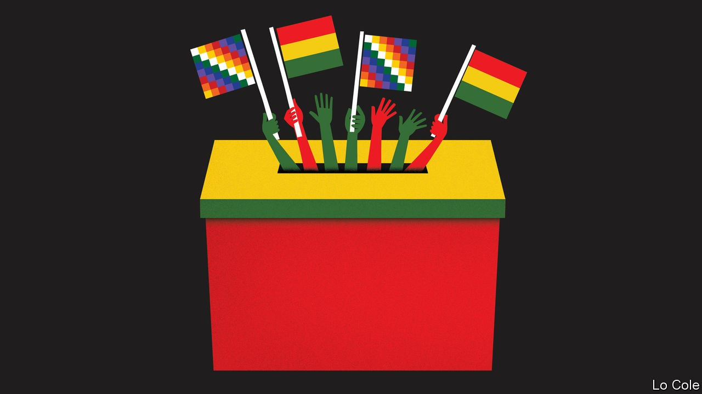

## Bello

# Don’t mess up Bolivia’s miracle

> A landslide election victory brings peace to the country, at least for now

> Oct 24th 2020

ON OCTOBER 18TH, the owner of a guesthouse on Isla del Sol in Lake Titicaca walked for an hour on a dusty path past Inca ruins to vote in a re-run of Bolivia’s election. He was worried. Last year’s contest had sparked a year of protests, driving up food prices and keeping tourists away. This time, polls predicted a runoff between Luis Arce, the candidate of the Movement to Socialism (MAS), which held power for 14 years until last November, and Carlos Mesa, a centrist former president. “I don’t care who wins,” said Óscar, the hotelier. “I’m worried about what happens after.”

Most Bolivians shared his fears that violence would break out, especially if a candidate lost narrowly and challenged the result. In fact, Mr Arce won by a landslide. With 93% of tally sheets counted, he got 54% of votes, 25 points more than Mr Mesa, who quickly conceded. Anti-MAS voters gathered in a few cities to denounce “electoral fraud” but dispersed. Peace, if it holds, would be “a little miracle”, says a diplomat. 

Also miraculous is the MAS’s comeback. Evo Morales, its founder and, from 2006, Bolivia’s first indigenous president, was popular for years. The government spent money from gas exports to reduce by two-thirds the number of people living on less than $1.90 a day. On Isla del Sol Aymara entrepreneurs took advantage of an expansion of credit to build tiny hotels. The children of potato farmers and sheep herders became tour guides and boat drivers. But with the end of the commodity boom public services worsened. Corruption proliferated and Mr Morales became more authoritarian. Last October he ran for a fourth term in defiance of a referendum vote in 2016. A pause in the count led to suspicions that he was rigging the election. Protests erupted. Mr Morales fled the country. 

Anger soon turned on Jeanine Áñez, the right-wing senator who took his place. She sent the army to quash protests, launched her own campaign and mismanaged the response to the pandemic. Nostalgia grew for the stability of Mr Morales’s early years. Mr Arce, who had been his finance minister, profited from that.

To succeed as president, Mr Arce must try to revive economic growth. He should also avoid weakening institutions and alienating half of Bolivians, as Mr Morales did. None of this will be easy. As a uniter, Mr Arce has begun promisingly. “I am not Evo Morales,” he insists. Whereas the former president was a populist, Mr Arce is a technocrat. As finance minister, he kept long hours and few assistants. Middle-class and educated partly in Britain, he has tried to connect with poor voters, cooking pork chicharrones with street vendors. His running mate, David Choquehuanca, is an Aymara intellectual beloved by the MAS’s rural support base. He resigned as foreign minister in 2017 and has criticised Mr Morales’s bid for a fourth term.

After his victory Mr Arce promised to “correct our mistakes” and govern “for all Bolivians”. Speaking in the pod of a cable car over La Paz, he said that he would welcome Mr Morales home, but not in a government role. Whether he keeps his word will be an early test of his independence. Both Mr Morales and Ms Áñez used the justice system to jail rivals. Mr Arce promises not to interfere in investigations of former MAS officials—including Mr Morales—for corruption, terrorism and electoral fraud. Mr Arce faces a corruption probe.

But promises of presidential restraint will be hard to keep, especially as the MAS will retain a majority in the legislature. Mr Arce may face pressure to wage lawfare against members of Ms Áñez’s government. “The pendulum could swing back,” warns Jorge Derpic, a Bolivian sociologist at the University of Georgia. 

Mr Arce, who as finance minister presided over low inflation and fast economic growth, must now cope with a slump and empty coffers. He wants to maintain social spending and renegotiate debt owed to multilateral lenders. To lessen dependence on gas, he would build up industries like lithium batteries and plastics. That will take time. “There’s no lithium industry,” notes Alberto Bonadona, an economist. “What we have is salt for a good barbecue.” 

Bolivians will not put up with failure. “We’re not ignorant anymore,” says Óscar, recalling that 20 years ago a señor arrived before elections to tell islanders how to vote. Now they get news on smartphones. Óscar hopes that Mr Arce stays for just one term. “You can’t sell the same product...year after year,” says the hotelier, who also hawks alpaca jumpers. That is a lesson that Mr Morales’s successor would do well to learn.

## URL

https://www.economist.com/the-americas/2020/10/24/dont-mess-up-bolivias-miracle
